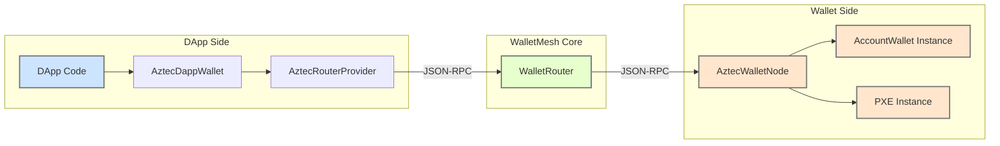

# @walletmesh/aztec-rpc-wallet

JSON-RPC wallet integration for Aztec Protocol, built on WalletMesh router for multi-chain support.

## Overview

This package provides an integration between Aztec wallets and dApps using the WalletMesh router system. It implements the aztec.js `Wallet` interface while leveraging WalletRouter for session management, permissions, and multi-chain support.

## Architecture



-   **DApp Side**: The dApp uses `AztecDappWallet` (an implementation of `aztec.js` `Wallet`) which communicates through `AztecRouterProvider`.
-   **WalletRouter**: The central router from `@walletmesh/router` that directs requests to the appropriate wallet node based on chain ID.
-   **Wallet Side**: `createAztecWalletNode` creates a `JSONRPCNode` (referred to as `AztecWalletNode` in the diagram) that wraps the user's `AccountWallet` and `PXE` instance, handling RPC requests.

## Installation

```bash
pnpm add @walletmesh/aztec-rpc-wallet
```

## Quick Start

### DApp Usage

This example demonstrates connecting to an Aztec wallet and performing a simple action.

```typescript
import { AztecRouterProvider, connectAztec } from '@walletmesh/aztec-rpc-wallet';
import { Contract } from '@aztec/aztec.js'; // Assuming you have a contract instance

// Define a transport (example: window postMessage for browser extensions)
const transport = {
  send: async (msg: unknown) => window.parent.postMessage(msg, '*'), // Or specific targetOrigin
  onMessage: (handler: (data: unknown) => void) => {
    const listener = (event: MessageEvent) => {
      // Add origin check for security if applicable
      // if (event.origin !== 'expected-origin') return;
      handler(event.data);
    };
    window.addEventListener('message', listener);
    // Return a cleanup function if your transport needs it
    // return () => window.removeEventListener('message', listener);
  },
};

async function main() {
  // 1. Create AztecRouterProvider with your transport
  // This provider automatically handles serialization of Aztec types.
  const provider = new AztecRouterProvider(transport);

  // 2. Connect to the Aztec chain and get an initialized wallet instance
  // This requests permissions for all Aztec methods by default.
  // Replace 'aztec:testnet' with your target chainId if different.
  const { sessionId, wallet } = await connectAztec(provider, 'aztec:testnet');
  console.log('Connected to Aztec wallet with session ID:', sessionId);

  // 3. Use the wallet (which implements aztec.js Wallet interface)
  const address = wallet.getAddress(); // Synchronous access after initialization
  console.log('Wallet address:', address.toString());

  // Example: Interacting with a contract (assuming 'myContract' is an aztec.js Contract instance)
  const myContract = await Contract.at(contractAddress, contractArtifact, wallet);
  const interaction = myContract.methods.someFunction(arg1, arg2);

  // Option A: Using WalletMesh high-level execution (Wallet gets passed high-level interaction
  // and can see the actual function call & arguments rather than just hashed values)
  const sentTx = await wallet.wmExecuteTx(interaction);
  const txHash = await sentTx.getTxHash();
  console.log('Transaction sent with wmExecuteTx, hash:', txHash.toString());
  const receipt = await sentTx.getReceipt();

  // Option A with custom send options (fee, nonce, cancellable)
  const sendOptions = {
    fee: customFeeOptions,      // Optional: Custom fee configuration
    txNonce: 42,                 // Optional: Custom transaction nonce
    cancellable: true            // Optional: Make transaction cancellable
  };
  const sentTxWithOptions = await wallet.wmExecuteTx(interaction, sendOptions);

  // Option B: Using standard aztec.js flow (only implemented for Aztec.js `Wallet` interface compatibility)
  const executionPayload = await interaction.request();
  const txExecutionRequest = await wallet.createTxExecutionRequest(executionPayload, feeOptions, txOptions);
  const provingResult = await wallet.proveTx(txExecutionRequest);
  const txHashStd = await wallet.sendTx(provingResult.toTx());
  console.log('Transaction sent with standard flow, hash:', txHashStd.toString());
  const receiptStd = await wallet.getTxReceipt(txHashStd);

  // For a read-only call
  const simulateResult = await myContract.methods.balanceOf(address).simulate();
  console.log('Simulate function result:', simulateResult);
}
```

### Wallet Implementation

```typescript
import { createAztecWalletNode } from '@walletmesh/aztec-rpc-wallet';
import { WalletRouter } from '@walletmesh/router';

// 1. Create Aztec wallet node
const walletNode = createAztecWalletNode(
  accountWallet, // Your AccountWallet instance
  pxe,           // Your PXE instance
  transport      // JSON-RPC transport
);

// 2. Register with router
const router = new WalletRouter(
  routerTransport,
  new Map([
    ['aztec:testnet', walletNode],
    // Add other chains as needed
  ]),
  permissionManager
);
```

## API Reference

### DApp API

#### `AztecRouterProvider`
Extended WalletRouterProvider with built-in Aztec serialization support. Automatically handles serialization/deserialization of Aztec types (AztecAddress, CompleteAddress, Fr, etc.) when communicating through the router.

```typescript
const provider = new AztecRouterProvider(transport);
// All Aztec types are automatically serialized/deserialized
```

#### `createAztecWallet(provider, chainId)`
Creates an Aztec wallet instance that implements the aztec.js `Wallet` interface.

```typescript
const wallet = createAztecWallet(provider, 'aztec:testnet');
```

#### `connectAztec(provider, chainId?, methods?)`
Connects to an Aztec wallet service and returns an initialized `AztecDappWallet` instance.
- `provider`: An initialized `AztecRouterProvider`.
- `chainId?`: The target `AztecChainId` (e.g., `'aztec:testnet'`). Defaults to `'aztec:mainnet'`.
- `methods?`: Optional array of method names to request permissions for. Defaults to `ALL_AZTEC_METHODS`.
Returns: `Promise<{ sessionId: string; wallet: AztecDappWallet }>`

```typescript
const { sessionId, wallet } = await connectAztec(provider, 'aztec:testnet');
const address = wallet.getAddress(); // Wallet is ready
```


#### `AztecDappWallet`
The main client-side wallet class that implements the `aztec.js` `Wallet` interface. It interacts with the remote wallet via the `AztecRouterProvider`. Instances are typically created using `createAztecWallet` or `connectAztec`.

**Key `Wallet` Interface Methods (implemented by `AztecDappWallet`):**

*   **Account Information:**
    *   `getAddress(): AztecAddress` - Gets the wallet's primary Aztec address (cached after initialization).
    *   `getCompleteAddress(): CompleteAddress` - Gets the wallet's complete address including public keys (cached).
    *   `getChainId(): Fr` - Gets the chain ID (cached).
    *   `getVersion(): Fr` - Gets the wallet/PXE version (cached).
    *   Async versions for direct fetching: `getAddressAsync()`, `getCompleteAddressAsync()`, `getChainIdAsync()`, `getVersionAsync()`.

*   **Transaction Lifecycle:**
    *   `createTxExecutionRequest(exec: ExecutionPayload, fee: FeeOptions, options: TxExecutionOptions): Promise<TxExecutionRequest>` - Creates a transaction execution request using the wallet's local entrypoint.
    *   `proveTx(txRequest: TxExecutionRequest, privateExecutionResult?: PrivateExecutionResult): Promise<TxProvingResult>` - Generates proofs for a transaction.
    *   `sendTx(tx: Tx): Promise<TxHash>` - Sends a proven transaction to the network.
    *   `getTxReceipt(txHash: TxHash): Promise<TxReceipt>` - Retrieves a transaction receipt.
    *   `simulateTx(txRequest: TxExecutionRequest, simulatePublic: boolean, msgSender?: AztecAddress, skipTxValidation?: boolean, skipFeeEnforcement?: boolean, scopes?: AztecAddress[]): Promise<TxSimulationResult>` - Simulates a transaction.
    *   `profileTx(txRequest: TxExecutionRequest, profileMode: 'gates' | 'execution-steps' | 'full', skipProofGeneration?: boolean, msgSender?: AztecAddress): Promise<TxProfileResult>` - Profiles a transaction.
    *   `simulateUtility(functionName: string, args: unknown[], to: AztecAddress, authWits?: AuthWitness[], from?: AztecAddress): Promise<UtilitySimulationResult>` - Simulates a view function call.

*   **Contract Management:**
    *   `registerContract(contract: { artifact?: ContractArtifact; instance: ContractInstanceWithAddress }): Promise<void>` - Registers a deployed contract instance.
    *   `registerContractClass(artifact: ContractArtifact): Promise<void>` - Registers a contract class/artifact.
    *   `getContracts(): Promise<AztecAddress[]>` - Gets all registered contract addresses.
    *   `getContractMetadata(address: AztecAddress): Promise<ContractMetadata>` - Gets metadata for a specific contract.
    *   `getContractClassMetadata(id: Fr, includeArtifact?: boolean): Promise<ContractClassMetadata>` - Gets metadata for a contract class.
    *   `updateContract(_contractAddress: AztecAddress, artifact: ContractArtifact): Promise<void>` - Updates a contract's artifact (typically re-registers its class).

*   **Authorization & Senders:**
    *   `createAuthWit(intent: Fr | Buffer | IntentInnerHash | IntentAction): Promise<AuthWitness>` - Creates an authorization witness.
    *   `registerSender(address: AztecAddress): Promise<AztecAddress>` - Registers an authorized sender.
    *   `getSenders(): Promise<AztecAddress[]>` - Gets all authorized senders.
    *   `removeSender(sender: AztecAddress): Promise<void>` - Removes an authorized sender.

*   **Network & Node Information:**
    *   `getBlock(number: number): Promise<L2Block | undefined>` - Gets a block by its number.
    *   `getBlockNumber(): Promise<number>` - Gets the current block number.
    *   `getCurrentBaseFees(): Promise<GasFees>` - Gets current base gas fees.
    *   `getNodeInfo(): Promise<NodeInfo>` - Gets node information.
    *   `getPXEInfo(): Promise<PXEInfo>` - Gets PXE service information.

*   **Event Querying:**
    *   `getPrivateEvents<T>(contractAddress: AztecAddress, eventMetadata: EventMetadataDefinition, from: number, numBlocks: number, recipients: AztecAddress[]): Promise<T[]>` - Queries private (encrypted) events.
    *   `getPublicEvents<T>(eventMetadata: EventMetadataDefinition, from: number, limit: number): Promise<T[]>` - Queries public (unencrypted) events.

**WalletMesh Extended Methods on `AztecDappWallet`:**
These methods simplify common dApp workflows by leveraging WalletMesh capabilities.
-   `wmExecuteTx(interaction: ContractFunctionInteraction, sendOptions?: AztecSendOptions): Promise<SentTx>` - High-level method to execute a transaction from a `ContractFunctionInteraction`. Handles payload creation, proving, and sending via the remote wallet. Optionally accepts `sendOptions` for custom fee configuration, transaction nonce, and cancellable flag.
-   `wmSimulateTx(interaction: ContractFunctionInteraction): Promise<TxSimulationResult>` - High-level method to simulate a transaction from a `ContractFunctionInteraction`.
-   `deployContract(artifact: ContractArtifact, args: unknown[], constructorName?: string): Promise<DeploySentTx>` - High-level method to deploy a contract.

Refer to `aztec.js` documentation for detailed explanations of the standard `Wallet` interface methods.

### Wallet API

#### `createAztecWalletNode(wallet, pxe, transport)`
Creates a JSONRPCNode configured for Aztec wallet operations.

```typescript
const walletNode = createAztecWalletNode(accountWallet, pxe, transport);
```

## Method Permissions

### Default Methods
When using `connectAztec()` without specifying methods:
- `aztec_getAddress`
- `aztec_getCompleteAddress` 
- `aztec_sendTx`
- `aztec_getTxReceipt`
- `aztec_createTxExecutionRequest`
- `aztec_simulateTx`
- `aztec_getNodeInfo`
- `aztec_getBlockNumber`
- `aztec_getCurrentBaseFees`

### All Available Methods
See `ALL_AZTEC_METHODS` export for the complete list of supported methods.

## Transport Layer

This library uses the `JSONRPCTransport` interface from `@walletmesh/jsonrpc` for communication:

```typescript
interface JSONRPCTransport {
  send(data: unknown): Promise<void>;
  onMessage(callback: (data: unknown) => void): void;
}
```

## Architecture Details

### Components

1. **Wallet Side** (`wallet/` directory)
   - `create-node.ts` - Factory for JSONRPCNode
   - `handlers/` - Pure function handlers for each method
   - `serializers/` - Type serialization for Aztec objects

2. **DApp Side** (`client/` directory)
   - `aztec-dapp-wallet.ts` - Implements aztec.js Wallet interface
   - `helpers.ts` - Convenience functions

3. **Shared** (`types.ts`)
   - Method definitions
   - Aztec-specific types

### Handler Pattern

```typescript
export function createAccountHandlers() {
  return {
    aztec_getAddress: async (
      ctx: AztecHandlerContext,
      _paramsTuple: AztecWalletMethodMap['aztec_getAddress']['params'],
    ): Promise<AztecWalletMethodMap['aztec_getAddress']['result']> => {
      return ctx.wallet.getAddress();
    },
    // ... more handlers
  };
}
```

### Serializer Architecture

This package relies on Aztec's serialization mechanisms to handle complex Aztec data types over JSON-RPC. This is managed by the `AztecWalletSerializer` on the wallet-side and automatically handled by `AztecRouterProvider` on the dApp-side.

**Key Aspects:**

1.  **`AztecWalletSerializer`**:
    *   A single, comprehensive serializer object (see `wallet/serializers.ts`) is responsible for all Aztec methods.
    *   **Parameter Deserialization (Wallet Side)**: When the wallet node receives a request, `AztecWalletSerializer` uses a detailed `switch` statement for `params.deserialize`. It parses the JSON parameters and reconstructs them into their proper Aztec object types (e.g., `AztecAddress.fromString(str)`, `TxExecutionRequest.schema.parse(obj)`), leveraging Zod schemas from `@aztec/aztec.js` and `@aztec/stdlib`.
    *   **Result Serialization (Wallet Side)**: For results being sent back to the dApp, `AztecWalletSerializer` uses `result.serialize`. It often employs `jsonStringify` from `@aztec/foundation/json-rpc` along with Zod schemas for specific Aztec result types.
    *   **Parameter Serialization (Client Side via `AztecRouterProvider`)**: The `AztecRouterProvider` ensures that when the dApp calls a method on `AztecDappWallet`, the parameters (which are already proper Aztec objects) are serialized correctly before being sent. This typically involves `jsonStringify` with appropriate schemas.
    *   **Result Deserialization (Client Side via `AztecRouterProvider`)**: When the dApp receives a response, `AztecRouterProvider` uses the serializer to convert the JSON data back into rich Aztec objects (e.g., an `AztecAddress` instance, not just a string).

2.  **Zod Schemas**: The serialization heavily relies on Zod schemas defined within the Aztec protocol's libraries (e.g., `AztecAddress.schema`, `Tx.schema`) and some custom Zod schemas defined in this package for types not having them upstream.

3.  **Automatic Handling for dApps**: DApp developers using `AztecRouterProvider` and `AztecDappWallet` generally do not need to worry about serialization details, as it's handled transparently.

This architecture ensures type safety and data integrity when complex Aztec objects are transmitted between the dApp and the wallet.

## DApp Usage Example

```typescript
import { AztecRouterProvider, connectAztecWithWallet, createAztecWallet } from '@walletmesh/aztec-rpc-wallet';

// Initialize the Aztec-specific router provider
const provider = new AztecRouterProvider(dAppTransportToRouter);

// Connect and get an initialized wallet instance
const { sessionId, wallet } = await connectAztecWithWallet(provider, 'aztec:testnet');

// 'wallet' is now an AztecDappWallet instance, ready for use
const address = wallet.getAddress();
```
