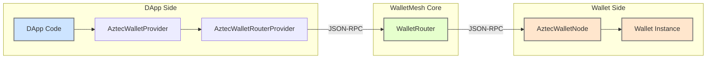

# @walletmesh/aztec-rpc-wallet

JSON-RPC wallet integration for Aztec Protocol, built on WalletMesh router for multi-chain support.

## Overview

This package provides an integration between Aztec wallets and dApps using the WalletMesh router system. It implements the aztec.js `Wallet` interface while leveraging WalletRouter for session management, permissions, and multi-chain support.

## Architecture



-   **DApp Side**: The dApp uses `AztecWalletProvider` (an implementation of `aztec.js` `Wallet`) which communicates through `AztecWalletRouterProvider`.
-   **WalletRouter**: The central router from `@walletmesh/router` that directs requests to the appropriate wallet node based on chain ID.
-   **Wallet Side**: `createAztecWalletNode` creates a `JSONRPCNode` (referred to as `AztecWalletNode` in the diagram) that wraps the user's `Wallet` instance, handling RPC requests.

## Installation

```bash
pnpm add @walletmesh/aztec-rpc-wallet
```

## Quick Start

### DApp Usage

This example demonstrates connecting to an Aztec wallet and performing a simple action.

```typescript
import { AztecWalletRouterProvider, connectAztec } from '@walletmesh/aztec-rpc-wallet/client';
import type { JSONRPCTransport } from '@walletmesh/jsonrpc';

// Define a transport (example: window postMessage for browser extensions)
const transport: JSONRPCTransport = {
  send: async (msg: unknown) => window.parent.postMessage(msg, '*'), // Or specific targetOrigin
  onMessage: (handler: (data: unknown) => void) => {
    const listener = (event: MessageEvent) => {
      // Add origin check for security if applicable
      // if (event.origin !== 'expected-origin') return;
      handler(event.data);
    };
    window.addEventListener('message', listener);
    // Return a cleanup function if your transport needs it
    // return () => window.removeEventListener('message', listener);
  },
};

async function main() {
  // 1. Create AztecWalletRouterProvider with your transport
  // This provider automatically handles serialization of Aztec types.
  const provider = new AztecWalletRouterProvider(transport);

  // 2. Connect to the Aztec chain and get an initialized wallet instance
  // This requests permissions for all Aztec methods by default.
  // Replace 'aztec:testnet' with your target chainId if different.
  const { sessionId, wallet } = await connectAztec(provider, 'aztec:testnet');
  console.log('Connected to Aztec wallet with session ID:', sessionId);

  // 3. Use the wallet (which implements aztec.js Wallet interface)
  // Example: Get chain info
  const chainInfo = await wallet.getChainInfo();
  console.log('Chain info:', chainInfo);

  // Example: Get accounts
  const accounts = await wallet.getAccounts();
  console.log('Available accounts:', accounts);

  // Example: Send a transaction
  const executionPayload = /* ... your execution payload ... */;
  const sendOptions = /* ... your send options ... */;
  const txHash = await wallet.sendTx(executionPayload, sendOptions);
  console.log('Transaction sent, hash:', txHash.toString());

  // Example: Get transaction receipt
  const receipt = await wallet.getTxReceipt(txHash);
  console.log('Transaction receipt:', receipt);
}
```

### Wallet Implementation

```typescript
import { createAztecWalletNode } from '@walletmesh/aztec-rpc-wallet/server';
import { WalletRouter } from '@walletmesh/router';
import type { Wallet } from '@aztec/aztec.js/wallet';
import type { JSONRPCTransport } from '@walletmesh/jsonrpc';

// 1. Create Aztec wallet node
const walletNode = createAztecWalletNode(
  wallet,    // Your Wallet instance from aztec.js
  transport  // JSON-RPC transport
);

// 2. Register with router
const router = new WalletRouter(
  routerTransport,
  new Map([
    ['aztec:testnet', walletNode],
    // Add other chains as needed
  ]),
  permissionManager
);
```

## API Reference

### DApp API

#### `AztecWalletRouterProvider`
Extended `WalletRouterProvider` with built-in Aztec serialization support. Automatically handles serialization/deserialization of Aztec types (AztecAddress, Fr, ExecutionPayload, etc.) when communicating through the router.

```typescript
import { AztecWalletRouterProvider } from '@walletmesh/aztec-rpc-wallet/client';

const provider = new AztecWalletRouterProvider(transport);
// All Aztec types are automatically serialized/deserialized
```

#### `connectAztec(provider, chainId, methods?)`
Connects to an Aztec wallet service and returns an initialized `AztecWalletProvider` instance.

**Parameters:**
- `provider`: An initialized `AztecWalletRouterProvider` instance.
- `chainId`: The target `AztecChainId` (e.g., `'aztec:testnet'`, `'aztec:mainnet'`).
- `methods?`: Optional array of method names to request permissions for. Defaults to `AZTEC_WALLET_METHODS`.

**Returns:** `Promise<{ sessionId: string; wallet: AztecWalletProvider }>`

```typescript
import { connectAztec } from '@walletmesh/aztec-rpc-wallet/client';

const { sessionId, wallet } = await connectAztec(provider, 'aztec:testnet');
// Wallet is ready to use
```

#### `AztecWalletProvider`
The main client-side wallet class that implements the `aztec.js` `Wallet` interface. It interacts with the remote wallet via the `AztecWalletRouterProvider`. Instances are typically created using `connectAztec`.

**Key `Wallet` Interface Methods (implemented by `AztecWalletProvider`):**

*   **Account & Chain Information:**
    *   `getAccounts(): Promise<Aliased<AztecAddress>[]>` - Gets all available accounts.
    *   `getAddressBook(): Promise<Aliased<AztecAddress>[]>` - Gets the address book.
    *   `getChainInfo(): Promise<ChainInfo>` - Gets chain information.

*   **Transaction Lifecycle:**
    *   `sendTx(exec: ExecutionPayload, opts: SendOptions): Promise<TxHash>` - Sends a transaction to the network.
    *   `getTxReceipt(txHash: TxHash): Promise<TxReceipt>` - Retrieves a transaction receipt.
    *   `simulateTx(exec: ExecutionPayload, opts: SimulateOptions): Promise<TxSimulationResult>` - Simulates a transaction.
    *   `simulateUtility(call: FunctionCall, authwits?: AuthWitness[]): Promise<UtilitySimulationResult>` - Simulates a view function call.
    *   `profileTx(exec: ExecutionPayload, opts: ProfileOptions): Promise<TxProfileResult>` - Profiles a transaction.

*   **Contract Management:**
    *   `getContractMetadata(address: AztecAddress): Promise<ContractMetadata>` - Gets metadata for a specific contract.
    *   `getContractClassMetadata(id: Fr, includeArtifact?: boolean): Promise<ContractClassMetadata>` - Gets metadata for a contract class.
    *   `registerContract(instance: ContractInstanceWithAddress, artifact?: ContractArtifact, secretKey?: Fr): Promise<ContractInstanceWithAddress>` - Registers a deployed contract instance.

*   **Authorization & Senders:**
    *   `createAuthWit(from: AztecAddress, messageHashOrIntent: Fr | IntentInnerHash | CallIntent): Promise<AuthWitness>` - Creates an authorization witness.
    *   `registerSender(address: AztecAddress, alias?: string): Promise<AztecAddress>` - Registers an authorized sender.

*   **Event Querying:**
    *   `getPrivateEvents<T>(contractAddress: AztecAddress, eventMetadata: EventMetadataDefinition, from: number, numBlocks: number, recipients: AztecAddress[]): Promise<T[]>` - Queries private (encrypted) events.

*   **Batch Operations:**
    *   `batch<T extends readonly BatchedMethod<keyof BatchableMethods>[]>(methods: T): Promise<BatchResults<T>>` - Executes multiple operations in a batch.

Refer to `aztec.js` documentation for detailed explanations of the standard `Wallet` interface methods.

### Wallet API

#### `createAztecWalletNode(wallet, transport)`
Creates a `JSONRPCNode` configured for Aztec wallet operations.

**Parameters:**
- `wallet`: An instance of `Wallet` from `aztec.js`, representing the user's Aztec account and signing capabilities.
- `transport`: A `JSONRPCTransport` instance that the node will use for sending and receiving JSON-RPC messages.

**Returns:** A fully configured `JSONRPCNode` instance, ready to process Aztec wallet requests.

```typescript
import { createAztecWalletNode } from '@walletmesh/aztec-rpc-wallet/server';

const walletNode = createAztecWalletNode(wallet, transport);
```

## Method Permissions

### Default Methods
When using `connectAztec()` without specifying methods, it requests permissions for all methods in `AZTEC_WALLET_METHODS`, which includes:

- `aztec_getChainInfo`
- `aztec_getAccounts`
- `aztec_getAddressBook`
- `aztec_createAuthWit`
- `aztec_registerSender`
- `aztec_getContractMetadata`
- `aztec_getContractClassMetadata`
- `aztec_registerContract`
- `aztec_sendTx`
- `aztec_simulateTx`
- `aztec_simulateUtility`
- `aztec_profileTx`
- `aztec_getPrivateEvents`
- `aztec_getTxReceipt`
- `aztec_batch`
- `aztec_wmExecuteTx`
- `aztec_wmBatchExecute`
- `aztec_wmDeployContract`
- `aztec_wmSimulateTx`

### All Available Methods
See `AZTEC_WALLET_METHODS` export from `@walletmesh/aztec-rpc-wallet/server` for the complete list of supported methods.

## Transport Layer

This library uses the `JSONRPCTransport` interface from `@walletmesh/jsonrpc` for communication:

```typescript
interface JSONRPCTransport {
  send(data: unknown): Promise<void>;
  onMessage(callback: (data: unknown) => void): void;
}
```

## Architecture Details

### Components

1. **Wallet Side** (`server/` directory)
   - `create-node.ts` - Factory for JSONRPCNode
   - `handlers.ts` - Pure function handlers for each method
   - `register-serializers.ts` - Registers serializers for Aztec types

2. **DApp Side** (`client/` directory)
   - `wallet.ts` - Implements aztec.js Wallet interface (`AztecWalletProvider`)
   - `aztec-router-provider.ts` - Extended router provider with Aztec serialization
   - `helpers.ts` - Convenience functions (`connectAztec`)

3. **Shared** (`types.ts`, `serializers.ts`)
   - Method definitions (`AztecWalletMethodMap`)
   - Aztec-specific types
   - Serializers for Aztec types

### Handler Pattern

```typescript
export const HANDLERS: Record<keyof AztecWalletMethodMap, unknown> = {
  aztec_getChainInfo: async (
    ctx: AztecWalletHandlerContext,
    _paramsTuple: AztecWalletMethodMap['aztec_getChainInfo']['params'],
  ): Promise<AztecWalletMethodMap['aztec_getChainInfo']['result']> => {
    return ctx.wallet.getChainInfo();
  },
  // ... more handlers
};
```

### Serializer Architecture

This package relies on Aztec's serialization mechanisms to handle complex Aztec data types over JSON-RPC. This is managed by serializers on both the wallet-side and client-side.

**Key Aspects:**

1.  **Serializers**:
    *   A comprehensive serializer object (see `serializers.ts`) is responsible for all Aztec methods.
    *   **Parameter Deserialization (Wallet Side)**: When the wallet node receives a request, serializers parse JSON parameters and reconstruct them into their proper Aztec object types using Zod schemas from `@aztec/aztec.js` and `@aztec/stdlib`.
    *   **Result Serialization (Wallet Side)**: For results being sent back to the dApp, serializers use `jsonStringify` from `@aztec/foundation/json-rpc` along with Zod schemas for specific Aztec result types.
    *   **Parameter Serialization (Client Side via `AztecWalletRouterProvider`)**: The `AztecWalletRouterProvider` ensures that when the dApp calls a method on `AztecWalletProvider`, the parameters (which are already proper Aztec objects) are serialized correctly before being sent.
    *   **Result Deserialization (Client Side via `AztecWalletRouterProvider`)**: When the dApp receives a response, `AztecWalletRouterProvider` uses the serializer to convert the JSON data back into rich Aztec objects.

2.  **Zod Schemas**: The serialization heavily relies on Zod schemas defined within the Aztec protocol's libraries (e.g., `AztecAddress.schema`, `TxHash.schema`) and some custom Zod schemas defined in this package for types not having them upstream.

3.  **Automatic Handling for dApps**: DApp developers using `AztecWalletRouterProvider` and `AztecWalletProvider` generally do not need to worry about serialization details, as it's handled transparently.

This architecture ensures type safety and data integrity when complex Aztec objects are transmitted between the dApp and the wallet.

## Package Exports

This package uses subpath exports:

- **`@walletmesh/aztec-rpc-wallet/client`** - Client-side exports for dApps
  - `AztecWalletRouterProvider` - Router provider with Aztec serialization
  - `AztecWalletProvider` - Wallet implementation
  - `connectAztec` - Helper function to connect and get wallet instance

- **`@walletmesh/aztec-rpc-wallet/server`** - Server-side exports for wallet implementations
  - `createAztecWalletNode` - Factory function to create wallet node
  - `AZTEC_WALLET_METHODS` - List of all supported methods
  - `AztecWalletMethodMap` - Type definitions for all methods
  - All other types and interfaces
