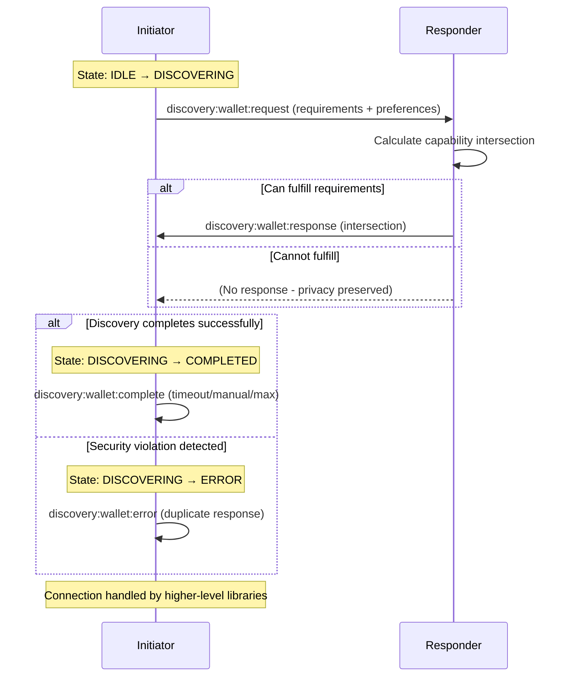

**@walletmesh/discovery v0.1.1**

***

# @walletmesh/discovery

**Version 0.1.0** - Development Release

Cross-origin discovery protocol implementation for WalletMesh. This package implements a capability-first discovery model that enables secure, privacy-preserving discovery between initiators (dApps) and responders (wallets).

📖 **Protocol Documentation**: For complete protocol specification, state machine details, and implementation guide, see [PROTOCOL.md](_media/PROTOCOL.md).

> ⚠️ **Development Release**: Version 0.1.0 indicates this package is still in active development. APIs may change between releases until version 1.0.0.

> 🚨 **Breaking Change in v0.7.0**: The discovery protocol now exclusively uses technology-based discovery. The deprecated `chains[]` and `interfaces[]` fields have been removed from `CapabilityRequirements`. All capability matching must now use the `technologies` array format. See the migration guide in [CLAUDE.md](_media/CLAUDE.md#version-070---technology-based-discovery-current) for details.

## Features

- **Capability-First Discovery**: Initiators request specific capabilities, responders self-qualify and respond
- **Multi-Chain Support**: Supports EVM, Solana, Aztec, and other blockchain networks
- **Privacy-Preserving**: Only capability intersections are revealed, protecting responder privacy
- **Modular Architecture**: Import only the parts you need for optimal bundle size
- **Security-First**: Built-in origin validation, rate limiting, and session tracking
- **Type-Safe**: Full TypeScript support with runtime validation

## Terminology

Understanding the discovery protocol requires familiarity with these key concepts:

### Capabilities
The complete set of functionalities a wallet can provide, organized into two main categories:

1. **Technologies**: Blockchain technology support with associated interfaces and features
   - Technology types: `'evm'`, `'solana'`, `'aztec'`
   - Each technology specifies supported interfaces (e.g., `'eip-1193'` for EVM)
   - Can include technology-specific features (e.g., `'eip-712'` for EVM signing)

2. **Features**: Global wallet functionalities independent of specific technologies
   - Examples: `'hardware-wallet'`, `'account-management'`, `'transaction-signing'`
   - Describes cross-technology capabilities of the wallet
   - See [RESPONDER_FEATURES](_media/constants.ts) constant for standard identifiers

### Key Concepts

- **Initiator**: The dApp or application seeking to connect to a wallet
- **Responder**: The wallet that can potentially fulfill the initiator's requirements
- **Capability Requirements**: The mandatory capabilities a wallet must support
- **Capability Preferences**: Optional capabilities that enhance user experience
- **Capability Intersection**: The overlap between requested and supported capabilities

### Example

```typescript
// A dApp's capability requirements
const requirements: CapabilityRequirements = {
  technologies: [{
    type: 'evm',
    interfaces: ['eip-1193'],              // Must implement EIP-1193 API
    features: ['eip-712']                  // Must support EIP-712 signing
  }],
  features: ['account-management']         // Must have account viewing
};

// Optional preferences for better UX
const preferences: CapabilityPreferences = {
  features: ['hardware-wallet']            // Prefer hardware security
};
```

## Installation

```bash
npm install @walletmesh/discovery
# or
pnpm add @walletmesh/discovery
# or 
yarn add @walletmesh/discovery
```

## Quick Start

### For Initiators (Discovery)

```typescript
import { createDiscoveryInitiator } from '@walletmesh/discovery/initiator';
import type { CapabilityRequirements } from '@walletmesh/discovery/types';

// Define what your initiator needs
const requirements: CapabilityRequirements = {
  technologies: [{
    type: 'evm',
    interfaces: ['eip-1193']
  }],
  features: ['account-management', 'transaction-signing']
};

// Create discovery initiator
const initiator = createDiscoveryInitiator({
  initiatorInfo: {
    name: 'My DeFi App',
    url: 'https://my-defi-app.com',
    icon: 'data:image/svg+xml;base64,PHN2ZyB3aWR0aD0iMjQiIGhlaWdodD0iMjQiIHZpZXdCb3g9IjAgMCAyNCAyNCIgZmlsbD0ibm9uZSI+PC9zdmc+'
  },
  requirements,
  preferences: {
    features: ['hardware-wallet']
  }
});

// Listen for discovery events
initiator.on('discovery:wallet:complete', (event) => {
  console.log(`Discovery completed: ${event.reason}, found ${event.respondersFound} responders`);
});

initiator.on('discovery:wallet:error', (event) => {
  console.error(`Discovery error: ${event.errorMessage} (code: ${event.errorCode})`);
});

// Start discovery
const qualifiedResponders = await initiator.startDiscovery();

console.log('Found qualified responders:', qualifiedResponders);
// Each responder includes capability intersection
```

### For Responders (Announcing)

```typescript
import { createDiscoveryResponder, createResponderInfo } from '@walletmesh/discovery/responder';

// Define your responder's capabilities
const responderInfo = createResponderInfo.ethereum({
  uuid: 'my-awesome-wallet',
  rdns: 'com.mycompany.wallet',
  name: 'My Awesome Wallet',
  icon: 'data:image/png;base64,...',
  version: '1.0.0',
  // Optional: Specify how dApps should connect
  transportConfig: {
    type: 'extension',
    extensionId: 'nkbihfbeogaeaoehlefnkodbefgpgknn'
  }
  // Additional Ethereum-specific capabilities are auto-included
});

// Create responder with security policy
const responder = createDiscoveryResponder({
  responderInfo,
  securityPolicy: {
    allowedOrigins: ['https://trusted-dapp.com'],
    requireHttps: true,
    rateLimit: {
      enabled: true,
      maxRequests: 10,
      windowMs: 60000
    }
  }
});

// Start listening for capability requests
responder.startListening();
```

## Modular Imports

The package is designed with modular exports to minimize bundle size:

```typescript
// Core types and constants
import type { CapabilityRequirements } from '@walletmesh/discovery/types';
import { DISCOVERY_PROTOCOL_VERSION } from '@walletmesh/discovery';

// Initiator-side functionality
import { createDiscoveryInitiator, DiscoveryInitiator } from '@walletmesh/discovery/initiator';

// Responder-side functionality  
import { createDiscoveryResponder, CapabilityMatcher } from '@walletmesh/discovery/responder';

// Browser extension components
import { ContentScriptRelay, WalletDiscovery } from '@walletmesh/discovery/extension';

// Protocol state machine
import { ProtocolStateMachine } from '@walletmesh/discovery';

// Testing utilities (for tests only)
import { createDiscoveryTestScenario, MockEventTarget } from '@walletmesh/discovery/testing';
```

## Architecture Overview

### Capability-First Discovery Model

Unlike traditional discovery that announces all available responders, this protocol uses a **capability-first** approach:

1. **Initiator Broadcasts Requirements**: Announces needed capabilities (chains, features, interfaces)
2. **Responders Self-Qualify**: Each responder determines if it can fulfill the requirements
3. **Intersection Response**: Qualified responders respond with only the capability intersection
4. **Privacy Preservation**: Responders don't reveal capabilities beyond what's requested

### Protocol Flow



### Protocol States

The discovery protocol uses a 4-state machine to manage the discovery lifecycle:

1. **IDLE**: No active discovery session
2. **DISCOVERING**: Actively collecting responder announcements
3. **COMPLETED**: Discovery finished successfully (terminal state)
4. **ERROR**: Discovery failed due to security violation (terminal state)

State transitions:
- `IDLE → DISCOVERING`: When discovery starts
- `DISCOVERING → COMPLETED`: On timeout, manual stop, or max responders reached
- `DISCOVERING → ERROR`: On security violation (e.g., duplicate response from same wallet)
- `COMPLETED/ERROR → IDLE`: Must explicitly reset to start new discovery

### Security Features

- **Origin Validation**: Prevents cross-origin attacks with configurable origin policies
- **Session Tracking**: Origin-bound session tracking prevents session poisoning
- **Rate Limiting**: Per-origin rate limiting with sliding window algorithm
- **Replay Protection**: Unique session IDs prevent replay attacks
- **HTTPS Enforcement**: Configurable HTTPS requirements for production security
- **Duplicate Response Detection**: Prevents wallet spoofing by detecting multiple responses from same RDNS

## Protocol Messages

The discovery protocol uses four message types:

1. **DiscoveryRequestEvent** (`discovery:wallet:request`): Initiator broadcasts capability requirements
   - `required`: Required capabilities (technologies with interfaces/features, global features)
   - `optional`: Preferred capabilities  
   - `initiatorInfo`: Information about the requesting application
   - `origin`: Request origin for security validation

2. **DiscoveryResponseEvent** (`discovery:wallet:response`): Responder announces capability match
   - `responderId`: Ephemeral session identifier
   - `rdns`: Stable reverse DNS identifier  
   - `matched`: Capability intersection with requirements
   - `transportConfig`: Optional connection configuration

3. **DiscoveryCompleteEvent** (`discovery:wallet:complete`): Discovery session completed
   - `reason`: 'timeout' | 'manual-stop' | 'max-responders'
   - `respondersFound`: Number of qualified responders

4. **DiscoveryErrorEvent** (`discovery:wallet:error`): Security violation or error
   - `errorCode`: Numeric error code
   - `errorMessage`: Human-readable error description
   - `errorCategory`: Error categorization for handling

## Protocol Documentation

For complete protocol documentation including state machine, security model, and implementation details, see [PROTOCOL.md](_media/PROTOCOL.md).

## Protocol Reference

### Chain Identifiers

The protocol uses CAIP-2 compliant chain identifiers:

- **EVM chains**: `eip155:1` (Ethereum), `eip155:11155111` (Sepolia), `eip155:137` (Polygon)
- **Solana**: `solana:5eykt4UsFv8P8NJdTREpY1vzqKqZKvdp` (mainnet), `solana:EtWTRABZaYq6iMfeYKouRu166VU2xqa1` (devnet)
- **Aztec**: `aztec:sandbox`, `aztec:testnet`

### Standard Features

- `account-management`: Basic account operations
- `transaction-signing`: Transaction signing capabilities  
- `message-signing`: Message signing support
- `private-transactions`: Privacy-focused transaction support
- `cross-chain-swaps`: Cross-chain asset swapping
- `hardware-wallet`: Hardware security module support

### Standard Interfaces

- `eip-1193`: Ethereum Provider API
- `solana-wallet-standard`: Solana Wallet Standard
- `aztec-wallet-api-v1`: Aztec Wallet API

## Examples

### Multi-Chain Initiator

```typescript
import { createDiscoveryInitiator } from '@walletmesh/discovery/initiator';

const initiator = createDiscoveryInitiator({
  initiatorInfo: {
    name: 'Multi-Chain DEX',
    url: 'https://multichain-dex.com',
    icon: 'data:image/png;base64,iVBORw0KGgoAAAANSUhEUgAAAAEAAAABCAYAAAAfFcSJAAAADUlEQVR42mNkYPhfDwAChwGA60e6kgAAAABJRU5ErkJggg=='
  },
  requirements: {
    // Support for multiple blockchain technologies
    technologies: [
      { type: 'evm', interfaces: ['eip-1193'] },
      { type: 'solana', interfaces: ['solana-wallet-standard'] }
    ],
    features: ['account-management', 'transaction-signing']
  },
  preferences: {
    // Prefer wallets that support multiple chains
    features: ['cross-chain-swaps']
  }
});

const responders = await initiator.startDiscovery();

// User selects from qualified responders
console.log('Available responders:', responders);

// Note: Connection is handled by higher-level libraries (modal-core, modal-react)
// The transport configuration provides connection details:
const selectedResponder = responders[0];
console.log('Selected responder:', selectedResponder.name);
console.log('RDNS:', selectedResponder.rdns);
console.log('Matched capabilities:', selectedResponder.matched);

// Higher-level libraries use transportConfig to establish connection
if (selectedResponder.transportConfig) {
  console.log('Transport type:', selectedResponder.transportConfig.type);
  // modal-core or modal-react will handle the actual connection
}
```

### Hardware Responder

```typescript
import { createResponderInfo, createDiscoveryResponder } from '@walletmesh/discovery/responder';

const hardwareWallet = createResponderInfo.ethereum({
  uuid: 'secure-hardware-wallet',
  rdns: 'com.securecompany.hardwarewallet',
  name: 'Secure Hardware Wallet',
  icon: 'data:image/png;base64,...',
  version: '2.0.0',
  // Hardware wallet capabilities are included based on config
});

const announcer = createDiscoveryResponder({
  responderInfo: hardwareWallet,
  securityPolicy: {
    // Hardware wallets typically have stricter security
    requireHttps: true,
    allowLocalhost: false,
    certificateValidation: true,
    rateLimit: {
      enabled: true,
      maxRequests: 5, // Lower rate limit
      windowMs: 60000
    }
  }
});

announcer.startListening();
```

### Testing

```typescript
import { 
  createDiscoveryTestScenario,
  createTestResponderInfo,
  createTestDAppInfo 
} from '@walletmesh/discovery/testing';

// Create test scenario
const scenario = createDiscoveryTestScenario({
  initiatorInfo: createTestInitiatorInfo({
    name: 'Test DeFi App',
    url: 'https://test-defi.com'
  }),
  responders: [
    createTestResponderInfo.ethereum(),
    createTestResponderInfo.solana(),
    createTestResponderInfo.multiChain()
  ],
  requirements: {
    technologies: [{ type: 'evm', interfaces: ['eip-1193'] }],
    features: ['account-management']
  }
});

// Run discovery test
const result = await scenario.runDiscovery();

expect(result.qualifiedResponders.length).toBeGreaterThan(0);
expect(result.qualifiedResponders[0].matched.required.technologies[0].type).toBe('evm');

scenario.cleanup();
```

## API Reference

### Types

- **CapabilityRequirements**: Capabilities that initiator requires
- **CapabilityPreferences**: Optional capabilities that initiator prefers  
- **QualifiedResponder**: Responder that can fulfill requirements with capability intersection
- **ResponderInfo**: Complete responder capability information (BaseResponderInfo, ExtensionResponderInfo, WebResponderInfo)
- **SecurityPolicy**: Security configuration for origin validation and rate limiting
- **TransportConfig**: Configuration for how dApps should connect to responders
  - `type`: 'extension' | 'popup' | 'websocket' | 'injected'
  - `extensionId?`: Chrome extension ID (for extension transport)
  - `popupUrl?`: Popup window URL (for popup transport)
  - `websocketUrl?`: WebSocket endpoint URL (for websocket transport)
  - `walletAdapter?`: Wallet adapter class name
  - `adapterConfig?`: Additional adapter configuration

### Protocol Events

- **DiscoveryRequestEvent**: Broadcast by initiator to discover wallets (`discovery:wallet:request`)
- **DiscoveryResponseEvent**: Response from qualified wallets (`discovery:wallet:response`)
- **DiscoveryCompleteEvent**: Emitted when discovery completes (`discovery:wallet:complete`)
- **DiscoveryErrorEvent**: Emitted on security violations or errors (`discovery:wallet:error`)

### Initiator Functions

- **createDiscoveryInitiator(config)**: Create discovery initiator
- **createInitiatorDiscoverySetup(config)**: Complete initiator setup helper
- **createCapabilityRequirements(chains, features?, interfaces?)**: Helper to create requirements

### Responder Functions

- **createDiscoveryResponder(config)**: Create discovery responder
- **createCapabilityMatcher(walletInfo)**: Create capability matching engine
- **createResponderInfo.{ethereum|solana|aztec|multiChain}()**: Helper functions to create responder info

### Security

- **OriginValidator**: Validate request origins against security policy
- **RateLimiter**: Per-origin rate limiting with sliding window
- **SessionTracker**: Track sessions to prevent replay attacks
- **createSecurityPolicy**: Factory functions for common security configurations

## Module Structure

The package is organized into focused modules that can be imported separately for optimal bundle size:

### Main Entry Points

- **`@walletmesh/discovery`**: Core functionality, types, and utilities
- **`@walletmesh/discovery/initiator`**: Initiator-specific functionality (DiscoveryInitiator)
- **`@walletmesh/discovery/responder`**: Responder-specific functionality (DiscoveryResponder, CapabilityMatcher)
- **`@walletmesh/discovery/types`**: TypeScript type definitions
- **`@walletmesh/discovery/extension`**: Browser extension specific components (ContentScriptRelay, WalletDiscovery)
- **`@walletmesh/discovery/testing`**: Testing utilities (for development only)

### Import Examples

```typescript
// Import only what you need for smaller bundles
import { createDiscoveryInitiator } from '@walletmesh/discovery/initiator';
import type { CapabilityRequirements } from '@walletmesh/discovery/types';

// For browser extensions
import { ContentScriptRelay, WalletDiscovery } from '@walletmesh/discovery/extension';

// For testing (development dependencies)
import { MockDiscoveryInitiator, createTestScenario } from '@walletmesh/discovery/testing';
```

## Development

```bash
# Install dependencies
pnpm install

# Run tests
pnpm test

# Run tests with coverage
pnpm coverage

# Build package
pnpm build

# Generate documentation
pnpm docs

# Lint code
pnpm lint

# Type check
pnpm type-check
```

## Protocol Version

Current protocol version: **0.1.0**

The protocol version is included in all discovery messages to ensure compatibility between initiators and responders. Incompatible versions will be rejected.

## Security Considerations

- **Always validate origins** in production environments
- **Use HTTPS** for all production traffic  
- **Implement rate limiting** to prevent abuse
- **Validate all messages** using provided type guards
- **Track sessions** to prevent replay attacks
- **Regular security audits** of custom security policies

## License

Apache-2.0

## Contributing

See the main [WalletMesh repository](https://github.com/walletmesh/walletmesh-packages) for contribution guidelines.
