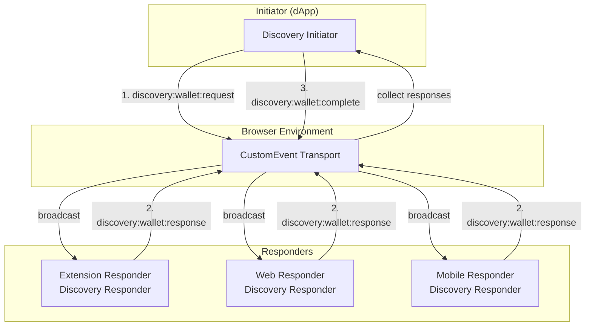
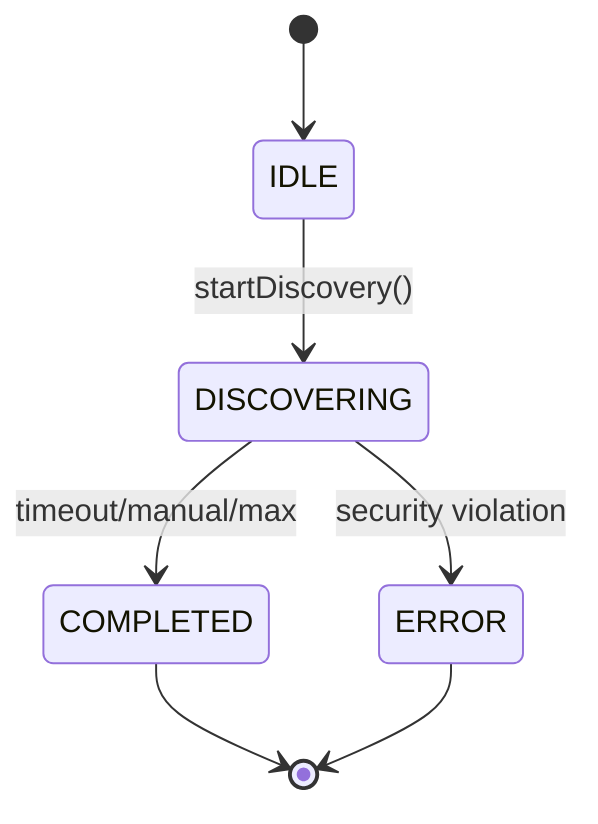

# WalletMesh Discovery Protocol

## Abstract

This document specifies the WalletMesh discovery protocol that enables initiators (dApps) to discover and connect to responders (wallets) across any blockchain network. The protocol provides a secure, capability-first discovery mechanism that prioritizes **security through simplicity** while maintaining universal compatibility across all blockchain technologies.

## Table of Contents

1. [Overview](#overview)
2. [Protocol Architecture](#protocol-architecture)
3. [Message Formats](#message-formats)
4. [State Machine](#state-machine)
5. [Security Model](#security-model)
6. [Transport Configuration](#transport-configuration)
7. [Implementation Guide](#implementation-guide)
8. [Error Handling](#error-handling)
9. [Examples](#examples)
10. [Best Practices](#best-practices)

## Overview

### Problem Statement

Current wallet discovery mechanisms suffer from:
- **Blockchain-specific**: Limited to single blockchain ecosystems
- **Centralized**: Rely on hardcoded provider lists
- **Limited**: Cannot express multi-chain capabilities effectively
- **Insecure**: Lack proper origin validation and anti-spoofing measures

### Solution

The WalletMesh discovery protocol provides:
- **Universal Compatibility**: Support for any blockchain technology
- **Multi-Chain Native**: Wallets can support multiple blockchains
- **Capability-First**: Privacy-preserving capability matching
- **Secure by Design**: 4-state machine with security enforcement
- **Transport Agnostic**: Multiple connection methods supported

### Key Concepts

1. **Initiator**: Application (dApp) seeking wallet connections
2. **Responder**: Wallet or service provider offering blockchain capabilities
3. **Capability Matching**: Privacy-preserving intersection of requirements
4. **Single-Use Sessions**: Each discovery session is valid for one cycle only
5. **Transport Configuration**: How to establish connections after discovery

## Protocol Architecture

### Components



### Protocol Version

Current version: **0.1.0**

All messages include version for compatibility checking.

## Message Formats

### Discovery Request Event

Sent by initiators to discover qualified responders.

```typescript
interface DiscoveryRequestEvent {
  type: 'discovery:wallet:request';
  version: '0.1.0';
  sessionId: string;      // crypto.randomUUID()
  
  // Required capabilities
  required: {
    chains: string[];     // ['eip155:1', 'solana:5eykt4UsFv8P8NJdTREpY1vzqKqZKvdp']
    features: string[];   // ['account-management', 'transaction-signing']
    interfaces: string[]; // ['eip-1193', 'eip-6963']
  };
  
  // Optional preferences
  optional?: {
    chains?: string[];
    features?: string[];
  };
  
  // Request context
  origin: string;         // Initiator origin
  initiatorInfo: {
    name: string;
    url: string;
    icon?: string;        // Data URI
    description?: string;
  };
}
```

### Discovery Response Event

Sent by responders that can fulfill ALL required capabilities.

```typescript
interface DiscoveryResponseEvent {
  type: 'discovery:wallet:response';
  version: '0.1.0';
  sessionId: string;           // Must match request
  
  // Responder identification
  responderId: string;         // Ephemeral UUID
  rdns: string;                // Reverse DNS identifier
  name: string;
  icon: string;                // Data URI
  
  // Capability intersection (only what was requested AND supported)
  matched: {
    required: {
      chains: string[];
      features: string[];
      interfaces: string[];
    };
    optional?: {
      chains?: string[];
      features?: string[];
    };
  };
  
  // Transport configuration
  transportConfig?: TransportConfig;
  
  // Optional metadata
  responderVersion?: string;
  description?: string;
}
```

### Discovery Complete Event

Sent when discovery session completes.

```typescript
interface DiscoveryCompleteEvent {
  type: 'discovery:wallet:complete';
  version: '0.1.0';
  sessionId: string;
  reason: 'timeout' | 'manual-stop' | 'max-responders';
  respondersFound: number;
}
```

### Discovery Error Event

Sent when discovery encounters an error.

```typescript
interface DiscoveryErrorEvent {
  type: 'discovery:wallet:error';
  version: '0.1.0';
  sessionId: string;
  errorCode: number;
  errorMessage: string;
  errorCategory: 'protocol' | 'security' | 'capability' | 'connection' | 'internal';
}
```

## State Machine

The protocol uses a 4-state machine with terminal states for security.

### States

1. **IDLE**: No active discovery session
2. **DISCOVERING**: Actively collecting responder announcements
3. **COMPLETED**: Discovery finished successfully (terminal)
4. **ERROR**: Discovery failed due to security violation (terminal)

### State Transitions



### Key Properties

- **Single-Use Sessions**: Once COMPLETED or ERROR, must create new instance
- **Automatic Timeouts**: Default 3-second discovery timeout
- **Security Enforcement**: Duplicate responses trigger ERROR state
- **Event-Driven**: State changes emit events for monitoring

### InitiatorStateMachine

The `InitiatorStateMachine` class extends the base state machine with automatic message dispatch:

- `IDLE → DISCOVERING`: Automatically sends discovery request
- `DISCOVERING → COMPLETED`: Automatically sends completion event
- `DISCOVERING → ERROR`: Automatically sends error event

## Security Model

### Core Security Properties

1. **Origin Validation**: All requests validated against security policy
2. **Session Uniqueness**: UUID v4 session IDs prevent replay
3. **First Response Wins**: Duplicate responses trigger security error
4. **Rate Limiting**: Per-origin request throttling
5. **Silent Failures**: Security violations logged but not exposed

### Threat Mitigation

| Threat | Mitigation |
|--------|------------|
| Origin Spoofing | HTTPS requirement + origin allowlists |
| Session Replay | Session tracking with one-time use |
| Response Flooding | Rate limiting per origin |
| Capability Enumeration | Silent non-response for non-matches |
| Duplicate Responses | First response wins + error state |

### Security Policy Configuration

```typescript
interface SecurityPolicy {
  allowedOrigins?: string[];      // Explicit allowlist
  requireHttps?: boolean;         // HTTPS enforcement
  rateLimit?: {
    enabled: boolean;
    maxRequests: number;          // Per window
    windowMs: number;             // Time window
  };
}
```

## Transport Configuration

Responders provide transport configuration for connection establishment.

```typescript
interface TransportConfig {
  type: 'extension' | 'popup' | 'websocket' | 'injected';
  
  // Extension transport
  extensionId?: string;           // 32-char Chrome extension ID
  
  // Popup transport
  popupUrl?: string;              // HTTPS URL for popup
  
  // WebSocket transport
  websocketUrl?: string;          // WSS endpoint
  
  // Adapter configuration
  walletAdapter?: string;         // Adapter class name
  adapterConfig?: Record<string, unknown>;
}
```

### Transport Types

1. **Extension**: Browser extension via chrome.runtime
2. **Popup**: Popup window for web wallets
3. **WebSocket**: Direct WebSocket connection
4. **Injected**: Window-injected providers

## Implementation Guide

### Initiator Implementation

```typescript
import { DiscoveryInitiator } from '@walletmesh/discovery';

// Create initiator with requirements
const initiator = new DiscoveryInitiator({
  requirements: {
    chains: ['eip155:1', 'solana:5eykt4UsFv8P8NJdTREpY1vzqKqZKvdp'],
    features: ['account-management', 'transaction-signing'],
    interfaces: ['eip-1193']
  },
  initiatorInfo: {
    name: 'My DApp',
    url: 'https://mydapp.com',
    icon: 'data:image/svg+xml;base64,...'
  }
});

// Start discovery
const responders = await initiator.startDiscovery();

// User selects a responder
const selected = responders[0];

// Use transport config to establish connection
// (handled by modal-core or modal-react)
```

### Responder Implementation

```typescript
import { DiscoveryResponder } from '@walletmesh/discovery';

// Create responder with capabilities
const responder = new DiscoveryResponder({
  responderInfo: {
    rdns: 'com.example.wallet',
    name: 'Example Wallet',
    icon: 'data:image/png;base64,...',
    uuid: crypto.randomUUID(),
    version: '1.0.0',
    protocolVersion: '0.1.0',
    type: 'extension',
    chains: [/* chain capabilities */],
    features: [/* wallet features */],
    transportConfig: {
      type: 'extension',
      extensionId: 'abcdefghijklmnopqrstuvwxyz'
    }
  },
  securityPolicy: {
    allowedOrigins: ['https://trusted-app.com'],
    requireHttps: true
  }
});

// Start listening
responder.startListening();
```

### Logger Interface

Both components support custom logging:

```typescript
interface Logger {
  debug(message: string, data?: unknown): void;
  info(message: string, data?: unknown): void;
  warn(message: string, data?: unknown): void;
  error(message: string, error?: unknown): void;
}

// Inject custom logger
const initiator = new DiscoveryInitiator({
  // ... config
  logger: myCustomLogger
});
```

## Error Handling

### Error Codes

| Code Range | Category | Description |
|------------|----------|-------------|
| 1000-1999 | Protocol | Message format and protocol errors |
| 2000-2999 | Security | Security violations and access control |
| 3000-3999 | Capability | Capability matching failures |
| 4000-4999 | Connection | Connection and transport errors |
| 5000-5999 | Internal | Internal implementation errors |

### Common Error Codes

- `1001`: Invalid message format
- `1002`: Unsupported protocol version
- `2001`: Origin validation failed
- `2002`: Rate limit exceeded
- `2003`: Session replay detected
- `2004`: Duplicate response detected
- `3001`: Required capability not supported

### Error Recovery

```typescript
try {
  const responders = await initiator.startDiscovery();
} catch (error) {
  if (error instanceof DuplicateResponseError) {
    // Security violation - create new session
    console.error('Duplicate response detected:', error.duplicateDetails);
  } else if (error.code === 4001) {
    // Connection timeout - retry with new session
    const newInitiator = new DiscoveryInitiator(config);
    const responders = await newInitiator.startDiscovery();
  }
}
```

## Examples

### Basic Discovery Flow

```typescript
// 1. Initiator broadcasts request
const request: DiscoveryRequestEvent = {
  type: 'discovery:wallet:request',
  version: '0.1.0',
  sessionId: crypto.randomUUID(),
  required: {
    chains: ['eip155:1'],
    features: ['account-management', 'transaction-signing'],
    interfaces: ['eip-1193']
  },
  origin: 'https://mydapp.com',
  initiatorInfo: {
    name: 'My DApp',
    url: 'https://mydapp.com',
    icon: 'data:image/svg+xml;base64,...'
  }
};

// 2. Qualified responder announces
const response: DiscoveryResponseEvent = {
  type: 'discovery:wallet:response',
  version: '0.1.0',
  sessionId: request.sessionId,
  responderId: crypto.randomUUID(),
  rdns: 'com.example.wallet',
  name: 'Example Wallet',
  icon: 'data:image/png;base64,...',
  matched: {
    required: {
      chains: ['eip155:1'],
      features: ['account-management', 'transaction-signing'],
      interfaces: ['eip-1193']
    }
  },
  transportConfig: {
    type: 'extension',
    extensionId: 'nkbihfbeogaeaoehlefnkodbefgpgknn'
  }
};

// 3. Discovery completes
const complete: DiscoveryCompleteEvent = {
  type: 'discovery:wallet:complete',
  version: '0.1.0',
  sessionId: request.sessionId,
  reason: 'timeout',
  respondersFound: 1
};
```

### Multi-Chain Discovery

```typescript
const requirements = {
  chains: [
    'eip155:1',                                    // Ethereum mainnet
    'eip155:137',                                  // Polygon
    'solana:5eykt4UsFv8P8NJdTREpY1vzqKqZKvdp',   // Solana mainnet
    'aztec:sandbox'                                // Aztec sandbox
  ],
  features: ['account-management', 'cross-chain-swaps'],
  interfaces: ['eip-1193', 'solana-wallet-standard']
};
```

### Chain Identifiers (CAIP-2)

```typescript
// EVM chains
'eip155:1'                                         // Ethereum Mainnet
'eip155:11155111'                                  // Sepolia Testnet
'eip155:137'                                       // Polygon
'eip155:42161'                                     // Arbitrum

// Solana
'solana:5eykt4UsFv8P8NJdTREpY1vzqKqZKvdp'        // Mainnet
'solana:EtWTRABZaYq6iMfeYKouRu166VU2xqa1'        // Devnet

// Aztec
'aztec:sandbox'                                    // Local sandbox
'aztec:testnet'                                    // Testnet

// Bitcoin
'bip122:000000000019d6689c085ae165831e93'        // Mainnet
```

## Best Practices

### For Initiators

1. **Create fresh instances**: Never reuse DiscoveryInitiator instances
2. **Handle timeouts gracefully**: Default 3-second timeout
3. **Validate responses**: Check matched capabilities before connecting
4. **Use specific requirements**: Only request what you actually need
5. **Provide clear initiator info**: Help users make informed decisions

### For Responders

1. **Implement rate limiting**: Protect against discovery spam
2. **Validate origins**: Use HTTPS and allowlists for security
3. **Provide accurate capabilities**: Only announce what you support
4. **Use stable RDNS**: Consistent reverse DNS identifiers
5. **Include transport config**: Enable automatic connection

### Security Best Practices

1. **Never expose private keys**: Discovery is for capabilities only
2. **Validate all inputs**: Sanitize and validate all message fields
3. **Log security events**: Track violations for analysis
4. **Fail silently**: Don't expose capability information on failure
5. **Use secure transports**: HTTPS for web, secure channels for native

### Performance Guidelines

1. **Discovery timeout**: 3 seconds is recommended
2. **Response time**: Respond within 500ms if possible
3. **Message size**: Keep under 10KB for performance
4. **Resource cleanup**: Clear sessions after 1 hour
5. **Rate limits**: 10 requests per minute per origin

## Migration Guide

### From Legacy Protocols

1. **Update event names**: Use `discovery:wallet:*` format
2. **Add capability structure**: Use nested `required`/`optional`
3. **Include transport config**: Specify connection method
4. **Implement state machine**: Use 4-state model
5. **Add security policy**: Configure origin validation

### Version Compatibility

- Protocol version in all messages enables compatibility checking
- Responders should ignore unsupported protocol versions
- Future versions will maintain backward compatibility

## Constants Reference

### Features (RESPONDER_FEATURES)

- `account-management`: Basic account operations
- `transaction-signing`: Sign and broadcast transactions
- `message-signing`: Sign arbitrary messages
- `hardware-wallet`: Hardware security module
- `multi-signature`: Multi-sig support
- `batch-transactions`: Batch operations
- `gasless-transactions`: Meta-transactions
- `cross-chain-swaps`: Native cross-chain

### Interfaces (RESPONDER_INTERFACES)

- `eip-1193`: Ethereum Provider API
- `eip-6963`: EIP-6963 Discovery
- `solana-wallet-standard`: Solana standard
- `aztec-wallet-api-v1`: Aztec wallet API

## Conclusion

The WalletMesh discovery protocol provides a secure, universal mechanism for wallet discovery across all blockchain networks. By prioritizing simplicity and focusing on real-world security threats, the protocol enables reliable wallet connections while maintaining user privacy and security.

Key advantages:
- **Universal**: Works with any blockchain
- **Secure**: 4-state machine with security enforcement
- **Private**: Capability intersection preserves privacy
- **Simple**: Clear implementation reduces bugs
- **Flexible**: Multiple transport options

For implementation details, see the [@walletmesh/discovery](https://www.npmjs.com/package/@walletmesh/discovery) package.