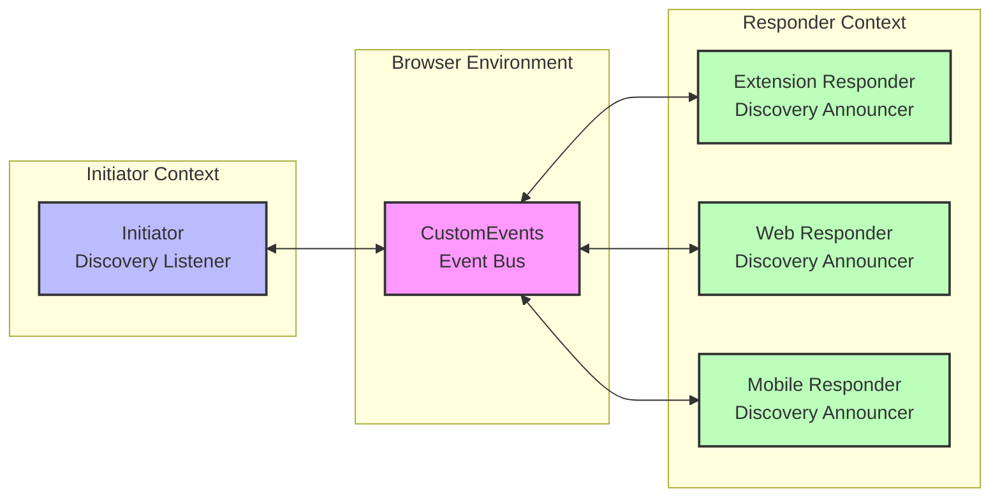
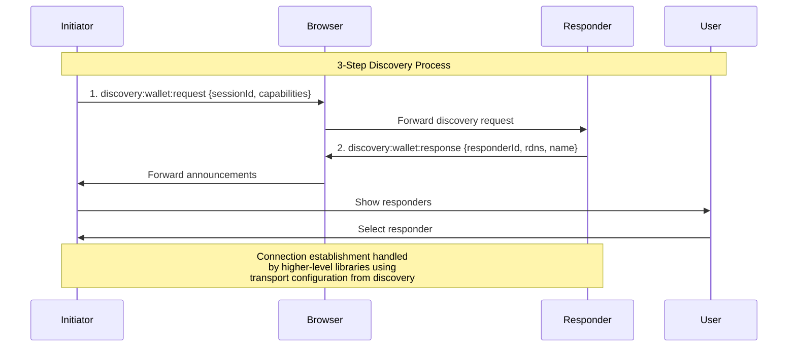

# Generic Cross-Blockchain Discovery Protocol

## Abstract

This document specifies a generic discovery protocol that enables initiators (applications) to discover and connect to responders (service providers like wallets) across any blockchain network. The protocol provides a secure discovery mechanism that prioritizes **security through simplicity** while maintaining universal compatibility across all blockchain technologies and use cases beyond just wallets.

## Related Documents

This is the main protocol specification document, part of a three-document suite:

1. **PROTOCOL_SPECIFICATION.md** (this document) - Defines the protocol's architecture, concepts, and design rationale
2. **[PROTOCOL_STATE_MACHINE.md](PROTOCOL_STATE_MACHINE.md)** - Provides formal state machine definitions and security properties
3. **[PROTOCOL_IMPLEMENTATION_GUIDE.md](PROTOCOL_IMPLEMENTATION_GUIDE.md)** - Contains concrete implementation requirements and technical details

Implementers should read all three documents to fully understand and correctly implement the protocol.

## Table of Contents

1. [Overview](#overview)
2. [Protocol Architecture](#protocol-architecture)
3. [Wallet Information Schema](#wallet-information-schema)
4. [Discovery Flow](#discovery-flow)
5. [Message Formats](#message-formats)
6. [Security Model](#security-model)
7. [Error Handling](#error-handling)
8. [Formal Verification](#formal-verification)
9. [Blockchain Abstraction](#blockchain-abstraction)
10. [Practical Security](#practical-security)
11. [Implementation Guidelines](#implementation-guidelines)
12. [Migration from Complex Protocol](#migration-from-complex-protocol)

## Overview

### Problem Statement

Current discovery mechanisms are either:
- **Blockchain-specific**: EIP-6963 works only for Ethereum providers
- **Centralized**: Rely on hardcoded provider lists or registries
- **Limited**: Cannot express multi-chain capabilities effectively
- **Insecure**: Lack proper origin validation and anti-spoofing measures

### Solution Goals

1. **Universal Compatibility**: Support providers for any blockchain technology
2. **Multi-Chain Native**: Handle providers supporting multiple blockchains
3. **Secure Communication**: Robust security model for cross-origin discovery
4. **CSP Compliance**: Full compatibility with Content Security Policy
5. **Clear Implementation**: Minimize implementation bugs through clarity
6. **Formally Verifiable**: Protocol can be formally modeled and verified
7. **Practical Security**: Address real-world threats effectively

### Design Philosophy

The protocol embraces **security through simplicity**:

- **4 core states**: Minimizes state transition complexity (IDLE → DISCOVERING → COMPLETED/ERROR - terminal states)
- **2 message types**: Reduces parser complexity and attack surface
- **Flat JSON structures**: Eliminates nested parsing vulnerabilities
- **Clear separation**: Discovery only discovers, connection is handled separately
- **Practical focus**: Addresses real security threats

## Protocol Architecture

### Core Components

1. **Discovery Listener**: Used by initiators to discover available responders
2. **Discovery Announcer**: Used by responders to announce their presence
3. **State Machine**: 4 states (IDLE → DISCOVERING → COMPLETED/ERROR - terminal)

### Communication Model

The protocol uses an **event-based** communication system:



### Event Flow



Communication happens through browser CustomEvents for same-origin efficiency and security. This approach:
- Provides true broadcasting to all responders simultaneously
- Maintains clean namespace separation
- Offers 7-8x better performance than cross-origin messaging
- Eliminates security risks from wildcard origin targets

## Responder Information Schema

### Responder Schema

```typescript
interface ResponderInfo {
  id: string;           // Unique responder identifier
  rdns: string;         // Reverse domain name (anti-spoofing)
  name: string;         // Human-readable name
  icon: string;         // Data URI or URL
  chains: string[];     // Supported chain identifiers
}
```

### Transport Configuration

Responders can optionally specify how initiators should connect to them:

```typescript
interface TransportConfig {
  type: 'extension' | 'popup' | 'websocket' | 'injected';
  extensionId?: string;        // Chrome extension ID (for extension transport)
  popupUrl?: string;           // Popup window URL (for popup transport)
  websocketUrl?: string;       // WebSocket endpoint URL (for websocket transport)
  walletAdapter?: string;      // Wallet adapter class name (e.g., 'MetaMaskAdapter')
  adapterConfig?: Record<string, unknown>;  // Additional adapter configuration
}
```

**Transport Types**:
- **extension**: Browser extension (requires extensionId)
- **popup**: Popup window (requires popupUrl)
- **websocket**: WebSocket connection (requires websocketUrl)
- **injected**: Injected provider (e.g., window.ethereum)

### Chain Identifiers

Standardized chain identifiers:
- **Ethereum**: `evm:1`, `evm:137`, `evm:56` (chainId-based)
- **Solana**: `solana:mainnet`, `solana:devnet`, `solana:testnet`
- **Aztec**: `aztec:mainnet`, `aztec:testnet`
- **Bitcoin**: `bitcoin:mainnet`, `bitcoin:testnet`

### Responder Types

```typescript
type ResponderType = 'extension' | 'web' | 'mobile' | 'hardware' | 'desktop';
```

### Provider Interfaces

Provider interfaces enable initiators and responders to negotiate compatible communication protocols:

#### Interface Negotiation Flow
1. **Initiator declares** supported interfaces in discovery request
2. **Responder responds** with subset it can provide
3. **Initiator selects** one interface in connection request
4. **Connection established** using chosen interface

#### Common Provider Interfaces
- **EIP-1193**: Ethereum provider standard (window.ethereum)
- **EIP-6963**: Provider discovery and multi-wallet support
- **solana-wallet-standard**: Solana wallet interface
- **WalletConnect v2**: QR code and deep link connections
- **Cosmos Kit**: Cosmos ecosystem standard

#### Example Flow
```typescript
// 1. Initiator supports multiple interfaces
discoveryRequest.interfaces = ['eip-1193', 'eip-6963', 'walletconnect-v2'];

// 2. Responder supports subset
responderAnnouncement.interfaces = ['eip-1193', 'eip-6963']; // No WalletConnect

// 3. Initiator chooses preferred interface
connectionRequest.interface = 'eip-6963'; // Selected from responder's list
```

**Note**: Interface negotiation is optional. Omitting interfaces assumes default provider for the chain type.

## Discovery Flow

### Four-State Discovery Process

```
1. IDLE        → No active session
2. DISCOVERING → Collecting responder announcements  
3. COMPLETED   → Discovery finished (TERMINAL STATE)
4. ERROR       → Discovery failed (TERMINAL STATE)
```

### Detailed Flow

1. **Discovery Initiation**
   - Initiator generates unique session ID
   - Broadcasts discovery request with required capabilities
   - Waits for responder announcements

2. **Responder Evaluation**
   - Responders validate origin and capabilities
   - Qualified responders announce their presence
   - Unqualified responders remain silent

3. **User Selection**
   - Initiator presents qualified responders to user
   - User selects preferred responder
   - Initiator sends connection request

4. **Connection Establishment** (Handled by Higher-Level Libraries)
   - Connection established using transport configuration from discovery
   - User consent and approval handled by modal-core/modal-react

### Transport Configuration Usage

When a responder announces itself, it can include transport configuration to inform the initiator how to establish a connection:

1. **During Discovery**: Responder includes `transportConfig` in announcement
2. **After Selection**: Initiator uses transport config to determine connection method
3. **Connection**: Frontend/browser establishes connection to wallet using specified transport

**Example Flow**:
```
Initiator discovers MetaMask extension:
- transportConfig.type: 'extension'
- transportConfig.extensionId: 'nkbihfbeogaeaoehlefnkodbefgpgknn'
- Frontend uses Chrome Extension API to connect

Initiator discovers WalletConnect wallet:
- transportConfig.type: 'websocket'
- transportConfig.websocketUrl: 'wss://relay.walletconnect.com'
- Frontend establishes WebSocket connection
```

## Message Formats

### Two Core Messages

```typescript
// 1. Discovery Request Event (Initiator → Responders)
interface DiscoveryRequestEvent {
  type: 'discovery:wallet:request';
  sessionId: string;    // crypto.randomUUID()
  chains: string[];     // ['evm:1', 'evm:137']
  origin: string;       // Initiator origin
  interfaces?: string[];// ['eip-1193', 'eip-6963'] - Initiator supported interfaces
}

// 2. Discovery Response Event (Responder → Initiator)
interface DiscoveryResponseEvent {
  type: 'discovery:wallet:response';
  responderId: string;      // crypto.randomUUID() (ephemeral)
  sessionId: string;        // Must match request
  rdns: string;             // 'com.example.responder'
  name: string;             // 'Example Responder'
  icon: string;             // Data URI
  chains: string[];         // Supported chains from request
  interfaces?: string[];    // Subset of initiator's interfaces that responder supports
  transportConfig?: TransportConfig;  // Transport configuration for connection
}
```

### Discovery Session Events

In addition to the two core discovery messages, the protocol also defines session lifecycle events that provide observability into discovery session status:

```typescript
// 3. Discovery Completed Event
interface DiscoveryCompletedEvent {
  type: 'discovery:wallet:complete';
  version: string;          // Protocol version
  sessionId: string;        // Session identifier
  reason: 'timeout' | 'manual-stop' | 'max-responders';
  respondersFound: number;  // Number of responders discovered
}

// 4. Discovery Error Event
interface DiscoveryErrorEvent {
  type: 'discovery:wallet:error';
  version: string;          // Protocol version
  sessionId: string;        // Session identifier
  errorCode: number;        // Standard error code
  errorMessage: string;     // Human-readable error description
  errorCategory: 'protocol' | 'security' | 'capability' | 'connection' | 'internal';
}
```

These events are emitted when:
- **Discovery Completed**: Discovery session transitions to COMPLETED state
- **Discovery Error**: Discovery session encounters an error (e.g., duplicate response detection)

### Connection Handling

**Note**: Connection establishment is handled separately by higher-level libraries (e.g., modal-core, modal-react) using the `transportConfig` information provided in the responder announcement. The discovery protocol only provides the information needed to know HOW to connect - the actual connection is a separate concern.

### Single-Use Session Pattern

The protocol implements a **single-use session pattern** for enhanced security and simplified state management:

- **Terminal States**: `COMPLETED` and `ERROR` states are terminal - sessions cannot be reused
- **Fresh Instances**: Each discovery operation requires a new `DiscoveryInitiator` instance
- **Error Prevention**: Attempting to reuse a completed/error session throws: `"Cannot reuse discovery session in {STATE} state. Create a new DiscoveryInitiator instance for each discovery session."`
- **Security Benefits**: Prevents state corruption, simplifies security analysis, eliminates reuse vulnerabilities

**Usage Pattern:**
```typescript
// ✅ Correct: New instance for each discovery
const listener1 = new DiscoveryInitiator(config);
const results1 = await listener1.startDiscovery();

const listener2 = new DiscoveryInitiator(config);  // Fresh instance
const results2 = await listener2.startDiscovery();

// ❌ Incorrect: Reusing completed session
const listener = new DiscoveryInitiator(config);
await listener.startDiscovery();  // Completes successfully
await listener.startDiscovery();  // Throws error - cannot reuse
```

### Message Properties

- **Flat structure**: No nested objects to reduce parsing complexity
- **Required fields only**: No optional complexity
- **Standard types**: String, array, no custom objects
- **Size limits**: 64KB max per message

## Security Model

### Six Core Security Properties

The protocol focuses on the security properties that matter:

1. **Origin Validation**: Browser enforces message origin
2. **Session Uniqueness**: Each discovery uses unique session ID
3. **User Consent**: No connections without explicit user approval
4. **Session Isolation**: One connection per responder at a time
5. **First Response Wins**: Duplicate responses detected and logged as suspicious
6. **Identity Verification**: RDNS allows user verification

### Security Analysis

**✅ What the Protocol Defends Against:**
- Origin spoofing (browser enforces origin)
- Session replay attacks (unique session IDs per discovery)
- Session hijacking (session isolation)
- Message tampering (browser validates origin)
- Responder spoofing (RDNS verification)
- Duplicate responses (first response wins with suspicious activity logging)

**⚠️ What Requires Additional Measures:**
- Visual phishing (wallet reputation systems)
- Timing attacks (rate limiting)
- Supply chain attacks (code signing)
- Social engineering (user education)

### First Response Wins Security Model

The protocol implements a "first response wins" security model that provides practical security benefits:

**Key Properties:**
- **Session-based tracking**: Responders are tracked by their RDNS identifier per discovery session
- **Duplicate detection**: Multiple responses from the same responder (RDNS) are detected and logged
- **Non-blocking approach**: Duplicate responses are processed but flagged as suspicious activity
- **Session isolation**: Duplicate tracking is cleared between discovery sessions

**Implementation:**
```typescript
// Initiator tracks seen responders per session
const seenResponders = new Map<string, number>(); // rdns -> response count

// On response received
const responseCount = seenResponders.get(response.rdns) || 0;
if (responseCount > 0) {
  console.warn('[WalletMesh] Duplicate response detected from responder', {
    rdns: response.rdns,
    responderId: response.responderId,
    responseCount: responseCount + 1,
    sessionId: response.sessionId,
  });
}
seenResponders.set(response.rdns, responseCount + 1);
```

**Security Benefits:**
- **Honest about limitations**: No false security from unsigned responses
- **Practical threat detection**: Identifies potentially malicious duplicate responses
- **User awareness**: Logs provide visibility into suspicious activity
- **Maintains functionality**: Legitimate use cases continue to work

### Security Through Simplicity

The protocol achieves strong security through design clarity:

- **Minimal state space**: Reduces opportunities for bugs
- **Clear implementation**: Straightforward logic aids correctness
- **Efficient auditing**: Security review is thorough yet quick
- **Reduced attack surface**: Focused functionality minimizes vulnerabilities
- **No timestamp complexity**: Eliminates timing-based vulnerabilities

## Error Handling

### Timeout Handling

- **Discovery timeout**: 3 seconds for responder announcements
- **Operation timeout**: Configurable per implementation

### Error Categories and Codes

The protocol defines standardized error codes for consistent error handling:

- **1000-1999**: Protocol errors (invalid messages, wrong state)
- **2000-2999**: Security errors (origin validation, rate limiting)
- **3000-3999**: Capability errors (unsupported chains, missing features)
- **4000-4999**: Connection errors (transport failures, timeouts)
- **5000-5999**: Internal errors (unexpected states, system failures)

### Common Error Codes

| Code | Category | Description |
|------|----------|-------------|
| 1001 | Protocol | Invalid message format |
| 1002 | Protocol | Wrong protocol state |
| 1003 | Protocol | Session not found |
| 2001 | Security | Origin validation failed |
| 2002 | Security | Rate limit exceeded |
| 2003 | Security | Session replay attempt |
| 2004 | Security | Duplicate response detected |
| 3001 | Capability | Capability not supported |
| 3002 | Capability | No matching chains |
| 4001 | Connection | Connection failed |
| 4002 | Connection | Connection timeout |
| 5001 | Internal | Internal error |

### Error Recovery

- **Discovery retry**: Start new session with different ID
- **Silent failures**: Invalid requests are ignored (privacy)
- **Retryable errors**: Errors include retryable flag

### Security Failures

- **Invalid origin**: Silent rejection (error 2001)
- **Malformed messages**: Ignore and log (error 1001)
- **Invalid session**: Reject silently (error 1003)
- **Session replay**: Detect and ignore (error 2003)
- **Duplicate response**: Transition to ERROR state and invalidate session (error 2004)

## Security Event Logging

The protocol supports comprehensive security event logging for monitoring and auditing:

### Security Event Types

- **origin-blocked**: Origin validation failure
- **rate-limit-exceeded**: Too many requests from origin
- **session-replay**: Attempt to reuse session ID
- **duplicate-response**: Multiple responses from same responder
- **origin-spoofing**: Attempt to spoof origin
- **capability-enumeration**: Attempt to enumerate capabilities

### Event Severity Levels

- **low**: Informational, minimal impact
- **medium**: Potentially concerning, monitor
- **high**: Significant security concern, investigate
- **critical**: Immediate security threat, take action

### Event Structure

```typescript
interface SecurityEvent {
  timestamp: number;
  eventType: string;
  origin: string;
  sessionId?: string;
  details?: Record<string, unknown>;
  severity: 'low' | 'medium' | 'high' | 'critical';
}
```

## Formal Verification

### Verification with Quint

The protocol can be formally verified using the Quint specification language:

```quint
module DiscoveryProtocol {
  type State = "IDLE" | "DISCOVERING" | "COMPLETED"
  
  // Security invariants
  invariant OriginValidation = 
    all(messages, m => m.origin == m.event.origin)
  
  invariant UserConsentRequired =
    all(connections, c => c.userApproved == true)
  
  invariant SessionIsolation =
    all(responders, r => r.connections.size <= 1)
}
```

### Verification Properties

- **Safety**: No unauthorized connections
- **Liveness**: Valid discovery eventually completes
- **Security**: All security properties maintained
- **Correctness**: State transitions are valid

## Blockchain Abstraction

### Universal Chain Support

The protocol supports any blockchain through simple identifiers:

```typescript
// EVM chains
'evm:1'      // Ethereum Mainnet
'evm:137'    // Polygon
'evm:56'     // BSC

// Account-based chains
'solana:mainnet'
'solana:devnet'
'aztec:mainnet'
'near:mainnet'

// UTXO chains
'bitcoin:mainnet'
'bitcoin:testnet'
'litecoin:mainnet'
```

### Multi-Chain Responders

Responders can support multiple chains:

```typescript
const responderChains = [
  'evm:1',        // Ethereum
  'evm:137',      // Polygon
  'solana:mainnet' // Solana
];
```

## Practical Security

### Real-World Threats

The protocol addresses real-world security threats:

1. **Visual Phishing**: Wallet reputation and verification systems
2. **Supply Chain**: Code signing and verification
3. **Social Engineering**: User education and warnings
4. **Timing Attacks**: Rate limiting and request throttling

### Reputation Systems

```typescript
interface ResponderReputation {
  rdns: string;
  verifiedDeveloper: boolean;
  userCount: number;
  securityAudits: string[];
  reportedIssues: number;
}
```

### User Education

- Clear warnings about new/unknown responders
- RDNS verification guidance
- Security best practices
- Phishing detection tips

## Implementation Guidelines

### Implementation Checklist

1. **Generate unique session IDs** using `crypto.randomUUID()`
2. **Validate origins** on all incoming messages
3. **Track used sessions** to prevent replay attacks (responder-side)
4. **Track seen responders** to detect duplicate responses (initiator-side)
5. **Implement timeouts** for all operations
6. **Add logging** for security events

### Common Pitfalls

- **Don't trust client data**: Always validate origins
- **Don't reuse session IDs**: Generate new ones each discovery session
- **Don't reuse discovery sessions**: Create new DiscoveryInitiator instances for each discovery
- **Don't ignore security events**: Log duplicate responses and other suspicious activity
- **Don't assume response authenticity**: Unsigned responses can be spoofed

### Testing

- Test with multiple responders and chains
- Test timeout scenarios
- Test security validation
- Test error recovery paths


## Conclusion

The protocol demonstrates that **security through simplicity** is highly effective. By focusing on essential security properties and maintaining design clarity, the protocol achieves:

1. **Strong real-world security** through reduced implementation complexity
2. **Clear implementation** with straightforward flow
3. **Efficient auditability** through transparent design
4. **Universal compatibility** across all blockchain technologies
5. **Practical security** addressing actual threats

The protocol proves that clear, focused design leads to more secure implementations in practice.