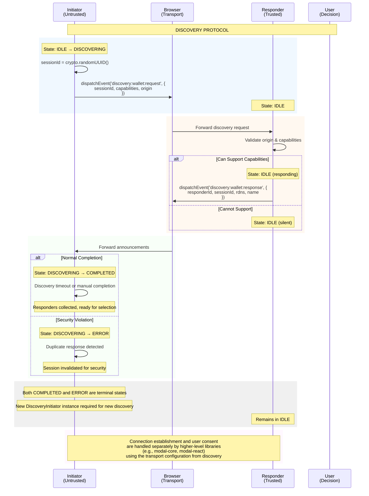

# Discovery Protocol State Machine

## Overview

This document defines the state machine for the Generic Cross-Blockchain Discovery Protocol, providing formal definitions of states, transitions, and security properties.

## Related Documents

This is the formal state machine specification, part of a three-document suite:

1. **[PROTOCOL_SPECIFICATION.md](PROTOCOL_SPECIFICATION.md)** - Main protocol specification with architecture and concepts
2. **PROTOCOL_STATE_MACHINE.md** (this document) - Formal state machine definitions and security properties
3. **[PROTOCOL_IMPLEMENTATION_GUIDE.md](PROTOCOL_IMPLEMENTATION_GUIDE.md)** - Concrete implementation requirements and technical details

## Design Philosophy

The protocol embraces the principle that **security through simplicity** is more effective than complex theoretical defenses. With only 4 states, the protocol:

- Minimizes potential state transition bugs
- Makes the protocol easier to audit and verify
- Improves implementation security with fail-safe error handling
- Maintains all essential security properties
- Provides clear error recovery mechanisms for security violations

## Actor Security Zones

- **Initiator**: Untrusted web application origin
- **Responder**: Trusted service provider extension/application (separate security context)  
- **User**: Human operator making trust decisions
- **Browser**: Neutral message transport layer (using CustomEvents)

## State Machine

### Four Core States

```
1. IDLE        → Waiting for discovery
2. DISCOVERING → Active discovery session
3. COMPLETED   → Discovery finished, responders collected
4. ERROR       → Discovery failed due to security violations or protocol errors
```

### State Machine Diagram



## State Definitions

### Core States (4 Total)

| State | Actor | Description | Valid Transitions |
|-------|-------|-------------|-------------------|
| `IDLE` | Initiator | No active session | → `DISCOVERING` |
| `DISCOVERING` | Initiator | Collecting responder announcements | → `COMPLETED`, → `ERROR` |
| `COMPLETED` | Initiator | Discovery finished, responders collected | **TERMINAL** |
| `ERROR` | Initiator | Discovery failed due to security violations | **TERMINAL** |

**Note**: Responders remain stateless during discovery. They simply listen for requests and announce when they match capabilities.

### State Transition Rules

1. **IDLE → DISCOVERING**: Initiator broadcasts discovery request with session ID
2. **DISCOVERING → COMPLETED**: Discovery timeout reached or manually completed
3. **DISCOVERING → ERROR**: Security violation detected (e.g., duplicate responses)
4. **COMPLETED**: **TERMINAL STATE** - Session cannot be reused, new DiscoveryInitiator instance required
5. **ERROR**: **TERMINAL STATE** - Session cannot be reused, new DiscoveryInitiator instance required

### Single-Use Session Pattern

The protocol implements a **single-use session pattern** where discovery sessions cannot be reused after reaching terminal states:

- **COMPLETED** and **ERROR** are terminal states
- Attempting to start discovery from these states throws an error: `"Cannot reuse discovery session in {STATE} state. Create a new DiscoveryInitiator instance for each discovery session."`
- This pattern prevents state corruption and simplifies security analysis
- Each discovery operation requires a fresh DiscoveryInitiator instance

**Note**: Connection establishment (user approval, etc.) is handled separately by higher-level libraries.

## Message Definitions

### Two Core Messages

```typescript
// 1. Capability Request (Initiator → Responders)
interface DiscoveryRequestEvent {
  type: 'discovery:wallet:request';
  sessionId: string;    // UUID v4
  chains: string[];     // e.g. ['evm:1', 'evm:137']
  origin: string;       // Initiator origin
}

// 2. Capability Response (Responder → Initiator)
interface DiscoveryResponseEvent {
  type: 'discovery:wallet:response';
  responderId: string;  // UUID v4 (ephemeral)
  sessionId: string;    // Must match request
  rdns: string;         // e.g. 'com.example.wallet'
  name: string;         // Display name
  icon: string;         // Data URI or URL
  chains: string[];     // Supported chains from request
  transportConfig?: TransportConfig; // How to connect to this responder
}
```

### Discovery Session Events

The protocol also defines session lifecycle events for observability:

```typescript
// 3. Discovery Completed Event (Discovery → Observers)
interface DiscoveryCompletedEvent {
  type: 'discovery:wallet:complete';
  version: string;          // Protocol version
  sessionId: string;        // Session identifier
  reason: 'timeout' | 'manual-stop' | 'max-responders';
  respondersFound: number;  // Number of responders discovered
}

// 4. Discovery Error Event (Discovery → Observers)
interface DiscoveryErrorEvent {
  type: 'discovery:wallet:error';
  version: string;          // Protocol version
  sessionId: string;        // Session identifier
  errorCode: number;        // Standard error code (e.g., 2004 for duplicate response)
  errorMessage: string;     // Human-readable error description
  errorCategory: 'protocol' | 'security' | 'capability' | 'connection' | 'internal';
}
```

**Event Timing**:
- `DiscoveryCompletedEvent`: Emitted when state transitions `DISCOVERING → COMPLETED`
- `DiscoveryErrorEvent`: Emitted when state transitions `DISCOVERING → ERROR`

**Use Cases**:
- Session monitoring and analytics
- Error tracking and debugging
- User interface feedback
- Security incident logging

### Connection Separation

**Note**: Connection establishment happens outside the discovery protocol using the `transportConfig` provided in the announcement. Discovery only provides the information needed to know HOW to connect.
```

## Security Properties

### Six Core Security Invariants

```quint
module DiscoveryProtocol {
  // 1. Origin Validation
  invariant OriginValidation = 
    all(messages, m => m.origin == m.event.origin)
  
  // 2. Session Uniqueness  
  invariant SessionUniqueness =
    all(sessions, s => sessions.filter(x => x.id == s.id).length == 1)
  
  // 3. User Consent Required
  invariant UserConsentRequired =
    all(connections, c => c.userApproved == true)
  
  // 4. Session Isolation
  invariant SessionIsolation =
    all(wallets, w => w.connections.size <= 1)
  
  // 5. First Response Wins (Duplicate Detection)
  invariant DuplicateResponseDetection =
    all(sessions, s => all(responders, r => 
      s.seenResponders.get(r.rdns).map(count => count >= 1).or(false)))
  
  // 6. RDNS Verification Available
  invariant RDNSVerification =
    all(announcements, a => a.rdns != null && a.rdns != "")
}
```

### Security Analysis

**What the Protocol Defends Against:**
- ✅ Origin spoofing (origin validation)
- ✅ Session replay attacks (unique session IDs per discovery)
- ✅ Session hijacking (session isolation)
- ✅ Message tampering (browser enforces origin)
- ✅ Responder spoofing (RDNS verification by user)
- ✅ Duplicate responses (first response wins with error state transition)

**What Requires Additional Measures:**
- ⚠️ Visual phishing (responder reputation systems)
- ⚠️ Timing attacks (rate limiting)
- ⚠️ Supply chain attacks (code signing)
- ⚠️ Social engineering (user education)

## Implementation Requirements

### Minimal State Tracking

```typescript
// Initiator State
interface InitiatorState {
  state: 'IDLE' | 'DISCOVERING' | 'COMPLETED' | 'ERROR';
  sessionId?: string;
  responders: DiscoveryResponseEvent[];
  seenResponders: Map<string, number>; // Track duplicate responses by RDNS
  error?: DuplicateResponseError;      // Error details for ERROR state
}

// Responder State  
interface ResponderState {
  // Responders are stateless during discovery
  usedSessions: Set<string>;        // Prevent replay attacks per responder
}
```

### Security Checklist

1. **Generate unique session IDs** using crypto.randomUUID()
2. **Validate origin** on every message
3. **Track used sessions** to prevent replay (responder-side)
4. **Track seen responders** to detect duplicates (initiator-side)
5. **Isolate sessions** (one discovery per session)
6. **Verify RDNS** (user responsibility during wallet selection)

### Duplicate Response Error Handling

**Security Model**: "First Response Wins" with Session Invalidation

When duplicate responses are detected from the same wallet RDNS identifier, the discovery protocol immediately transitions to the ERROR state and invalidates the entire discovery session.

**Error Transition Process**:

1. **First Response**: Accepted and stored normally
2. **Duplicate Detection**: Second response from same RDNS triggers security violation
3. **Error State Transition**: `DISCOVERING → ERROR`
4. **Session Invalidation**: All collected responders cleared
5. **Error Details**: Comprehensive duplicate information logged
6. **Discovery Failure**: Promise rejected with `DuplicateResponseError`

**DuplicateResponseError Structure**:

```typescript
interface DuplicateResponseError extends Error {
  code: 2004;                    // Security error code
  category: 'security';          // Error category
  retryable: false;              // Never retryable for security
  duplicateDetails: {
    rdns: string;                // Wallet RDNS identifier
    originalResponderId: string; // First response ID
    duplicateResponderId: string;// Duplicate response ID
    responseCount: number;       // Total responses received
    sessionId: string;           // Discovery session ID
    detectedAt: number;          // Detection timestamp
    originalName: string;        // First wallet name
    duplicateName: string;       // Duplicate wallet name
  };
}
```

**Security Benefits**:

- **Attack Prevention**: Eliminates potential wallet spoofing attacks
- **Clear Failure Mode**: Unambiguous error state for developers
- **Forensic Information**: Detailed duplicate data for investigation
- **Fail-Safe Operation**: Session invalidation prevents partial state
- **Developer Guidance**: Clear error messages with recovery instructions

**Recovery Process**:

1. Application catches `DuplicateResponseError`
2. User informed of suspicious activity
3. New discovery session started with fresh session ID
4. Previous session data completely discarded

## Formal Verification

### Quint Model

```quint
module DiscoveryProtocol {
  type ProtocolState = "IDLE" | "DISCOVERING" | "COMPLETED" | "ERROR"
  
  type State = {
    initiatorState: ProtocolState,
    sessions: Set[str],
    connections: Set[str],
    usedNonces: Set[str],
    userConsents: Set[str]
  }
  
  // State transitions
  action startDiscovery = {
    require(initiatorState == "IDLE"),
    val sessionId = generateUUID(),
    all {
      initiatorState' = "DISCOVERING",
      sessions' = sessions.union(Set(sessionId)),
      unchanged(connections, usedNonces, userConsents)
    }
  }
  
  action announceWallet = {
    require(initiatorState == "DISCOVERING"),
    // Responder announces if it supports requested chains
    // Responders are stateless during discovery
    unchanged(all_but_announcements)
  }
  
  action completeDiscovery = {
    require(initiatorState == "DISCOVERING"),
    all {
      initiatorState' = "COMPLETED",
      // Discovery completed with collected responders
      unchanged(sessions, connections, usedNonces, userConsents)
    }
  }
  
  action resetDiscovery = {
    require(initiatorState == "COMPLETED"),
    all {
      initiatorState' = "IDLE",
      // Ready for new discovery session
      unchanged(sessions, connections, usedNonces, userConsents)
    }
  }
  
  // Security properties
  invariant SessionUniqueness =
    // Each session ID used only once
    sessions.size == usedSessions.size
  
  invariant ValidStateTransitions =
    // Only valid state transitions allowed
    initiatorState in Set("IDLE", "DISCOVERING", "COMPLETED", "ERROR")
  
  invariant TerminalStatesAreTerminal =
    // Terminal states cannot transition to new discovery
    (initiatorState == "COMPLETED" or initiatorState == "ERROR") implies
      // Can only remain in terminal state or be disposed
      true
  
  temporal EventualCompletion =
    (initiatorState == "DISCOVERING") leads_to 
    (initiatorState == "COMPLETED" or initiatorState == "ERROR")
}
```

### Verification Commands

```bash
# Verify security invariants
quint verify --invariant="NoConnectionWithoutConsent" protocol.qnt
quint verify --invariant="OneConnectionPerResponder" protocol.qnt

# Check liveness property
quint verify --temporal="EventualConnection" protocol.qnt

# Simulate discovery flow
quint run --max-steps=10 protocol.qnt
```

## Protocol Characteristics

### Key Metrics

| Metric | Value |
|--------|-------|
| States | 3 |
| State Transitions | 6 |
| Message Types | 2 |
| Security Properties | 6 |
| Typical Implementation | ~400 LoC |
| Typical Audit Time | ~2 days |

### Design Benefits

1. **Security Through Simplicity**
   - Minimal state space reduces bugs
   - Clear mental model aids correct implementation
   - Easy to audit increases confidence

2. **Developer Experience**
   - Quick to understand and implement
   - Straightforward debugging
   - Clear state transitions

3. **User Experience**
   - Fast discovery process
   - Clear security model
   - Predictable behavior

## Conclusion

The 3-state protocol provides strong security guarantees while being maximally straightforward to implement, audit, and maintain. By embracing the "first response wins" security model and removing timestamp complexity, the protocol achieves practical security that acknowledges the realities of unsigned responses.

**Key Insights**: 
- Most security vulnerabilities come from implementation bugs, not protocol design flaws
- A clear protocol implemented correctly is more secure than a complex protocol with subtle bugs
- Honest security models that acknowledge limitations are more trustworthy than false security