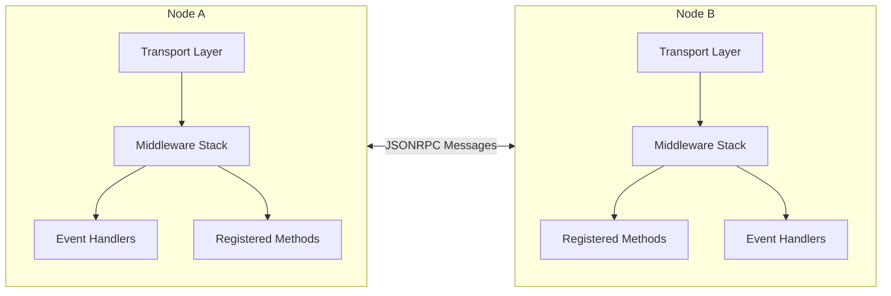
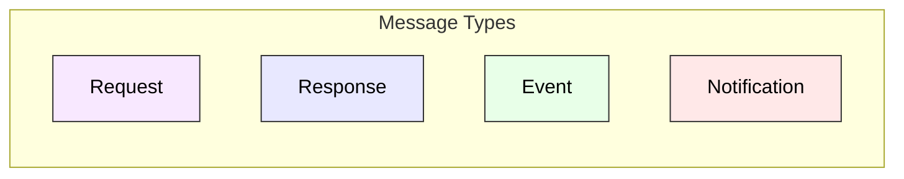

**@walletmesh/jsonrpc v0.5.4**

***

# @walletmesh/jsonrpc

A TypeScript implementation of the JSON-RPC 2.0 protocol, designed for building client-server applications with bi-directional communication capabilities.

## Quick Start

```bash
# Install the package
pnpm add @walletmesh/jsonrpc
```

```typescript
import { JSONRPCNode, JSONRPCError } from '@walletmesh/jsonrpc';

// Define shared types for type safety
type Methods = {
  add: {
    params: { a: number; b: number };
    result: number;
  };
  greet: {
    params: { name: string };
    result: string;
  };
};

type Events = {
  notification: { message: string };
};

// Define a transport (using a WebSocket-like object 'ws' as an example)
const serverTransport: JSONRPCTransport = {
  send: async message => {
    // In a real app, send to client (e.g., via WebSocket)
    // ws.send(JSON.stringify(message));
    console.log('Server sending:', message); // Placeholder
  },
  onMessage: callback => {
    // Set up message reception from client
    // ws.on('message', data => callback(JSON.parse(data.toString())));
    console.log('Server onMessage registered.'); // Placeholder
    // Simulate client sending a message to server
    // setTimeout(() => callback({ jsonrpc: '2.0', method: 'greet', params: { name: 'Server' }, id: 'client-req-1' }), 500);
  }
};

// Create server node with the transport
const server = new JSONRPCNode<Methods, Events>(serverTransport);

// Register server methods with proper error handling
server.registerMethod('add', async (context, { a, b }) => {
  if (typeof a !== 'number' || typeof b !== 'number') {
    throw new JSONRPCError(-32602, 'Invalid parameters: numbers required', {
      expected: { a: 'number', b: 'number' },
      received: { a: typeof a, b: typeof b }
    });
  }
  return a + b;
});

server.registerMethod('greet', async (context, { name }) => {
  if (typeof name !== 'string') {
    throw new JSONRPCError(-32602, 'Invalid parameters: string required', {
      expected: 'string',
      received: typeof name
    });
  }
  return `Hello, ${name}!`;
});

// Define a transport for the client
const clientTransport: JSONRPCTransport = {
  send: async message => {
    // In a real app, send to server (e.g., via WebSocket)
    // ws.send(JSON.stringify(message));
    console.log('Client sending:', message); // Placeholder
    // Simulate server responding to client's 'greet' request
    // if ((message as any).method === 'greet') {
    //   setTimeout(() => client.receiveMessage({ jsonrpc: '2.0', result: 'Hello, Client!', id: (message as any).id }), 100);
    // }
  },
  onMessage: callback => {
    // Set up message reception from server
    // ws.on('message', data => callback(JSON.parse(data.toString())));
    console.log('Client onMessage registered.'); // Placeholder
    // Simulate server sending an event to client
    // setTimeout(() => callback({ jsonrpc: '2.0', event: 'notification', params: { message: 'Server event to client' } }), 1000);
  }
};

// Create client node with the transport
const client = new JSONRPCNode<Methods, Events>(clientTransport);

// Use client to call server methods
async function main() {
  try {
    // Call methods with timeout
    const sum = await client.callMethod('add', { a: 2, b: 3 }, 5);
    console.log('Sum:', sum); // Output: Sum: 5

    const greeting = await client.callMethod('greet', { name: 'Alice' }, 5);
    console.log('Greeting:', greeting); // Output: Greeting: Hello, Alice!

    // Handle events with proper cleanup
    const cleanup = client.on('notification', ({ message }) => {
      console.log('Notification:', message);
    });

    // Server can emit events
    await server.emit('notification', { message: 'Server update!' });

    // Clean up event handlers
    cleanup();
  } catch (error) {
    if (error instanceof JSONRPCError) {
      console.error(`RPC Error ${error.code}: ${error.message}`);
      if (error.data) {
        console.error('Additional data:', error.data);
      }
    } else if (error instanceof TimeoutError) {
      console.error('Request timed out');
    } else {
      console.error('Unexpected error:', error);
    }
  }
}

main().catch(console.error);
```

This example demonstrates:
- Type-safe method and event definitions
- Bi-directional communication
- Method calls with parameters and timeouts
- Comprehensive error handling
- Event handling with cleanup
- Parameter validation

In a real application, you would:
1. Replace the direct message passing with your transport layer (WebSocket, postMessage, etc.)
2. Implement proper connection management
3. Add middleware for logging, authentication, etc.
4. Add proper error recovery strategies

## Features

✨ **Full JSON-RPC 2.0 Compliance**
- Complete implementation of the JSON-RPC 2.0 specification
- Support for both request-response and notification patterns
- Bi-directional communication capabilities

🔒 **Type Safety**
- Comprehensive TypeScript type definitions
- Generic type parameters for methods and events
- Compile-time parameter and result validation

🔄 **Middleware System**
- Request/response modification
- Context passing through middleware chain
- Automatic cleanup of middleware handlers

📡 **Event System**
- Asynchronous notification support
- Type-safe event definitions
- Automatic event handler cleanup

⚡ **Performance & Reliability**
- Configurable timeout support
- Parameter serialization for complex types
- Method response validation
- Detailed error information

## Architecture

The library implements a node-to-node architecture where each node can both send and receive JSON-RPC messages. Here's a high-level overview:





### Key Components

1. **JSONRPCNode**: The main class that implements the JSON-RPC 2.0 protocol.
   - Handles both client and server functionality.
   - Manages method registration (`registerMethod`, `setFallbackHandler`), invocation (`callMethod`, `notify`), and custom serialization (`registerSerializer`).
   - Processes incoming messages (via `transport.onMessage` which calls `receiveMessage` internally) and outgoing messages.
   - Coordinates middleware execution (`addMiddleware`).
   - Manages event handling (`on`, `emit`).
   - Supports automatic cleanup of event handlers, middleware, and pending requests on `close()`.
   - Provides comprehensive error handling with `JSONRPCError` and `TimeoutError`.
   - Exposes a `context` object shared across handlers and middleware.

2. **Transport Layer**: Bidirectional interface for message transmission
   - Implemented by the user (e.g., WebSocket, postMessage, HTTP)
   - Handles both sending and receiving messages
   - `send`: Delivers messages to the remote node
   - `onMessage`: Registers a callback for incoming messages
   - Automatic connection during node initialization

3. **Middleware Stack**: Chain of request/response processors
   - Request/response modification
   - Context sharing
   - Automatic cleanup on node close

4. **Type System**: Comprehensive TypeScript types
   - Method definitions with params/result types
   - Event definitions with payload types
   - Context types for shared data
   - Serialization interfaces
   - Support for both object and array parameters

## Usage

### Basic Setup

```typescript
// Define your types
type MethodMap = {
  add: { params: { a: number; b: number }; result: number };
  greet: { params: { name: string }; result: string };
};

type EventMap = {
  userJoined: { username: string; timestamp: number };
  statusUpdate: { status: 'online' | 'offline'; lastSeen?: number };
};

type Context = JSONRPCContext & {
  userId?: string;
  sessionData?: Record<string, unknown>;
  // Add any other custom context properties
  customValue?: number;
};

// Implement a transport (e.g., using a WebSocket-like object 'ws')
const transport: JSONRPCTransport = {
  send: async (message) => {
    // Send messages to remote node
    // await ws.send(JSON.stringify(message));
    console.log('Node sending message:', message); // Placeholder
  },
  onMessage: (callback) => {
    // Receive messages from remote node
    // ws.on('message', data => {
    //   callback(JSON.parse(data.toString()));
    // });
    console.log('Node onMessage registered.'); // Placeholder
  }
};

// Create a node instance with the transport and optional initial context
const node = new JSONRPCNode<MethodMap, EventMap, Context>(transport, { customValue: 123 });
```

### Method Registration and Calls

```typescript
// Register method with proper error handling
node.registerMethod('add', async (context, { a, b }) => {
  if (typeof a !== 'number' || typeof b !== 'number') {
    throw new JSONRPCError(-32602, 'Invalid parameters: numbers required', {
      expected: { a: 'number', b: 'number' },
      received: { a: typeof a, b: typeof b }
    });
  }
  return a + b;
});

// Register method with array parameters and detailed error handling
node.registerMethod('sum', async (context, numbers: number[]) => {
  if (!Array.isArray(numbers)) {
    throw new JSONRPCError(-32602, 'Invalid parameters: array required', {
      expected: 'array',
      received: typeof numbers
    });
  }

  const invalidIndex = numbers.findIndex(n => typeof n !== 'number');
  if (invalidIndex !== -1) {
    throw new JSONRPCError(-32602, 'Invalid parameters: array must contain only numbers', {
      invalidIndex,
      invalidValue: numbers[invalidIndex],
      valueType: typeof numbers[invalidIndex]
    });
  }

  return numbers.reduce((a, b) => a + b, 0);
});

// Call methods with proper error handling
try {
  const sum = await node.callMethod('add', { a: 1, b: 2 }, 5);
  const total = await node.callMethod('sum', [1, 2, 3, 4], 5);
} catch (error) {
  if (error instanceof TimeoutError) {
    console.error('Request timed out');
  } else if (error instanceof JSONRPCError) {
    console.error(`RPC Error ${error.code}: ${error.message}`);
    if (error.data) {
      console.error('Additional data:', error.data);
    }
  }
}

// Register a fallback handler for unknown methods
node.setFallbackHandler(async (context, method, params) => {
  console.log(`Unknown method called: ${method}`);
  throw new JSONRPCError(-32601, `Method ${method} is not supported`, {
    availableMethods: ['add', 'sum'],
    suggestion: method === 'addition' ? 'Did you mean "add"?' : undefined
  });
});
```

### Error Handling

```typescript
// Custom error in method handler with detailed error data
node.registerMethod('validateUser', async (context, { username, age }) => {
  const errors: Record<string, { received: unknown; expected: string }> = {};

  if (!username || typeof username !== 'string') {
    errors.username = {
      received: username,
      expected: 'non-empty string'
    };
  }

  if (!age || typeof age !== 'number' || age < 0) {
    errors.age = {
      received: age,
      expected: 'positive number'
    };
  }

  if (Object.keys(errors).length > 0) {
    throw new JSONRPCError(-32602, 'Validation failed', { errors });
  }

  return { valid: true };
});

// Error handling in method calls
try {
  await node.callMethod('validateUser', { username: '', age: -1 }, 5);
} catch (error) {
  if (error instanceof JSONRPCError) {
    console.error(`RPC Error ${error.code}: ${error.message}`);
    if (error.data?.errors) {
      for (const [field, details] of Object.entries(error.data.errors)) {
        console.error(`${field}: expected ${details.expected}, got ${details.received}`);
      }
    }
  }
}
```

### Event System

```typescript
// Define event handlers with type safety
type UserJoinedHandler = (params: { username: string; timestamp: number }) => void;
type StatusUpdateHandler = (params: { status: 'online' | 'offline'; lastSeen?: number }) => void;

// Register event handlers with cleanup
const userJoinedCleanup = node.on('userJoined', ({ username, timestamp }) => {
  console.log(`${username} joined at ${new Date(timestamp).toLocaleString()}`);
});

const statusCleanup = node.on('statusUpdate', ({ status, lastSeen }) => {
  console.log(`Status changed to ${status}`);
  if (lastSeen) {
    console.log(`Last seen: ${new Date(lastSeen).toLocaleString()}`);
  }
});

// Emit events
node.emit('userJoined', {
  username: 'Alice',
  timestamp: Date.now()
});

node.emit('statusUpdate', {
  status: 'offline',
  lastSeen: Date.now()
});

// Later: remove handlers
userJoinedCleanup();
statusCleanup();
```

### Middleware System

```typescript
// Add logging middleware with timing and error handling
const cleanupLogging = node.addMiddleware(async (context, request, next) => {
  const start = Date.now();
  console.log(`[${start}] Request:`, request);

  try {
    const response = await next();
    console.log(`[${Date.now()}] Response (${Date.now() - start}ms):`, response);
    return response;
  } catch (error) {
    console.error(`[${Date.now()}] Error (${Date.now() - start}ms):`, error);
    throw error;
  }
});

// Add authentication middleware with detailed errors
const cleanupAuth = node.addMiddleware(async (context, request, next) => {
  if (!context.userId) {
    throw new JSONRPCError(-32600, 'Unauthorized', {
      requiredField: 'userId',
      method: request.method,
      context: Object.keys(context)
    });
  }
  return next();
});

// Add request validation middleware
const cleanupValidation = node.addMiddleware(async (context, request, next) => {
  if (!request.params) {
    throw new JSONRPCError(-32602, 'Parameters required', {
      method: request.method,
      requestId: request.id
    });
  }
  return next();
});

// Later: cleanup middleware
cleanupLogging();
cleanupAuth();
cleanupValidation();
```

### Parameter Serialization

```typescript
// Define serializer for complex types with proper error handling
const dateSerializer: JSONRPCSerializer<Date, string> = {
  params: {
    serialize: async (method, date) => {
      if (!(date instanceof Date)) {
        throw new JSONRPCError(-32602, 'Invalid date parameter', {
          expected: 'Date',
          received: typeof date
        });
      }
      return { serialized: date.toISOString(), method };
    },
    deserialize: async (data, method) => {
      try {
        return new Date(data.serialized);
      } catch (error) {
        throw new JSONRPCError(-32602, 'Invalid date format', {
          received: data.serialized,
          error: error instanceof Error ? error.message : String(error)
        });
      }
    }
  },
  result: {
    serialize: async (method, date) => {
      if (!(date instanceof Date)) {
        throw new JSONRPCError(-32603, 'Invalid date result for serialization', {
          expected: 'Date',
          received: typeof date
        });
      }
      return { serialized: date.toISOString(), method };
    },
    deserialize: async (data, method) => {
      try {
        return new Date(data.serialized);
      } catch (error) {
        throw new JSONRPCError(-32603, 'Invalid date format in result', {
          received: data.serialized,
          error: error instanceof Error ? error.message : String(error)
        });
      }
    }
  }
};

// Register method with serializer
node.registerMethod('processDate', async (context, { date }) => {
  if (!(date instanceof Date)) {
    throw new JSONRPCError(-32602, 'Invalid date parameter');
  }
  return new Date(date.getTime() + 86400000); // Add one day
});

// Register serializer separately
node.registerSerializer('processDate', dateSerializer);

// Use the method with error handling
try {
  const tomorrow = await node.callMethod('processDate', { date: new Date() }, 5);
  console.log('Tomorrow:', tomorrow);
} catch (error) {
  if (error instanceof JSONRPCError) {
    console.error('Serialization error:', error.message, error.data);
  }
}
```

### Transport Interface

The transport layer provides bidirectional communication between JSON-RPC nodes:

```typescript
interface JSONRPCTransport {
  // Send messages to the remote node
  send(message: unknown): Promise<void>;
  
  // Register a callback to receive messages from the remote node
  onMessage(callback: (message: unknown) => void): void;
}
```

The `JSONRPCNode` automatically connects to the transport during initialization by calling `onMessage` to register its message handler. This design:
- Separates transport concerns from protocol logic
- Supports any communication mechanism (WebSocket, postMessage, HTTP, etc.)
- Handles both synchronous and asynchronous transports
- Ensures automatic message routing without manual `receiveMessage` calls

### Transport Layer Examples

The library is transport-agnostic and can work with any messaging system. Here are examples of common transport implementations:

#### Browser-to-Browser using postMessage

```typescript
// website-a.com
import { JSONRPCNode, JSONRPCError } from '@walletmesh/jsonrpc';

type Methods = {
  getData: { params: { id: string }; result: { data: string } };
};

// Create node for Website A with bidirectional transport
const nodeA = new JSONRPCNode<Methods>({
  send: async message => {
    // Send to Website B's iframe
    const iframe = document.querySelector<HTMLIFrameElement>('#website-b-frame');
    if (iframe?.contentWindow) {
      iframe.contentWindow.postMessage(message, 'https://website-b.com');
    } else {
      throw new Error('Target iframe not found');
    }
  },
  onMessage: callback => {
    // Listen for messages from Website B with origin validation
    window.addEventListener('message', event => {
      if (event.origin === 'https://website-b.com') {
        callback(event.data);
      }
    });
  }
});

// Use the node with error handling
try {
  const result = await nodeA.callMethod('getData', { id: '123' }, 5);
  console.log('Data:', result);
} catch (error) {
  if (error instanceof JSONRPCError) {
    console.error('RPC Error:', error.message, error.data);
  }
}
```

```typescript
// website-b.com
import { JSONRPCNode, JSONRPCError } from '@walletmesh/jsonrpc';

type Methods = {
  getData: { params: { id: string }; result: { data: string } };
};

// Create node for Website B with bidirectional transport
const nodeB = new JSONRPCNode<Methods>({
  send: async message => {
    // Send to parent window (Website A)
    window.parent.postMessage(message, 'https://website-a.com');
  },
  onMessage: callback => {
    // Listen for messages from Website A with origin validation
    window.addEventListener('message', event => {
      if (event.origin === 'https://website-a.com') {
        callback(event.data);
      }
    });
  }
});

// Register method with validation
nodeB.registerMethod('getData', async (context, { id }) => {
  if (typeof id !== 'string' || !id) {
    throw new JSONRPCError(-32602, 'Invalid ID', {
      expected: 'non-empty string',
      received: id
    });
  }
  return { data: `Data for ${id}` };
});
```

#### WebSocket Transport

```typescript
// Browser Client
import { JSONRPCNode, JSONRPCError, TimeoutError } from '@walletmesh/jsonrpc';

type Methods = {
  subscribe: { params: { topic: string }; result: boolean };
};

type Events = {
  update: { topic: string; data: unknown };
};

// Create WebSocket connection
const ws = new WebSocket('wss://api.example.com');

// Create JSON-RPC node with WebSocket transport
const client = new JSONRPCNode<Methods, Events>({
  send: async message => {
    if (ws.readyState === WebSocket.OPEN) {
      ws.send(JSON.stringify(message));
    } else {
      // Queue message or throw error
      throw new Error('WebSocket not connected');
    }
  },
  onMessage: callback => {
    ws.addEventListener('message', event => {
      try {
        const data = JSON.parse(event.data);
        callback(data);
      } catch (error) {
        console.error('Failed to parse message:', error);
      }
    });
  }
});

// Use the client with proper error handling
try {
  // Subscribe to updates
  await client.callMethod('subscribe', { topic: 'prices' }, 5);

  // Handle updates
  client.on('update', ({ topic, data }) => {
    console.log(`Update for ${topic}:`, data);
  });
} catch (error) {
  if (error instanceof TimeoutError) {
    console.error('Subscription request timed out');
  } else if (error instanceof JSONRPCError) {
    console.error('RPC Error:', error.message, error.data);
  }
}

// Clean up
window.addEventListener('beforeunload', () => {
  client.close();
  ws.close();
});
```

```typescript
// Node.js Server
import { WebSocketServer } from 'ws';
import { JSONRPCNode, JSONRPCError } from '@walletmesh/jsonrpc';

const wss = new WebSocketServer({ port: 8080 });

wss.on('connection', ws => {
  // Create JSON-RPC node for this connection with bidirectional transport
  const server = new JSONRPCNode<Methods, Events>({
    send: async message => {
      if (ws.readyState === ws.OPEN) {
        ws.send(JSON.stringify(message));
      }
    },
    onMessage: callback => {
      // Handle incoming messages with error handling
      ws.on('message', data => {
        try {
          const message = JSON.parse(data.toString());
          callback(message);
        } catch (error) {
          console.error('Failed to parse message:', error);
          // Send parse error response
          ws.send(JSON.stringify({
            jsonrpc: '2.0',
            error: {
              code: -32700,
              message: 'Parse error',
              data: error instanceof Error ? error.message : String(error)
            },
            id: null
          }));
        }
      });
    }
  });

  // Register methods with validation
  server.registerMethod('subscribe', async (context, { topic }) => {
    if (typeof topic !== 'string' || !topic) {
      throw new JSONRPCError(-32602, 'Invalid topic', {
        expected: 'non-empty string',
        received: topic
      });
    }
    // Subscribe logic here
    return true;
  });

  // Emit events periodically
  const interval = setInterval(() => {
    server.emit('update', {
      topic: 'prices',
      data: { BTC: 50000, ETH: 3000 }
    });
  }, 1000);

  // Clean up on connection close
  ws.on('close', () => {
    clearInterval(interval);
    server.close();
  });
});
```

#### HTTP Transport

```typescript
// Browser Client
import { JSONRPCNode, JSONRPCError } from '@walletmesh/jsonrpc';

type Methods = {
  getUser: { params: { id: number }; result: { name: string; email: string } };
};

// For HTTP transports, we need to handle the synchronous request-response pattern
let messageHandler: ((message: unknown) => void) | null = null;

// Create client with HTTP transport
const client = new JSONRPCNode<Methods>({
  send: async message => {
    const response = await fetch('https://api.example.com/jsonrpc', {
      method: 'POST',
      headers: {
        'Content-Type': 'application/json',
        'Accept': 'application/json'
      },
      body: JSON.stringify(message)
    });

    if (!response.ok) {
      throw new Error(`HTTP error: ${response.status}`);
    }

    const data = await response.json();
    
    // Call the message handler with the response
    if (messageHandler) {
      messageHandler(data);
    }
  },
  onMessage: callback => {
    // Store the callback for use in send()
    messageHandler = callback;
  }
});

// Use the client with error handling
try {
  const user = await client.callMethod('getUser', { id: 123 }, 5);
  console.log('User:', user);
} catch (error) {
  if (error instanceof JSONRPCError) {
    console.error('RPC Error:', error.message, error.data);
  } else if (error instanceof TimeoutError) {
    console.error('Request timed out');
  } else {
    console.error('Transport error:', error);
  }
}
```

```typescript
// Node.js Server (Express)
import express from 'express';
import { JSONRPCNode, JSONRPCError } from '@walletmesh/jsonrpc';

const app = express();
app.use(express.json());

app.post('/jsonrpc', async (req, res) => {
  let responded = false;
  
  // Create new node for each request with bidirectional transport
  const server = new JSONRPCNode<Methods>({
    send: async message => {
      if (!responded) {
        responded = true;
        res.json(message);
      }
    },
    onMessage: callback => {
      // For HTTP server, we process the request body immediately
      setImmediate(() => callback(req.body));
    }
  });

  // Register methods with validation
  server.registerMethod('getUser', async (context, { id }) => {
    if (typeof id !== 'number' || id < 0) {
      throw new JSONRPCError(-32602, 'Invalid user ID', {
        expected: 'positive number',
        received: id
      });
    }

    // Fetch user from database
    return {
      name: 'John Doe',
      email: 'john@example.com'
    };
  });

  // Wait a bit for the node to process the message
  setTimeout(() => {
    if (!responded) {
      res.status(500).json({
        jsonrpc: '2.0',
        error: {
          code: -32603,
          message: 'Internal error',
          data: 'No response generated'
        },
        id: req.body.id ?? null
      });
    }
  }, 5000);
});

app.listen(3000);
```

### Cleanup

```typescript
// Clean shutdown
await node.close(); // Removes all event handlers and middleware
ws.close();
```

## Error Codes

The library uses standard JSON-RPC 2.0 error codes:

- Parse error (-32700): Invalid JSON received
  - Used when the JSON string cannot be parsed
  - Example: Malformed JSON syntax

- Invalid Request (-32600): The JSON sent is not a valid Request object
  - Used when the request structure is invalid
  - Example: Missing required fields, wrong version

- Method not found (-32601): The requested method does not exist
  - Used when the method name is not registered
  - Example: Calling an unregistered method

- Invalid params (-32602): Invalid method parameters
  - Used when parameters don't match the method's expectations
  - Example: Wrong types, missing required params

- Internal error (-32603): Internal JSON-RPC error
  - Used for unexpected server conditions
  - Example: Database connection failure

- Server error (-32000 to -32099): Implementation-defined server errors
  - TimeoutError uses -32000
  - Other codes in this range can be used for custom server errors
  - Example: Rate limiting, validation errors
