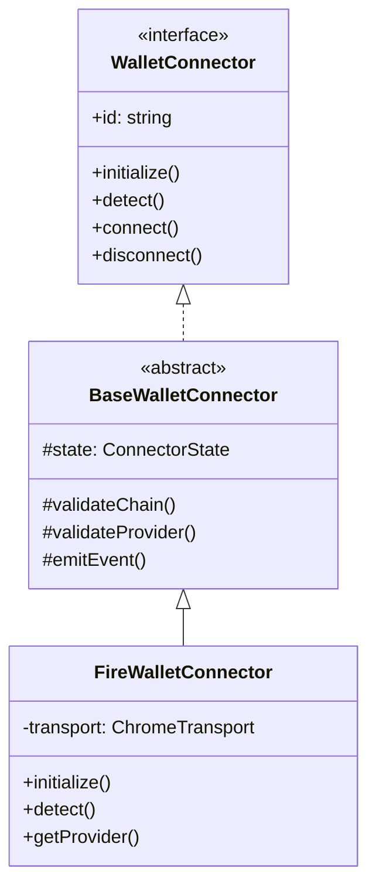

# Wallet Connector System

This document describes the wallet connector system architecture and how to implement new connectors.

## Overview

The wallet connector system provides an abstraction layer for interacting with different types of cryptocurrency wallets. It supports multiple provider interfaces per chain and is designed for future multi-chain extensibility.

## Architecture



## Provider Interfaces

The system supports multiple provider interfaces:

- **EIP1193**: Standard Ethereum provider interface
- **EIP6963**: Multi-wallet provider discovery
- **Ethers**: Ethers.js compatibility layer  
- **Native**: Direct wallet integration

## Implementing New Connectors

To implement a new wallet connector:

1. Create a directory in `src/connectors/[wallet-name]`
2. Define wallet-specific types in `types.ts`
3. Implement the connector by extending `BaseWalletConnector`
4. Export from `src/connectors/index.ts`

Example:

```typescript
export class MyWalletConnector extends BaseWalletConnector {
  readonly id = 'my-wallet';
  readonly name = 'My Wallet';
  readonly supportedChains = [ChainType.ETHEREUM];
  readonly supportedProviders = [ProviderInterface.EIP1193];

  async initialize(): Promise<void> {
    // Initialize connection to wallet
  }

  async detect(): Promise<boolean> {
    // Check if wallet is available
  }

  protected async performConnect(
    chain: ChainType, 
    options?: ConnectOptions
  ): Promise<ConnectionResult> {
    // Implement connection logic
  }

  protected async performDisconnect(): Promise<void> {
    // Implement disconnection logic
  }
}
```

## Multi-Chain Support

The connector system is designed to support multiple blockchains:

1. Define new chain types in `ChainType` enum
2. Implement chain-specific provider interfaces
3. Add chain validation in connector implementation
4. Update provider capabilities per chain

## Error Handling

The system includes several error types for common scenarios:

- `ConnectorNotInitializedError`: Connector not initialized
- `ConnectionInProgressError`: Connection already in progress  
- `ChainNotSupportedError`: Chain not supported
- `ProviderNotSupportedError`: Provider interface not supported

Handle errors appropriately and emit error events:

```typescript
try {
  // Attempt operation
} catch (error) {
  this.emit({
    type: ClientEventType.ERROR,
    error: error as Error,
    context: 'operation-name'
  });
  throw error;
}
```

## Event System

Connectors emit events for state changes:

- `connecting`: Connection attempt started
- `connected`: Successfully connected  
- `disconnected`: Disconnected from wallet
- `chainChanged`: Active chain changed
- `accountsChanged`: Account list updated
- `error`: Error occurred

Subscribe to events:

```typescript
connector.on(ClientEventType.CONNECTED, (event) => {
  console.log('Connected to chain:', event.chainType);
});
```

## Best Practices

1. **Initialization**
   - Always call initialize() before other operations
   - Check for wallet availability in detect()
   - Handle initialization failures gracefully

2. **State Management**  
   - Use updateState() to modify connector state
   - Emit appropriate events for state changes
   - Validate state before operations

3. **Provider Handling**
   - Cache provider instances when possible
   - Validate provider interface support
   - Implement all advertised capabilities

4. **Error Handling**
   - Use specific error types
   - Include context in error events  
   - Clean up resources on errors

5. **Testing**
   - Test all provider interfaces
   - Verify error scenarios
   - Test state transitions
   - Mock external dependencies

## Testing

Test files should be placed in `tests/connectors/`:

```typescript
describe('MyWalletConnector', () => {
  let connector: MyWalletConnector;
  
  beforeEach(() => {
    connector = new MyWalletConnector(config);
  });

  it('should initialize successfully', async () => {
    await connector.initialize();
    expect(connector.initialized).toBe(true);
  });

  // Test connection flows
  // Test provider interfaces
  // Test error scenarios
});
