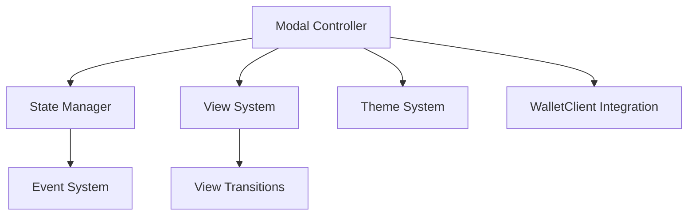
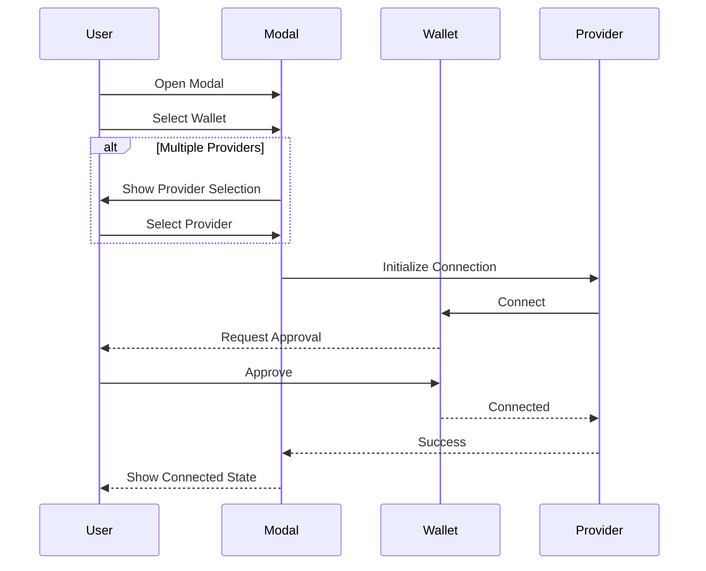
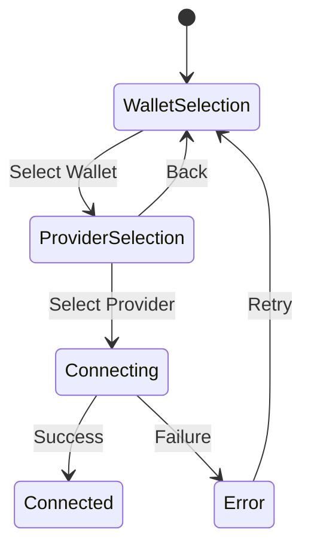

# Modal Core System

A framework-agnostic modal system for wallet connections, designed for flexibility and extensibility.

## Features

- Framework-agnostic implementation
- Robust state management
- Type-safe view transitions
- Multi-provider interface support
- Future-proof multi-chain capability
- Customizable theming system

## Architecture



### Components

1. **Modal Controller**: Main API that UI frameworks interact with
2. **State Manager**: Handles modal state and updates
3. **View System**: Manages view transitions and validations
4. **Theme System**: Provides consistent styling capabilities

## Provider Interface Selection Flow

1. User opens the modal
2. If multiple provider interfaces are available:
   - User selects a wallet
   - User selects a provider interface (EIP-1193, EIP-6963, etc.)
3. If only one provider interface:
   - User selects a wallet and proceeds directly to connection



## Multi-Chain Support

The system is designed to support multiple blockchain networks through:

- Chain-agnostic state management
- Extensible provider interfaces
- Chain-specific configuration options
- Flexible validation system

## State Management

The state management system uses:

- Immutable state updates
- Type-safe actions
- Observable state changes
- Predictable transitions

### State Flow Example:



## View System

Views are managed through:

- Defined view transitions
- State validation
- Lifecycle hooks
- Consistent error handling

## Integration with WalletClient

The modal core:

1. Manages UI state independently
2. Delegates wallet operations to WalletClient
3. Handles connection status and errors
4. Provides consistent user experience

## Theming and Customization

### Theme Structure

```typescript
interface Theme {
  colors: ColorPalette;
  typography: Typography;
  spacing: Spacing;
  borderRadius: BorderRadius;
  animation: Animation;
}
```

### Features:

- Light/Dark mode support
- System theme detection
- Customizable color schemes
- Responsive design utilities

## Usage Example

```typescript
import { ModalControllerImpl } from '@walletmesh/modal-core';

// Initialize
const modal = new ModalControllerImpl({
  config: {
    theme: 'system',
    showProviderSelection: true,
  }
});

// Subscribe to state changes
modal.subscribe((state) => {
  console.log('Modal state:', state);
});

// Open modal
modal.open();

// Handle wallet selection
modal.selectWallet('metamask');

// Handle provider selection
modal.selectProvider(ProviderInterface.EIP1193);

// Connect
await modal.connect();
```

## Testing

The system includes comprehensive tests for:

- State management
- View transitions
- Theme system
- Error handling
- Event subscription
- Configuration management

Run tests with:

```bash
pnpm test
```

## Best Practices

1. **State Management**
   - Always use the controller API for state changes
   - Subscribe to state changes for UI updates
   - Handle errors appropriately

2. **View Transitions**
   - Validate state before transitions
   - Implement proper cleanup in view exit hooks
   - Handle back navigation gracefully

3. **Theme Customization**
   - Extend the default theme for consistency
   - Use provided theme utilities
   - Test themes in both light and dark modes

4. **Error Handling**
   - Implement proper error recovery flows
   - Provide clear error messages
   - Allow users to retry operations

## Contributing

1. Follow TypeScript best practices
2. Maintain framework agnosticism
3. Add tests for new features
4. Update documentation
5. Ensure backwards compatibility

## License

MIT License
