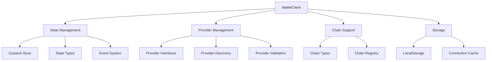

# WalletMesh Modal Core

Core implementation of the WalletMesh client with support for multiple provider interfaces and future multi-chain capabilities.

## Architecture

The WalletClient is designed with a modular architecture to support:
- Multiple provider interfaces (EIP1193, EIP6963, Ethers.js, Native)
- Future multi-chain support
- Persistent connection state
- Event-driven state management

### Core Components



### State Management

The client uses Zustand for state management, providing:
- Reactive state updates
- Simple and efficient store API
- Type-safe state access
- Middleware support

### Provider Interface Abstraction

Provider interfaces are abstracted through a common interface:

```typescript
interface BaseProvider {
  type: ProviderInterface;
  request(args: { method: string; params?: unknown[] }): Promise<unknown>;
  supportsMethod?(method: string): boolean;
}
```

Each specific provider type (EIP1193, EIP6963, etc.) extends this base interface with its own capabilities.

### Multi-Chain Support

The system is designed for multi-chain support through:
- ChainType enum for supported chains
- Chain-specific configurations
- Extensible provider interface

## Usage

### Basic Setup

```typescript
import { WalletClient, ProviderInterface } from '@walletmesh/modal-core';

const client = new WalletClient({
  appName: 'My dApp',
  autoReconnect: true,
  persistConnection: true,
  defaultProviderInterface: ProviderInterface.EIP1193
});

await client.initialize();
```

### Connecting to a Wallet

```typescript
const result = await client.connect('metamask', {
  preferredInterface: ProviderInterface.EIP6963,
  chainType: ChainType.ETHEREUM
});

console.log('Connected accounts:', result.accounts);
```

### Event Handling

```typescript
client.on(ClientEventType.CONNECTED, (event) => {
  console.log('Connected to wallet:', event.accounts);
});

client.on(ClientEventType.CHAIN_CHANGED, (event) => {
  console.log('Chain changed:', event.chainType);
});
```

### State Management

```typescript
// Get current state
const state = client.getState();

// Subscribe to state changes
client.store.subscribe((state) => {
  console.log('New state:', state);
});
```

## Event System

The client implements a comprehensive event system:

| Event | Description |
|-------|-------------|
| CONNECTING | Wallet connection initiated |
| CONNECTED | Wallet successfully connected |
| DISCONNECTED | Wallet disconnected |
| CHAIN_CHANGED | Active chain changed |
| ACCOUNTS_CHANGED | Connected accounts changed |
| ERROR | Error occurred |

## Provider Interfaces

Supported provider interfaces:

- **EIP1193**: Standard Ethereum provider interface
- **EIP6963**: Provider discovery and registration
- **Ethers**: Ethers.js provider compatibility
- **Native**: Built-in wallet support

## Future Extensibility

The system is designed for future extensibility:

1. **Multi-Chain Support**
   - Abstract chain interfaces
   - Chain-specific provider implementations
   - Unified chain switching

2. **Additional Provider Types**
   - Modular provider interface system
   - Easy integration of new standards
   - Provider capability discovery

3. **Enhanced State Management**
   - Middleware support
   - State persistence options
   - Custom state extensions

## Contributing

1. Fork the repository
2. Create your feature branch
3. Commit your changes
4. Push to the branch
5. Create a new Pull Request
