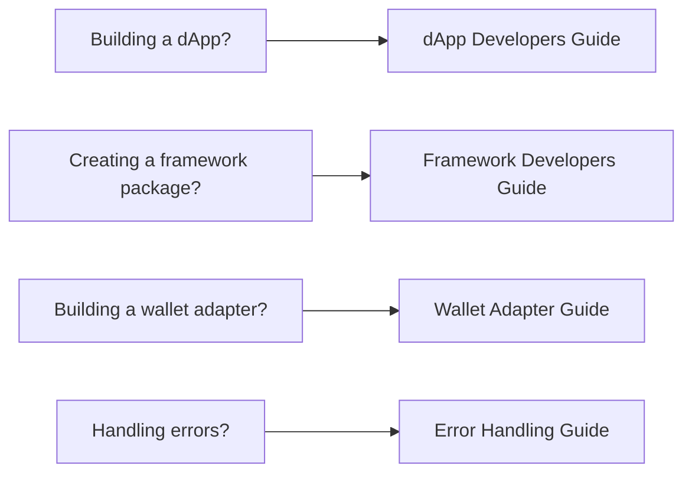

# WalletMesh Modal Core Guides

This section contains comprehensive guides for different types of developers working with WalletMesh Modal Core.

## 📚 Available Guides

### [dApp Developers Guide](./dapp-developers.md)
For developers building decentralized applications using WalletMesh.
- When to use modal-core vs framework packages
- Client-first API patterns
- Multi-wallet management
- Session handling

### [Framework Developers Guide](./framework-developers.md)
For developers creating framework-specific WalletMesh packages.
- Creating framework adapters
- Integrating with modal-core
- Handling framework lifecycle
- State management patterns

### [Wallet Adapter Developers Guide](./wallet-adapter-developers.md)
For developers creating wallet adapters for WalletMesh.
- Implementing the WalletAdapter interface
- Provider integration
- Discovery service setup
- Testing wallet adapters

### [Error Handling Guide](./error-handling.md)
Comprehensive error handling patterns and best practices.
- Error types and codes
- Recovery strategies
- User-friendly error messages
- Debugging techniques

### [Creating Framework Adapters](./creating-framework-adapters.md)
Step-by-step guide to creating new framework integrations.
- Adapter architecture
- Required interfaces
- Testing strategies
- Publishing guidelines

## 🎯 Quick Navigation

Choose your guide based on what you're building:

## 💡 Tips

- Each guide includes code examples and best practices
- Guides reference the [API documentation](../api/README.md) for detailed type information
- Check the [examples directory](../examples/README.md) for working code samples
- Review the [architecture documentation](../architecture/README.md) for system design details