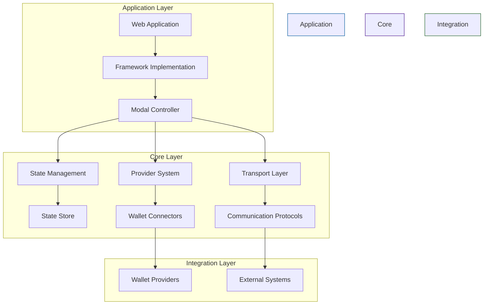
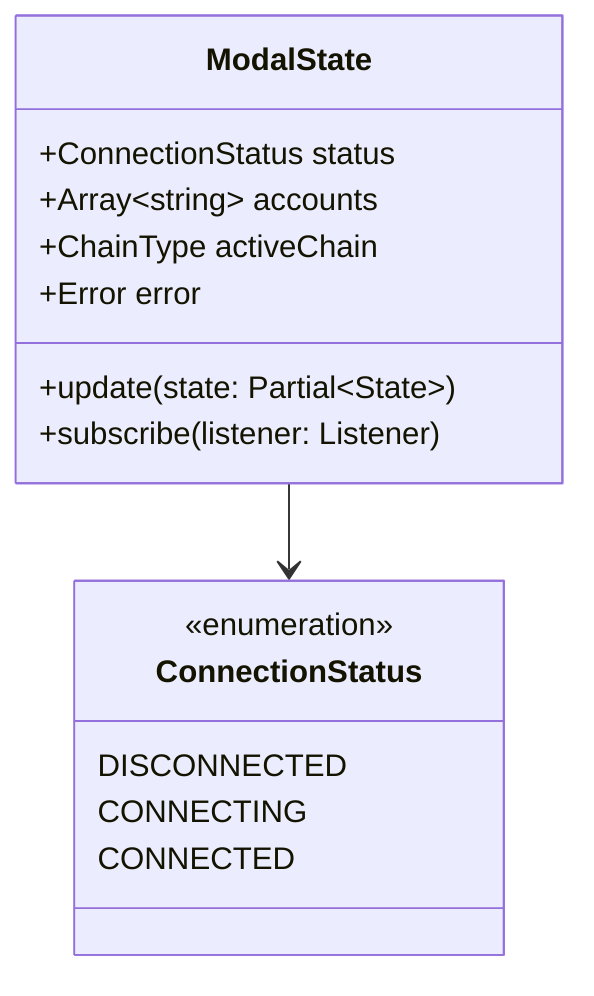
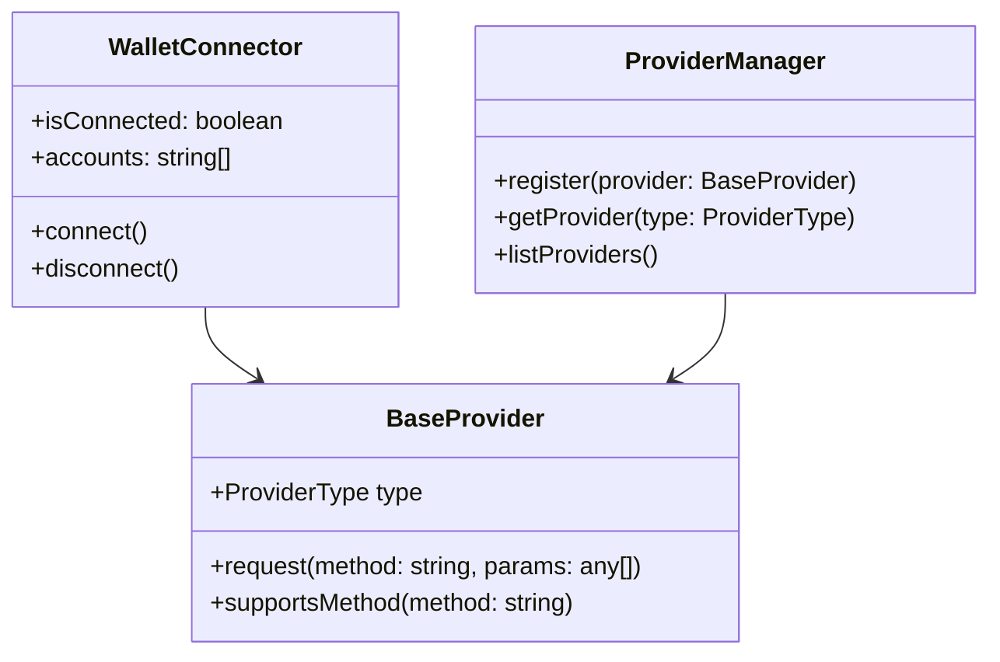
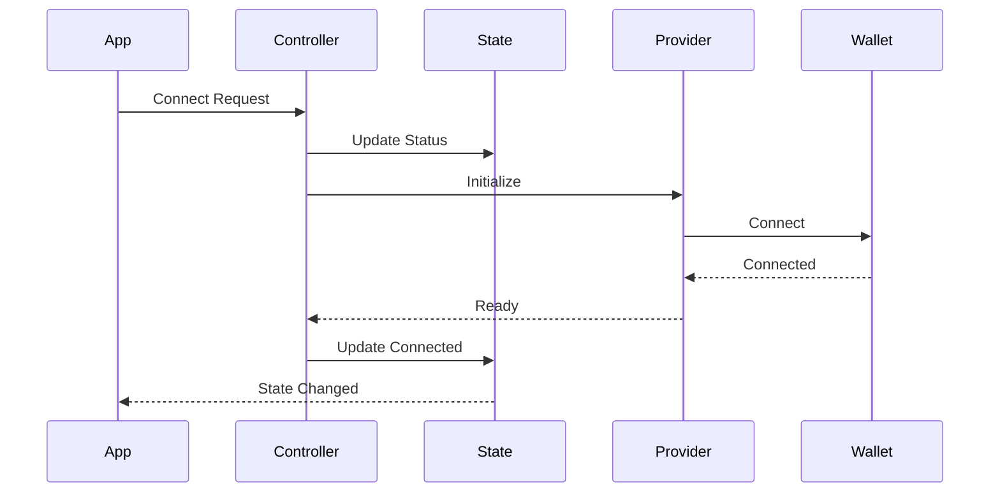

# WalletMesh Architecture

## Overview

WalletMesh Modal Core is built on a modular, layered architecture that prioritizes flexibility, type safety, and framework independence. This document provides a high-level overview of the system architecture and its key components.

## System Architecture

## Key Components

### 1. Modal Controller
- Central coordination point
- Manages UI state and interactions
- Orchestrates provider connections
- Handles state transitions

### 2. State Management
- Immutable state updates
- Type-safe access patterns
- Reactive subscriptions
- Framework integration hooks

### 3. Provider System
- Multi-provider support
- Capability detection
- Method standardization
- Chain management

### 4. Transport Layer
- Abstract communication interface
- Protocol implementations
- Connection management
- Error handling

## Design Principles

1. **Framework Agnosticism**
   - Core functionality independent of UI frameworks
   - Clean separation of concerns
   - Framework-specific optimizations possible

2. **Type Safety**
   - Comprehensive TypeScript usage
   - Compile-time error detection
   - Runtime type validation

3. **Modular Design**
   - Pluggable components
   - Extensible interfaces
   - Clear boundaries

4. **Error Handling**
   - Hierarchical error system
   - Contextual error information
   - Recovery mechanisms

## Data Flow

## Security Model

### 1. Provider Validation
- Origin verification
- Method validation
- Permission checks
- Capability enforcement

### 2. Transport Security
- Secure messaging
- Connection validation
- Error boundaries
- Resource cleanup

### 3. State Protection
- Immutable updates
- Type validation
- Permission checks
- Error recovery

## Performance Considerations

### 1. Initialization
- Lazy loading
- Async initialization
- Resource pooling

### 2. State Updates
- Batched updates
- Minimal redraws
- Efficient subscriptions

### 3. Memory Management
- Resource cleanup
- Event unsubscription
- Connection pooling

## Further Reading

### Architecture Documents
- [Technical Architecture](./technical-architecture.md) - Comprehensive technical details
- [Provider Architecture](./provider-architecture.md) - Provider system design
- [Integration Patterns](./integration-patterns.md) - Common integration patterns

### Key Topics
- Session Management System
- Multi-Wallet Coordination
- Discovery Service Architecture
- State Management Patterns
- Service Layer Design
