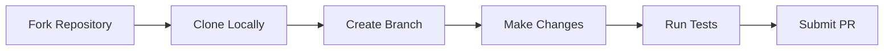
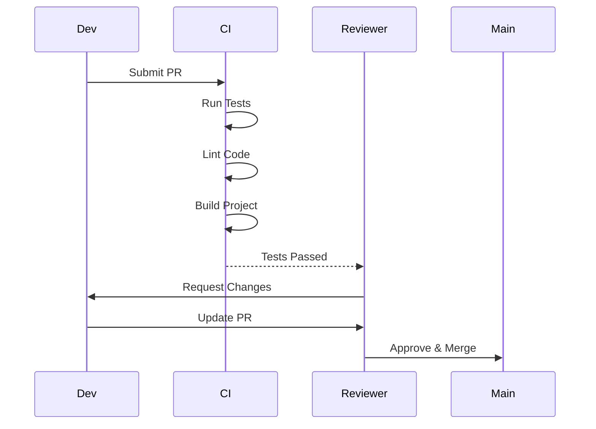
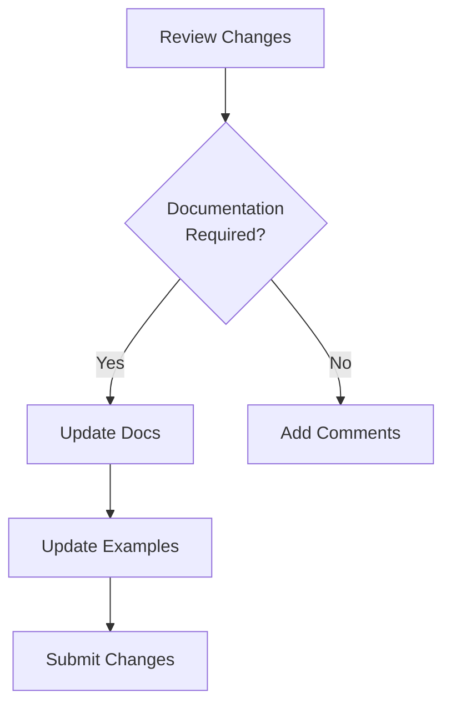

# Contributing to WalletMesh

This guide outlines the process for contributing to WalletMesh and provides guidelines for code style, pull requests, and documentation updates.

## Getting Started



### 1. Fork & Clone
```bash
# Fork the repository on GitHub, then:
git clone https://github.com/your-username/walletmesh-packages.git
cd walletmesh-packages
pnpm install
```

### 2. Set Up Development Environment
```bash
# Install dependencies
pnpm install

# Build packages
pnpm build

# Run tests
pnpm test
```

## Development Workflow

### Branch Naming Convention
```
type/description

Types:
- feature/   (new features)
- fix/       (bug fixes)
- docs/      (documentation updates)
- refactor/  (code improvements)
- test/      (test improvements)
- chore/     (maintenance tasks)
```

### Commit Message Format
```
type(scope): description

Example:
feat(modal): add support for custom themes
fix(provider): resolve connection timeout issue
docs(api): update state management guide
```

## Code Style Guidelines

### TypeScript Standards

```typescript
// Use explicit types
interface ModalConfig {
  projectId: string;
  chains: string[];
  theme?: ThemeConfig;
}

// Use meaningful variable names
const walletProvider: Provider = createProvider();

// Use async/await consistently
async function connectWallet(): Promise<void> {
  try {
    await provider.connect();
    await updateState();
  } catch (error) {
    handleError(error);
  }
}
```

### Comments and Documentation

```typescript
/**
 * Creates a new Modal instance with the specified configuration.
 * 
 * @param config - The modal configuration
 * @returns A configured Modal instance
 * @throws {ConfigurationError} If required options are missing
 */
function createModal(config: ModalConfig): Modal {
  // Implementation
}

// Use inline comments sparingly, only for complex logic
function complexOperation() {
  // Calculate hash using custom algorithm
  const hash = calculateHash();
}
```

## Testing Guidelines

### Unit Test Structure

```typescript
describe('ModalController', () => {
  let modal: ModalController;
  let mockProvider: Provider;
  
  beforeEach(() => {
    mockProvider = createMockProvider();
    modal = new ModalController({
      provider: mockProvider
    });
  });
  
  it('should connect to wallet', async () => {
    await modal.connect();
    expect(mockProvider.isConnected).toBe(true);
  });
  
  it('should handle connection errors', async () => {
    mockProvider.connect.mockRejectedValue(new Error());
    await expect(modal.connect()).rejects.toThrow();
  });
});
```

### Integration Testing

```typescript
describe('Wallet Integration', () => {
  it('should complete full transaction flow', async () => {
    // Arrange
    const modal = createTestModal();
    const transaction = createTestTransaction();
    
    // Act
    await modal.connect();
    const result = await modal.sendTransaction(transaction);
    
    // Assert
    expect(result.status).toBe('confirmed');
  });
});
```

## Pull Request Process



### PR Checklist
- [ ] Tests added/updated
- [ ] Documentation updated
- [ ] Changeset created
- [ ] Code follows style guide
- [ ] CI checks pass
- [ ] Reviewer(s) assigned

## Documentation Updates

### Process

1. **Identify Documentation Needs**


2. **Update Relevant Files**
- README.md files
- API documentation
- Example code
- Diagrams
- Migration guides

3. **Documentation Standards**
- Clear and concise language
- Code examples for features
- Diagrams for complex concepts
- Cross-references where appropriate

### Example Documentation Update

```markdown
## New Feature: Custom Themes

The Modal component now supports custom themes:

```typescript
const modal = createModal({
  theme: {
    primary: '#1a73e8',
    background: '#ffffff',
    text: '#000000'
  }
});
```

Custom themes allow you to match your application's branding:
- Override default colors
- Customize component styles
- Apply consistent theming
```

## Release Process

### Version Bump
```bash
# Create changeset
pnpm changeset

# Version packages
pnpm version-packages

# Build all packages
pnpm build

# Publish to npm
pnpm publish
```

### Release Notes
- List all changes
- Highlight breaking changes
- Include migration steps
- Update changelog

## Support

### Getting Help
- Create an issue
- Join discussions
- Review documentation

### Reporting Bugs
- Use issue template
- Include reproduction
- Attach error logs
- Specify environment

## Code of Conduct

All contributors are expected to:
- Be respectful and inclusive
- Follow project guidelines
- Help maintain quality
- Support other contributors

## License

By contributing, you agree to license your work under the project's license terms.

## Further Reading
- [Project Architecture](../architecture/README.md)
- [API Documentation](../api-guides/README.md)
- [Testing Guidelines](testing-guidelines.md)
