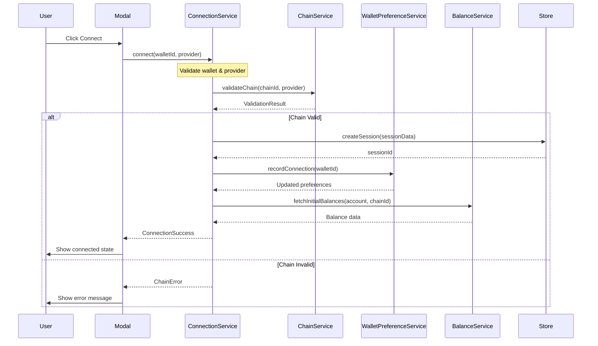
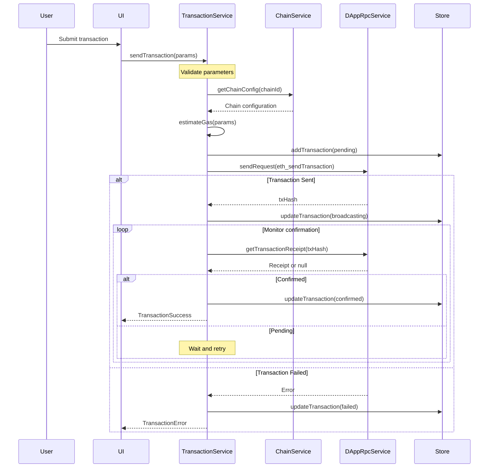
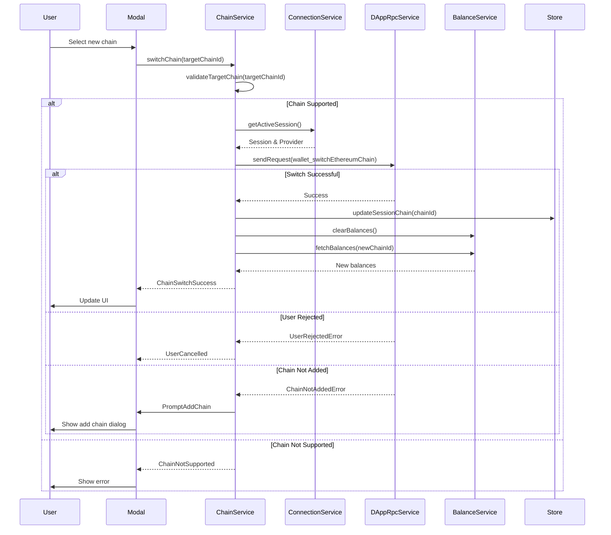
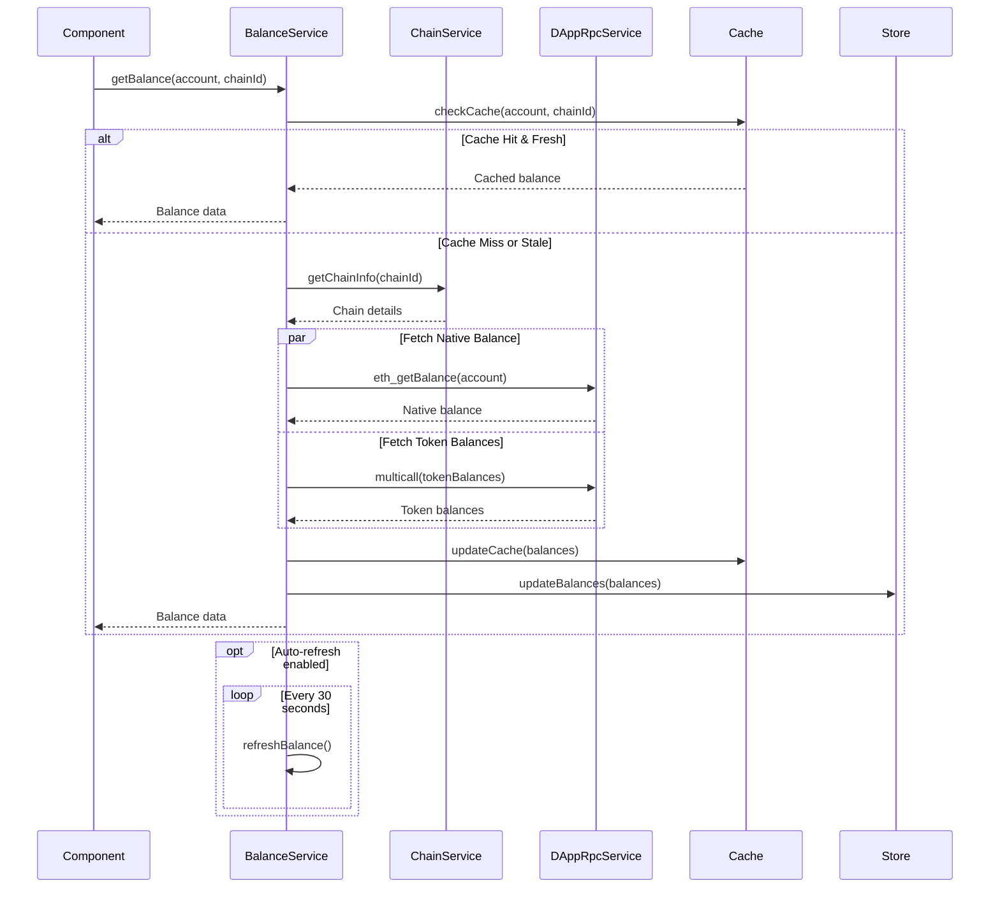
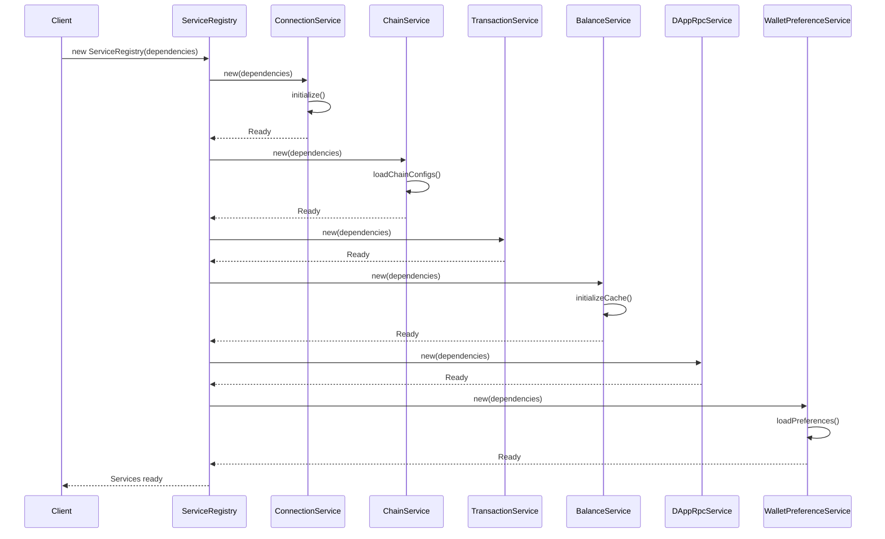
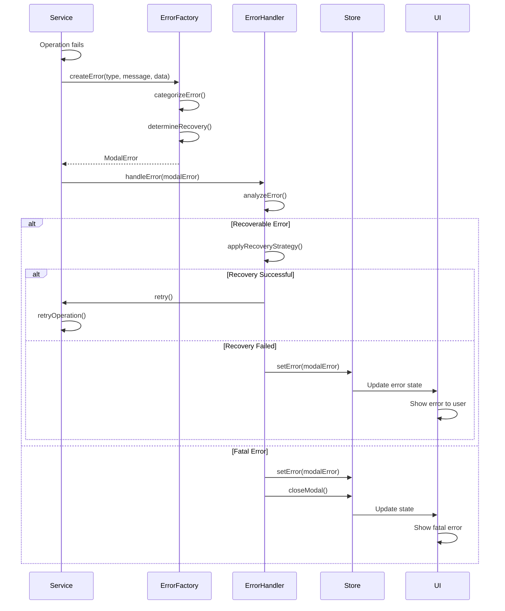
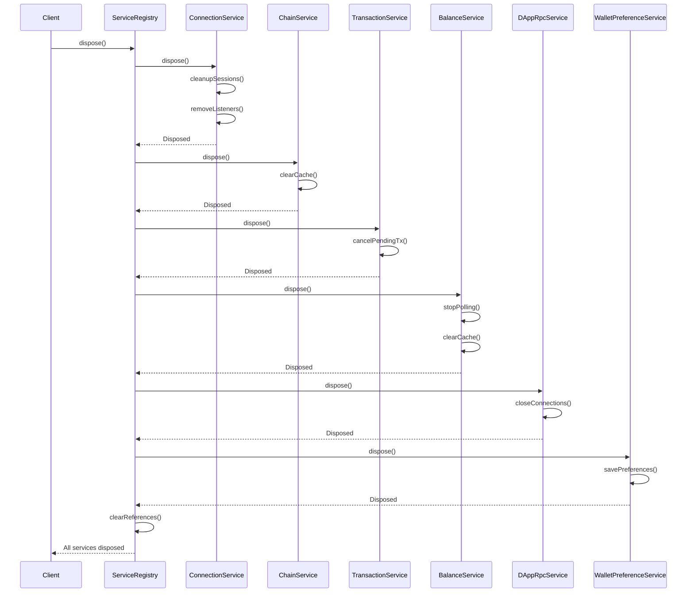

# Service Sequence Diagrams

This document provides detailed sequence diagrams for key service interactions in WalletMesh Modal Core.

## Wallet Connection Sequence



## Transaction Execution Sequence



## Chain Switching Sequence



## Balance Fetching Sequence



## Service Initialization Sequence



## Error Handling Sequence



## Multi-Chain Session Management

```mermaid
sequenceDiagram
    participant User
    participant Modal
    participant ConnectionService
    participant ChainServiceRegistry
    participant EVMService
    participant SolanaService
    participant Store

    User->>Modal: Connect multi-chain wallet
    
    Modal->>ConnectionService: connectMultiChain(walletId)
    
    ConnectionService->>ChainServiceRegistry: getSupportedChains(walletId)
    ChainServiceRegistry-->>ConnectionService: [EVM, Solana]
    
    par EVM Connection
        ConnectionService->>EVMService: connect(provider)
        EVMService->>EVMService: getAccounts()
        EVMService-->>ConnectionService: EVM accounts
    and Solana Connection
        ConnectionService->>SolanaService: connect(provider)
        SolanaService->>SolanaService: getAccounts()
        SolanaService-->>ConnectionService: Solana accounts
    end
    
    ConnectionService->>Store: createMultiChainSession({
        evm: evmAccounts,
        solana: solanaAccounts
    })
    
    Store-->>ConnectionService: sessionId
    
    ConnectionService-->>Modal: MultiChainConnected
    Modal->>User: Show all connected chains
```

## Service Disposal Sequence



## Key Interaction Patterns

### 1. Request-Response Pattern
Most service interactions follow a request-response pattern with error handling:
- Service A calls Service B method
- Service B processes and returns result or throws error
- Service A handles response or error appropriately

### 2. Event-Driven Updates
Some interactions use events for loose coupling:
- Service emits event when state changes
- Other services or UI components listen and react
- No direct dependencies between event source and listeners

### 3. Cache-First Pattern
Services like BalanceService use caching to improve performance:
- Check cache before making external calls
- Update cache after successful fetches
- Invalidate cache on relevant state changes

### 4. Retry with Backoff
Critical operations implement retry logic:
- Initial attempt
- Exponential backoff on failure
- Maximum retry limit
- Final error if all retries fail

## Performance Optimization Points

1. **Parallel Operations**: Services execute independent operations in parallel (e.g., fetching balances for multiple tokens)

2. **Lazy Loading**: Services load data only when needed (e.g., chain configs loaded on first use)

3. **Debouncing**: Rapid repeated calls are debounced (e.g., balance refresh requests)

4. **Resource Pooling**: Connections are reused where possible (e.g., RPC connections)

## Testing Considerations

When testing these sequences:

1. **Mock External Calls**: Mock RPC providers and external services
2. **Test Error Paths**: Ensure error cases are properly handled
3. **Verify State Updates**: Check that store is updated correctly
4. **Test Async Flows**: Handle promises and async operations properly
5. **Check Cleanup**: Verify resources are properly disposed