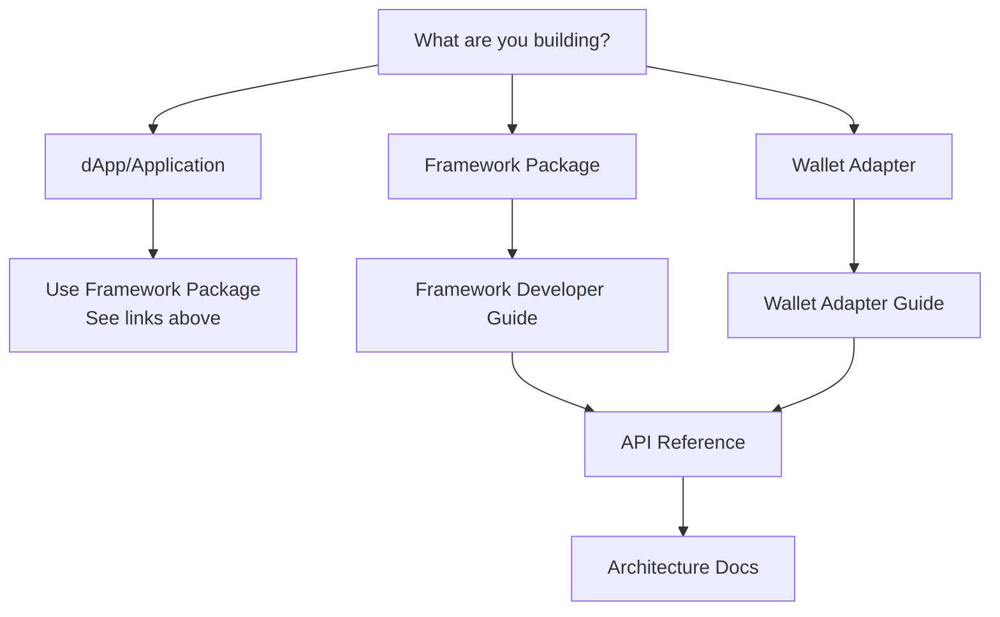

# WalletMesh Modal Core Documentation

Welcome to the WalletMesh Modal Core documentation. This guide will help you navigate our documentation based on your role and needs.

## ⚠️ Important Notice for dApp Developers

**If you're building a dApp, you should use one of our framework-specific packages instead of modal-core directly:**

- React: [`@walletmesh/modal-react`](../../modal-react)
- Vue: [`@walletmesh/modal-vue`](../../modal-vue) 
- Svelte: [`@walletmesh/modal-svelte`](../../modal-svelte)
- Angular: [`@walletmesh/modal-angular`](../../modal-angular)
- Lit: [`@walletmesh/modal-lit`](../../modal-lit)

The `@walletmesh/modal-core` package is intended for framework package developers and advanced integrations only.

## 🧭 Which Documentation Should I Read?



### Quick Links by Role

#### 🚀 For dApp Developers
- You're in the wrong place! Use a [framework package](#️-important-notice-for-dapp-developers) instead
- If you must use modal-core directly: [dApp Developer Guide](./guides/dapp-developers.md)

#### 🔧 For Framework Package Developers
- [Framework Developer Guide](./guides/framework-developers.md) - Creating framework integrations
- [API Reference](./api/README.md) - Complete API documentation
- [Architecture Overview](./architecture/README.md) - System design and patterns

#### 🔌 For Wallet Adapter Developers
- [Wallet Adapter Developer Guide](./guides/wallet-adapter-developers.md) - Creating wallet adapters
- [Provider Architecture](./architecture/provider-architecture.md) - Provider system details
- [Integration Patterns](./architecture/integration-patterns.md) - Common patterns

#### 📚 General Resources
- [Getting Started](./getting-started/README.md) - Installation and basic setup
- [Error Handling Guide](./guides/error-handling.md) - Error handling patterns
- [Examples](./examples/README.md) - Code examples
- [TypeDoc API Reference](../docs/README.md) - Auto-generated API docs

## 📖 Documentation Structure

```
documentation/
├── getting-started/     # Quick start guides
├── guides/             # In-depth developer guides
├── architecture/       # System design and architecture
├── api/               # API reference and usage
├── reference/         # Additional reference materials
├── examples/          # Working code examples
└── ai/               # AI integration documentation
```

## 🔍 Common Tasks

### Creating a Framework Integration
1. Read the [Framework Developer Guide](./guides/framework-developers.md)
2. Review the [API Reference](./api/README.md)
3. Check existing [Examples](./examples/README.md)
4. Understand the [Architecture](./architecture/README.md)

### Building a Wallet Adapter
1. Start with the [Wallet Adapter Guide](./guides/wallet-adapter-developers.md)
2. Review [Provider Architecture](./architecture/provider-architecture.md)
3. See [Integration Patterns](./architecture/integration-patterns.md)
4. Check the [API Reference](./api/README.md)

### Debugging Issues
1. Check [Error Handling Guide](./guides/error-handling.md)
2. Review [Troubleshooting](./reference/troubleshooting.md)
3. See [TypeDoc API Reference](../docs/README.md) for detailed type information

## 🛠️ Key Concepts

### Core Components
- **WalletMeshClient**: Main client interface for applications
- **WalletAdapter**: Interface for wallet integrations
- **Provider System**: Multi-chain provider architecture
- **Discovery Service**: Cross-origin wallet discovery

### API Pattern
The modal-core package uses a factory function pattern:

```typescript
import { createWalletMesh } from '@walletmesh/modal-core';

const { client, modal } = createWalletMesh({
  // Configuration
});
```

For detailed API usage, see the [API Reference](./api/README.md).

## 📝 Contributing

See our [Contributing Guide](./contributing/README.md) for information on:
- Code style and standards
- Testing requirements
- Documentation updates
- Pull request process

## 🆘 Getting Help

1. **Documentation**: Start with the relevant guide for your use case
2. **TypeDoc**: Check the [auto-generated API docs](../docs/README.md)
3. **Examples**: Review our [example code](./examples/README.md)
4. **Issues**: Search or create [GitHub issues](https://github.com/walletmesh/walletmesh-packages/issues)

## 📋 Documentation Maintenance

This documentation is maintained alongside the codebase. When making changes:
- Update relevant documentation files
- Keep examples up to date
- Ensure consistency across guides
- Run `pnpm docs` to update TypeDoc

---

*Last updated: [Auto-generated during build]*