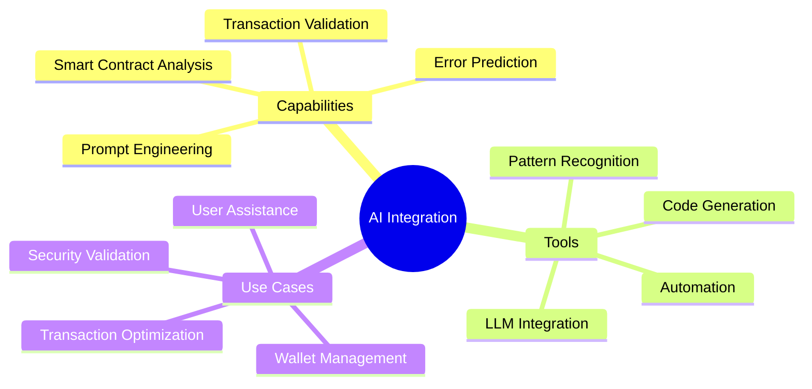
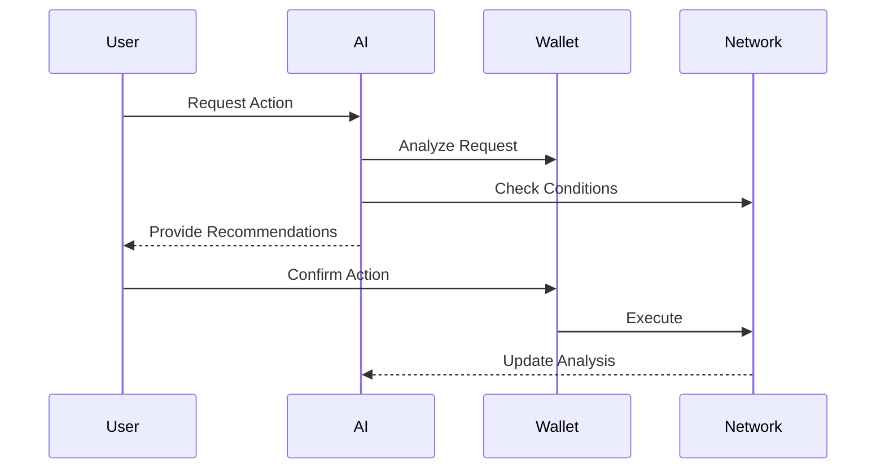

# WalletMesh AI Integration

This guide covers how to effectively integrate and use WalletMesh with AI tools and services. Learn how to leverage AI capabilities for wallet interactions, smart contract interactions, and transaction management.

## Overview



## AI Integration Patterns

### 1. Smart Contract Interaction

```typescript
// AI-assisted contract validation
async function validateContractWithAI(contract: Contract) {
  const analysis = await analyzeContract({
    abi: contract.interface.format(),
    bytecode: contract.bytecode,
    source: contract.source
  });
  
  return {
    securityScore: analysis.securityScore,
    recommendations: analysis.recommendations,
    warnings: analysis.warnings
  };
}

// Usage example
const contractAnalysis = await validateContractWithAI(myContract);
if (contractAnalysis.securityScore < 0.8) {
  console.warn('Security concerns detected:', contractAnalysis.warnings);
}
```

### 2. Transaction Optimization

```typescript
// AI-powered gas optimization
async function optimizeTransaction(tx: Transaction) {
  const prediction = await predictGasMarket({
    network: tx.chainId,
    timeWindow: '1h'
  });
  
  return {
    ...tx,
    gasPrice: prediction.optimalPrice,
    gasLimit: prediction.recommendedLimit
  };
}

// Usage example
const optimizedTx = await optimizeTransaction({
  to: '0x...',
  value: '1000000000000000000'
});
```

## Prompt Templates

### 1. Transaction Analysis

```typescript
const transactionPrompt = `
Analyze the following transaction for potential issues:
- Transaction Type: {type}
- To Address: {to}
- Value: {value}
- Data: {data}

Consider:
1. Common scam patterns
2. Contract interaction risks
3. Gas optimization
4. Network conditions
`;

// Usage
const analysis = await analyzeWithAI(
  transactionPrompt.replace(
    '{type}', tx.type,
    '{to}', tx.to,
    '{value}', tx.value,
    '{data}', tx.data
  )
);
```

### 2. Error Resolution

```typescript
const errorPrompt = `
Debug the following wallet error:
Error Type: {errorType}
Message: {message}
Context:
- Chain: {chain}
- Action: {action}
- Provider: {provider}

Provide:
1. Potential causes
2. Resolution steps
3. Prevention measures
`;

// Usage
const resolution = await getAIResolution(
  errorPrompt.replace(
    '{errorType}', error.type,
    '{message}', error.message,
    '{chain}', error.chain,
    '{action}', error.action,
    '{provider}', error.provider
  )
);
```

## AI Usage Patterns

### 1. Wallet Management



### 2. Security Validation

```typescript
// AI-powered security checks
async function validateWithAI(params: SecurityParams) {
  const checks = [
    validateAddress(params.address),
    validateAmount(params.amount),
    validateNetwork(params.chainId),
    validateContract(params.contract)
  ];
  
  const results = await Promise.all(checks);
  return aggregateResults(results);
}

// Usage
const securityCheck = await validateWithAI({
  address: recipientAddress,
  amount: transferAmount,
  chainId: currentChain,
  contract: targetContract
});
```

## Best Practices

### 1. Prompt Engineering

```typescript
// Structured prompt builder
class PromptBuilder {
  private sections: string[] = [];
  
  addContext(context: string) {
    this.sections.push(`Context: ${context}`);
    return this;
  }
  
  addInstruction(instruction: string) {
    this.sections.push(`Instruction: ${instruction}`);
    return this;
  }
  
  addParameters(params: Record<string, any>) {
    this.sections.push('Parameters:');
    Object.entries(params).forEach(([key, value]) => {
      this.sections.push(`- ${key}: ${value}`);
    });
    return this;
  }
  
  build() {
    return this.sections.join('\n\n');
  }
}

// Usage
const prompt = new PromptBuilder()
  .addContext('Transaction validation')
  .addInstruction('Analyze for security risks')
  .addParameters({
    to: recipientAddress,
    value: amount,
    network: chainId
  })
  .build();
```

### 2. Error Handling

```typescript
// AI-assisted error handling
class AIErrorHandler {
  async handle(error: WalletError) {
    const analysis = await this.analyzeError(error);
    const resolution = await this.getResolution(analysis);
    
    if (resolution.canAutoResolve) {
      return this.autoResolve(resolution.steps);
    }
    
    return this.provideUserGuidance(resolution.guidance);
  }
  
  private async analyzeError(error: WalletError) {
    // AI analysis implementation
  }
  
  private async getResolution(analysis: ErrorAnalysis) {
    // Resolution generation
  }
}
```

## AI Tool Integration

### 1. Configuration

```typescript
// AI service configuration
interface AIConfig {
  provider: 'openai' | 'anthropic' | 'custom';
  apiKey: string;
  modelName: string;
  options?: {
    temperature?: number;
    maxTokens?: number;
    topP?: number;
  };
}

// Initialize AI integration
const ai = createAIIntegration({
  provider: 'openai',
  apiKey: process.env.OPENAI_API_KEY,
  modelName: 'gpt-4',
  options: {
    temperature: 0.7,
    maxTokens: 2000
  }
});
```

### 2. Usage Examples

```typescript
// Transaction analysis
const txAnalysis = await ai.analyze({
  type: 'transaction',
  content: transaction,
  context: {
    chainId: currentChain,
    userHistory: previousTransactions,
    marketConditions: currentMarket
  }
});

// Security validation
const securityCheck = await ai.validate({
  type: 'security',
  target: contractAddress,
  context: {
    contractType: 'ERC20',
    permissions: requestedPermissions,
    userRisk: riskProfile
  }
});
```

## Troubleshooting

### Common Issues

1. **Rate Limiting**
```typescript
class AIRateLimiter {
  private queue = new Map();
  
  async execute(operation: () => Promise<any>) {
    const key = this.getOperationKey();
    await this.waitForSlot(key);
    
    try {
      return await operation();
    } finally {
      this.releaseSlot(key);
    }
  }
}
```

2. **Context Length**
```typescript
function optimizeContext(context: string, maxTokens: number) {
  // Context optimization logic
}
```

3. **Error Recovery**
```typescript
async function withAIRetry<T>(
  operation: () => Promise<T>,
  maxAttempts = 3
): Promise<T> {
  // Retry logic with AI-assisted error analysis
}
```

## Further Reading

- [AI Integration Patterns](ai-usage-patterns.md)
- [Prompt Templates](prompt-templates.md)
- [Security Guidelines](security-guidelines.md)
- [API Reference](../api-guides/README.md)
