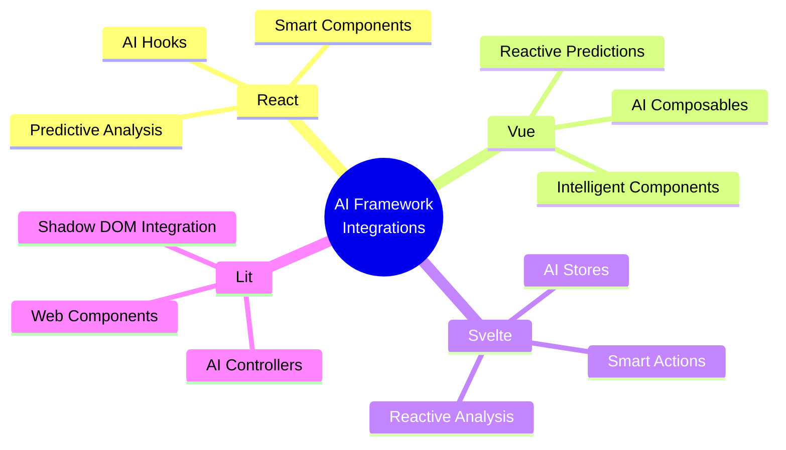
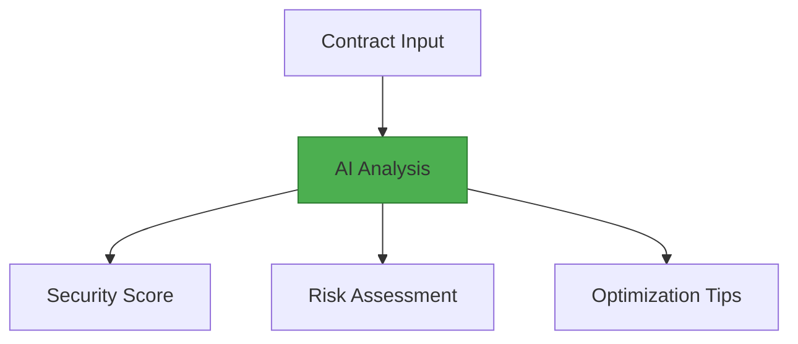
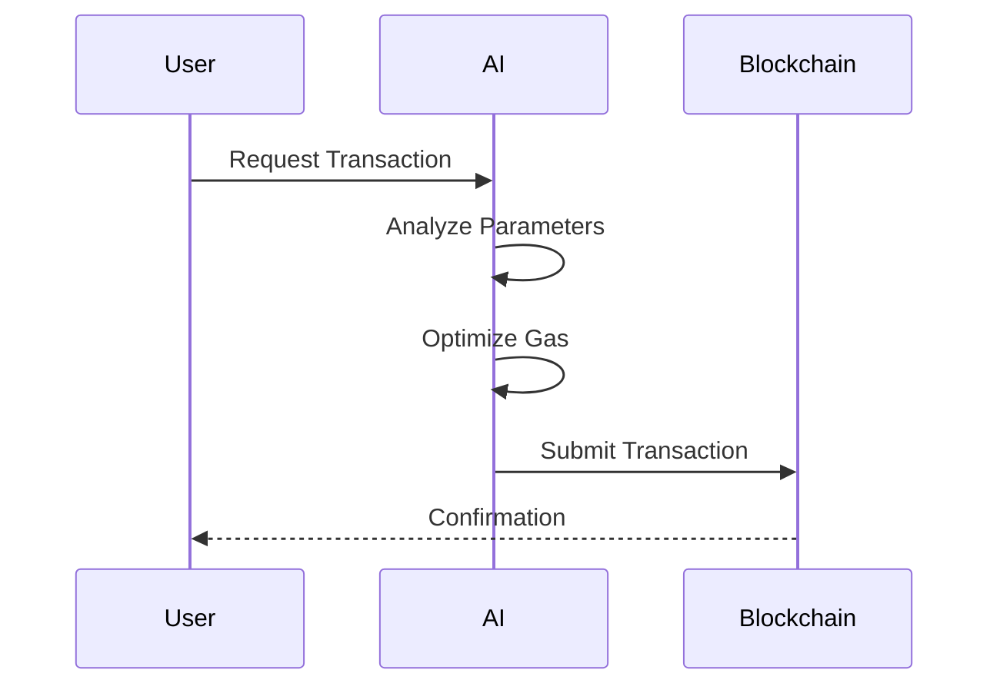
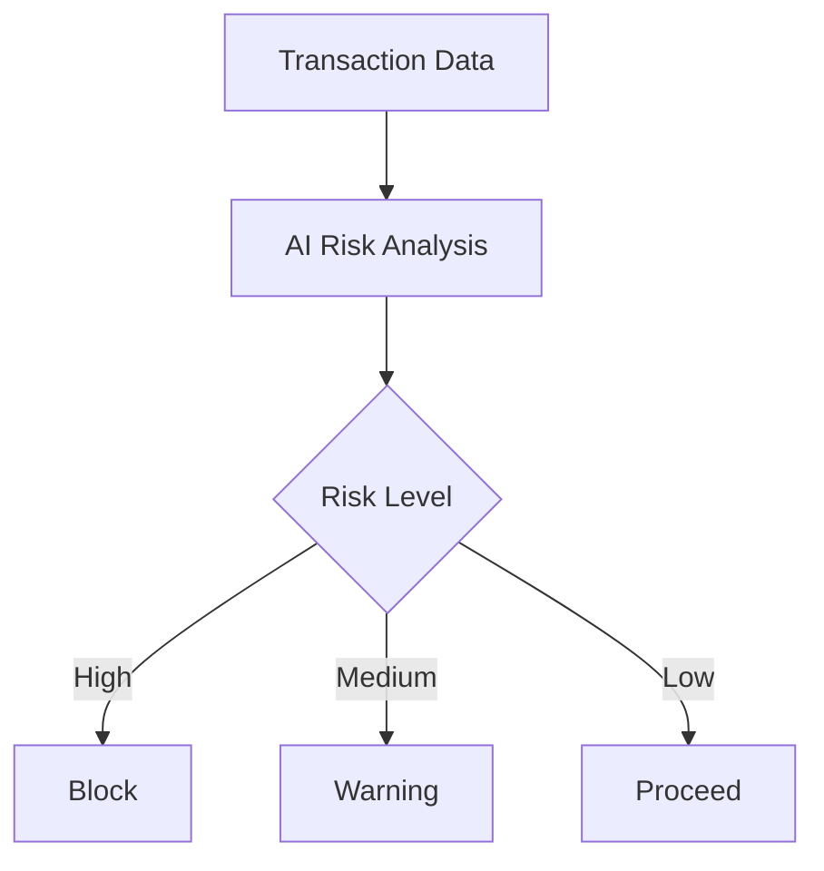

# WalletMesh AI Framework Integrations

This guide provides an overview of WalletMesh's AI capabilities integrated with various frontend frameworks.

## Overview



## Framework Integrations

### [React Integration](./ai-react-integration.md)
- AI-powered hooks for smart contract analysis
- Predictive error handling
- Transaction optimization components
- Real-time risk assessment

### [Vue Integration](./ai-vue-integration.md)
- AI composables for blockchain interaction
- Smart contract analysis components
- Predictive state management
- Intelligent error recovery

### [Svelte Integration](./ai-svelte-integration.md)
- AI-enhanced Svelte stores
- Smart contract analysis components
- Reactive prediction systems
- Automated optimization

### [Lit Integration](./ai-lit-integration.md)
- AI-powered web components
- Smart contract analyzers
- Reactive controllers for predictions
- Shadow DOM optimization

## Common AI Features

### 1. Smart Contract Analysis



### 2. Transaction Optimization



### 3. Risk Assessment



## Framework-Specific AI Features

### React
```typescript
// AI-powered hook
function useContractAnalysis(address: string) {
  const analysis = useAIAnalysis(address);
  return {
    securityScore: analysis.score,
    risks: analysis.risks,
    recommendations: analysis.recommendations
  };
}
```

### Vue
```typescript
// AI composable
export function useAIAnalysis() {
  const analysis = ref(null);
  
  async function analyzeContract(address: string) {
    analysis.value = await ai.analyzeContract(address);
  }
  
  return {
    analysis,
    analyzeContract
  };
}
```

### Svelte
```typescript
// AI-enhanced store
const aiAnalysis = createAIStore((set) => ({
  analyze: async (contract) => {
    const result = await ai.analyzeContract(contract);
    set({ result });
  }
}));
```

### Lit
```typescript
// AI controller
class AIAnalysisController implements ReactiveController {
  async analyze(contract: string) {
    return await ai.analyzeContract(contract);
  }
}
```

## Common Integration Patterns

### 1. AI Configuration

```typescript
const aiConfig = {
  model: 'gpt-4',
  temperature: 0.7,
  riskThreshold: 0.8,
  optimizationTarget: 'gas'
};
```

### 2. Error Handling

```typescript
try {
  const analysis = await ai.analyzeContract(address);
} catch (error) {
  const recovery = await ai.suggestRecovery(error);
  if (recovery.canResolve) {
    await recovery.execute();
  }
}
```

### 3. Event Management

```typescript
ai.on('predictionMade', (prediction) => {
  console.log('AI Prediction:', prediction);
});

ai.on('riskDetected', (risk) => {
  console.log('Risk Level:', risk.level);
});
```

## Testing Strategies

Each framework provides specific testing utilities for AI components:

### React Testing
```typescript
import { renderAIHook } from '@walletmesh/ai-react/testing';
```

### Vue Testing
```typescript
import { createAIWrapper } from '@walletmesh/ai-vue/testing';
```

### Svelte Testing
```typescript
import { createAIStore } from '@walletmesh/ai-svelte/testing';
```

### Lit Testing
```typescript
import { createAIElement } from '@walletmesh/ai-lit/testing';
```

## Best Practices

### 1. AI State Management
- Keep AI state separate from application state
- Use framework-specific patterns for state updates
- Handle asynchronous AI operations gracefully

### 2. Performance
- Implement AI result caching
- Use debouncing for frequent AI calls
- Optimize AI model selection

### 3. Error Handling
- Implement graceful fallbacks
- Provide user-friendly error messages
- Use AI for error recovery suggestions

## Security Considerations

1. **API Key Management**
   - Secure storage of AI provider keys
   - Rate limiting for AI requests
   - Access control for AI features

2. **Data Privacy**
   - Minimize sensitive data in AI requests
   - Implement data encryption
   - Clear AI analysis caches

3. **Transaction Security**
   - AI-powered transaction validation
   - Risk assessment before execution
   - Multi-factor confirmation for high-risk operations

## Further Reading

- [AI Integration Overview](../README.md)
- [Core AI Features](../features.md)
- [Security Guidelines](../security.md)
- [API Documentation](../../api-guides/README.md)
