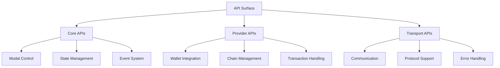
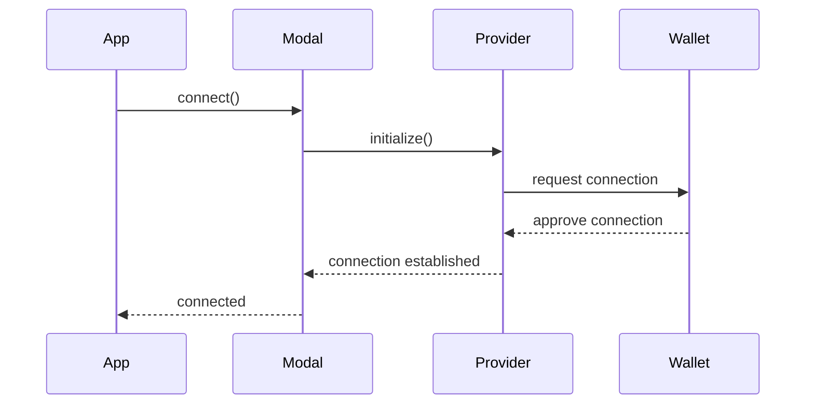

# WalletMesh API Guides

This section provides practical guidance for working with the WalletMesh API. Rather than duplicating the TypeDoc API reference, these guides focus on common usage patterns, best practices, and real-world examples.

## Overview



## Core Concepts

### Modal Control

The Modal Controller is the primary interface for interacting with WalletMesh:

```typescript
import { createModal } from '@walletmesh/modal-core';

const modal = createModal({
  projectId: 'your-project-id',
  chains: ['ethereum']
});

// Modal lifecycle
await modal.initialize();
await modal.connect();
await modal.disconnect();
```

### State Management

WalletMesh uses a reactive state system:

```typescript
// Subscribe to state changes
modal.subscribe((state) => {
  console.log('Connection status:', state.status);
  console.log('Active accounts:', state.accounts);
  console.log('Current chain:', state.chain);
});

// Access current state
const currentState = modal.getState();
```

### Event Handling

```typescript
// Listen for specific events
modal.on('connect', ({ accounts }) => {
  console.log('Connected accounts:', accounts);
});

modal.on('chainChanged', ({ chain }) => {
  console.log('New chain:', chain);
});

// Remove listeners
modal.off('connect', handleConnect);
```

## Common Patterns

### Connection Management



Example implementation:

```typescript
// Initialize connection with auto-reconnect
const initializeWallet = async () => {
  try {
    await modal.connect({ autoReconnect: true });
    
    modal.on('disconnect', async () => {
      try {
        await modal.connect();
      } catch (error) {
        console.error('Reconnection failed:', error);
      }
    });
  } catch (error) {
    console.error('Initial connection failed:', error);
  }
};
```

### Chain Management

```typescript
// Switch chains
const switchToPolygon = async () => {
  try {
    await modal.switchChain('polygon');
  } catch (error) {
    if (error.code === 4902) { // Chain not added
      await modal.addChain({
        chainId: '0x89',
        chainName: 'Polygon',
        // ... chain configuration
      });
      await modal.switchChain('polygon');
    }
  }
};
```

### Transaction Workflow

```typescript
// Send transaction with confirmation
const sendWithConfirmation = async (transaction) => {
  try {
    const hash = await modal.sendTransaction(transaction);
    
    const receipt = await modal.waitForTransaction({
      hash,
      confirmations: 1
    });
    
    return receipt;
  } catch (error) {
    console.error('Transaction failed:', error);
    throw error;
  }
};
```

## Integration Scenarios

### Basic Web Application

```typescript
// Initialize once at app startup
const modal = createModal({
  projectId: 'your-project-id',
  chains: ['ethereum']
});

// Connect button handler
const connectButton = document.getElementById('connect');
connectButton.onclick = async () => {
  try {
    await modal.connect();
    updateUI();
  } catch (error) {
    showError(error);
  }
};
```

### React Integration

```typescript
import { WalletProvider, useWallet } from '@walletmesh/modal-react';

function App() {
  return (
    <WalletProvider
      projectId="your-project-id"
      chains={['ethereum']}
    >
      <WalletConnection />
    </WalletProvider>
  );
}

function WalletConnection() {
  const { connect, disconnect, status } = useWallet();
  
  return (
    <button onClick={status === 'connected' ? disconnect : connect}>
      {status === 'connected' ? 'Disconnect' : 'Connect Wallet'}
    </button>
  );
}
```

### Vue Integration

```typescript
import { useWallet } from '@walletmesh/modal-vue';

export default {
  setup() {
    const { connect, disconnect, status } = useWallet();
    
    return {
      connect,
      disconnect,
      status
    };
  }
};
```

## Error Handling Best Practices

```typescript
import {
  WalletError,
  ConnectionError,
  ChainError,
  TransactionError
} from '@walletmesh/modal-core';

// Comprehensive error handling
const handleWalletOperation = async () => {
  try {
    await modal.connect();
  } catch (error) {
    if (error instanceof ConnectionError) {
      // Handle connection-specific errors
      handleConnectionError(error);
    } else if (error instanceof ChainError) {
      // Handle chain-related errors
      handleChainError(error);
    } else if (error instanceof WalletError) {
      // Handle general wallet errors
      handleWalletError(error);
    } else {
      // Handle unknown errors
      handleUnknownError(error);
    }
  }
};
```

## Security Considerations

### Provider Validation

```typescript
// Validate provider before use
const validateProvider = async (provider) => {
  if (!provider.isConnected) {
    throw new Error('Provider not connected');
  }
  
  const accounts = await provider.request({
    method: 'eth_accounts'
  });
  
  if (!accounts.length) {
    throw new Error('No accounts available');
  }
  
  return true;
};
```

### Transaction Security

```typescript
// Secure transaction handling
const sendSecureTransaction = async (transaction) => {
  // Validate transaction
  if (!transaction.to || !ethers.isAddress(transaction.to)) {
    throw new Error('Invalid recipient address');
  }
  
  // Verify chain
  const chain = await modal.getChain();
  if (chain !== transaction.chainId) {
    throw new Error('Chain mismatch');
  }
  
  // Send with confirmation
  return modal.sendTransaction(transaction);
};
```

## Further Reading

- [TypeDoc API Reference](/docs/README.md)
- [Architecture Overview](../architecture/README.md)
- [Design Patterns](../patterns/README.md)
- [Error Handling Guide](../guides/error-handling.md)
