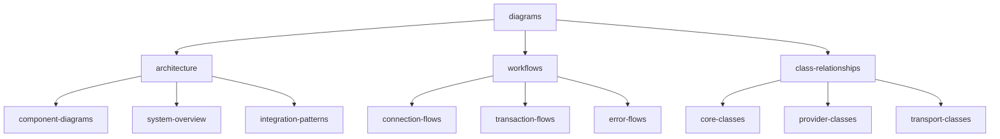
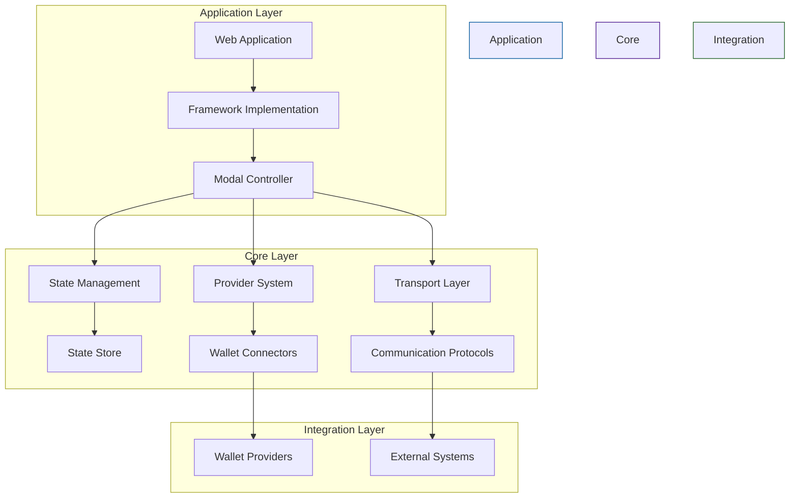
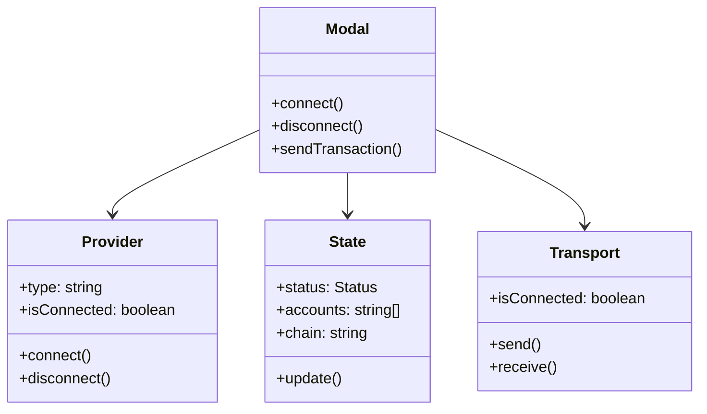
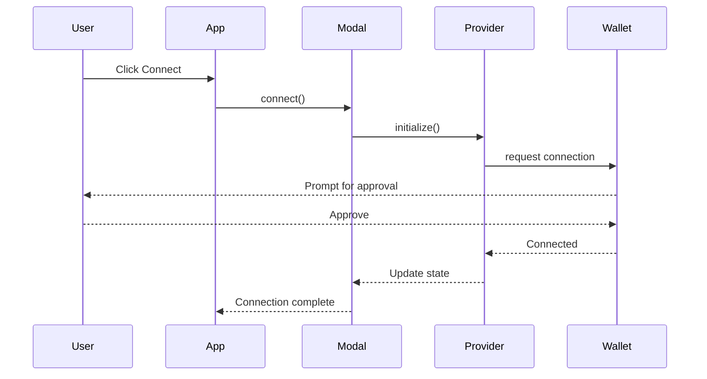
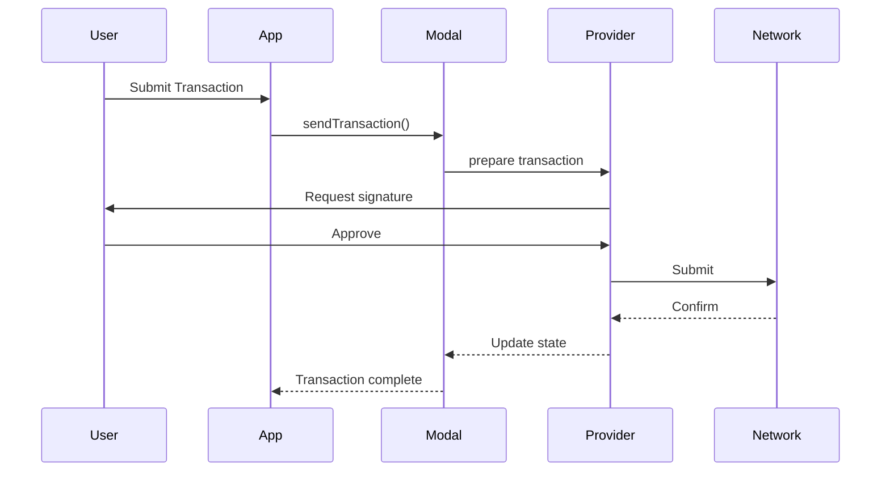
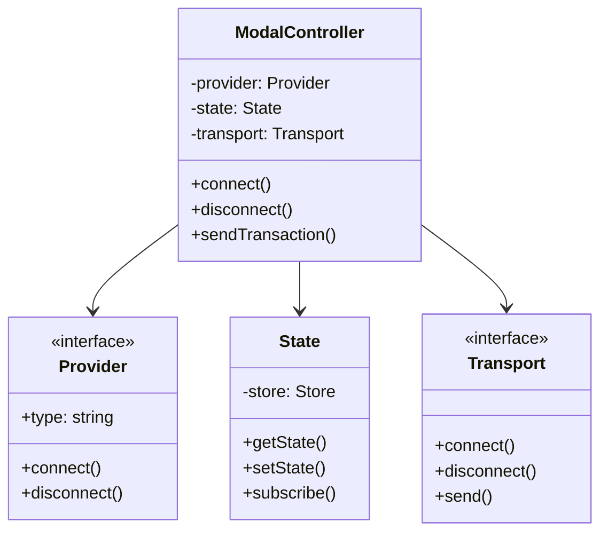
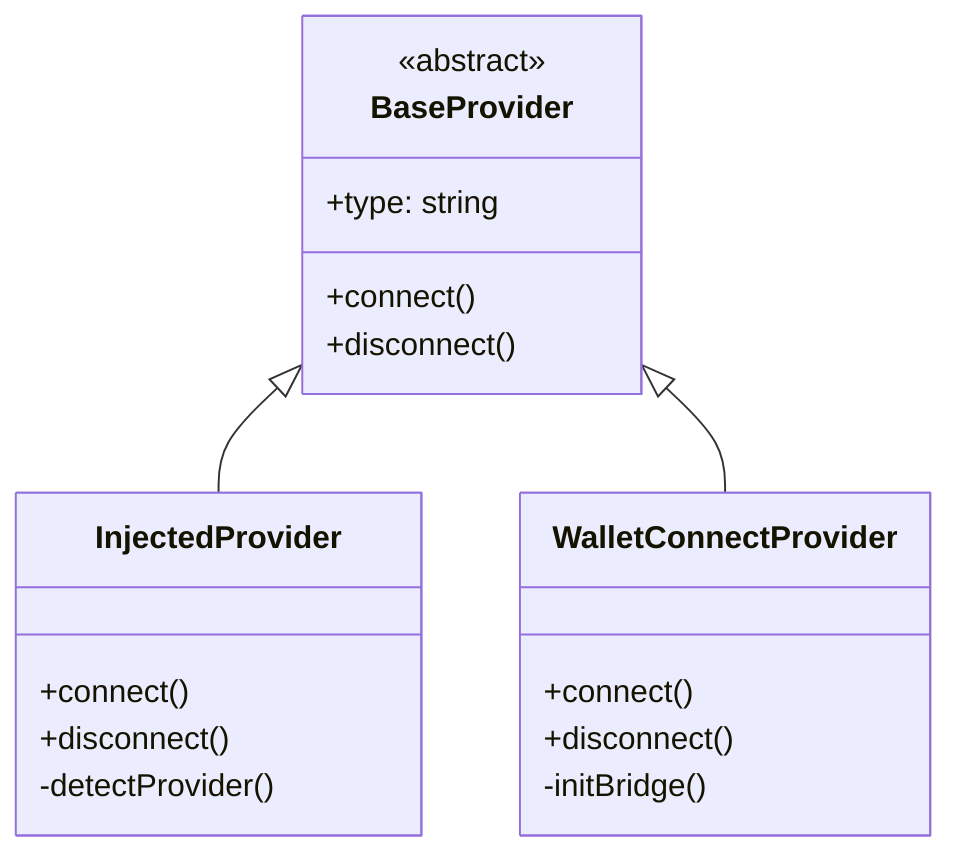
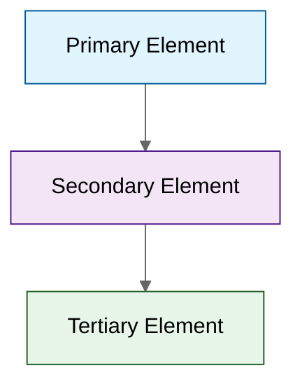

# WalletMesh Diagrams

This section contains all diagrams used throughout the WalletMesh documentation. Having them centralized here allows for easier maintenance and reuse while ensuring consistency across the documentation.

## Directory Structure

## Architecture Diagrams

### System Overview

### Component Relationships

## Workflow Diagrams

### Connection Flow

### Transaction Flow

## Class Relationship Diagrams

### Core Classes

### Provider Classes

## Usage Guidelines

### 1. Diagram Maintenance

When updating diagrams:
1. Edit the source in this directory
2. Update any copies in other documentation
3. Ensure consistency with implementation
4. Verify visual clarity and readability

### 2. Creating New Diagrams

When adding new diagrams:
1. Follow existing naming conventions
2. Use consistent styling
3. Add to appropriate subdirectory
4. Update this index document
5. Include clear descriptions

### 3. Style Guidelines

- Use consistent colors for similar elements
- Maintain readable contrast ratios
- Keep diagrams focused and uncluttered
- Split complex diagrams when needed

## Diagram Types and Uses

### Component Diagrams
- Show system architecture
- Illustrate module relationships
- Highlight data flow
- Explain integration points

### Sequence Diagrams
- Demonstrate workflows
- Show interaction patterns
- Illustrate error handling
- Display timing relationships

### Class Diagrams
- Show code structure
- Display inheritance
- Illustrate patterns
- Document APIs

## Further Reading

- [Architecture Documentation](../architecture/README.md)
- [API Guides](../api-guides/README.md)
- [Design Patterns](../patterns/README.md)
