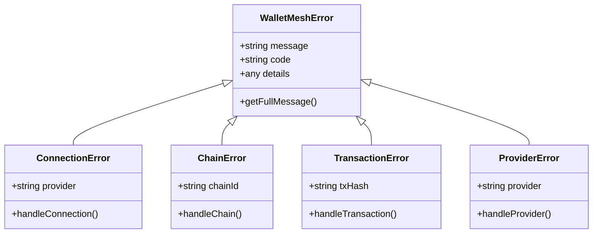

# Error Handling in WalletMesh

This guide covers the error handling system in WalletMesh, including error types, handling strategies, and best practices for managing errors in your application.

## Error Hierarchy



## Error Types

### 1. ConnectionError

Thrown during wallet connection attempts:

```typescript
try {
  await modal.connect();
} catch (error) {
  if (error instanceof ConnectionError) {
    switch (error.code) {
      case 'USER_REJECTED':
        showUserRejectionMessage();
        break;
      case 'PROVIDER_NOT_FOUND':
        showInstallWalletPrompt();
        break;
      case 'ALREADY_CONNECTED':
        reconnectWallet();
        break;
      default:
        handleGenericError(error);
    }
  }
}
```

### 2. ChainError

Occurs during chain-related operations:

```typescript
try {
  await modal.switchChain('polygon');
} catch (error) {
  if (error instanceof ChainError) {
    switch (error.code) {
      case 'CHAIN_NOT_ADDED':
        await addChainAndRetry();
        break;
      case 'UNSUPPORTED_CHAIN':
        showUnsupportedChainMessage();
        break;
      case 'SWITCH_REJECTED':
        handleUserRejection();
        break;
    }
  }
}
```

### 3. TransactionError

Handles transaction-related failures:

```typescript
try {
  const hash = await modal.sendTransaction(tx);
} catch (error) {
  if (error instanceof TransactionError) {
    switch (error.code) {
      case 'INSUFFICIENT_FUNDS':
        showInsufficientFundsMessage();
        break;
      case 'USER_REJECTED':
        handleUserRejection();
        break;
      case 'GAS_ESTIMATE_FAILED':
        handleGasEstimationError();
        break;
    }
  }
}
```

### 4. ProviderError

Manages provider-specific issues:

```typescript
try {
  await modal.initializeProvider();
} catch (error) {
  if (error instanceof ProviderError) {
    switch (error.code) {
      case 'PROVIDER_NOT_READY':
        await waitAndRetryProvider();
        break;
      case 'METHOD_NOT_SUPPORTED':
        showUnsupportedFeatureMessage();
        break;
      case 'PROVIDER_DISCONNECTED':
        handleDisconnection();
        break;
    }
  }
}
```

## Error Handling Strategies

### 1. Comprehensive Error Handling

```typescript
const handleWalletOperation = async () => {
  try {
    await modal.connect();
  } catch (error) {
    if (error instanceof ConnectionError) {
      handleConnectionError(error);
    } else if (error instanceof ChainError) {
      handleChainError(error);
    } else if (error instanceof TransactionError) {
      handleTransactionError(error);
    } else if (error instanceof ProviderError) {
      handleProviderError(error);
    } else {
      handleUnknownError(error);
    }
  }
};
```

### 2. Retry Mechanisms

```typescript
const withRetry = async (operation, maxAttempts = 3) => {
  let lastError;
  
  for (let attempt = 1; attempt <= maxAttempts; attempt++) {
    try {
      return await operation();
    } catch (error) {
      lastError = error;
      
      if (!isRetryableError(error) || attempt === maxAttempts) {
        throw error;
      }
      
      await wait(Math.pow(2, attempt) * 1000); // Exponential backoff
    }
  }
  
  throw lastError;
};
```

### 3. Error Recovery

```typescript
const withErrorRecovery = async (operation) => {
  try {
    return await operation();
  } catch (error) {
    if (error instanceof ConnectionError) {
      if (error.code === 'PROVIDER_DISCONNECTED') {
        await modal.reconnect();
        return await operation();
      }
    }
    throw error;
  }
};
```

## Best Practices

### 1. User-Friendly Error Messages

```typescript
const getUserFriendlyMessage = (error: WalletMeshError): string => {
  switch (error.code) {
    case 'USER_REJECTED':
      return 'You declined the connection request. Please try again.';
    case 'INSUFFICIENT_FUNDS':
      return 'Not enough funds to complete this transaction.';
    case 'CHAIN_NOT_SUPPORTED':
      return 'This network is not supported. Please switch to a supported network.';
    default:
      return 'An error occurred. Please try again.';
  }
};
```

### 2. Error Logging

```typescript
const logError = (error: WalletMeshError) => {
  console.error({
    code: error.code,
    message: error.message,
    details: error.details,
    timestamp: new Date().toISOString(),
    // Add any relevant context
    chainId: modal.getChain(),
    connectionStatus: modal.getState().status
  });
};
```

### 3. Preventive Validation

```typescript
const validateBeforeTransaction = async (transaction) => {
  // Check connection
  if (!modal.isConnected()) {
    throw new ConnectionError('NOT_CONNECTED');
  }
  
  // Validate chain
  const currentChain = await modal.getChain();
  if (currentChain !== transaction.chainId) {
    throw new ChainError('WRONG_CHAIN');
  }
  
  // Check balance
  const balance = await modal.getBalance();
  if (balance.lt(transaction.value)) {
    throw new TransactionError('INSUFFICIENT_FUNDS');
  }
};
```

## Error Reference

### Common Error Codes

| Code | Description | Recovery Strategy |
|------|-------------|------------------|
| `USER_REJECTED` | User denied the request | Prompt user to retry |
| `PROVIDER_NOT_FOUND` | Wallet provider not detected | Show wallet installation guide |
| `INSUFFICIENT_FUNDS` | Not enough balance | Display funding options |
| `CHAIN_NOT_SUPPORTED` | Unsupported blockchain | Show supported networks |
| `METHOD_NOT_SUPPORTED` | Unsupported wallet method | Suggest wallet upgrade |
| `NETWORK_ERROR` | Network connection issue | Retry with backoff |

## Further Reading

- [API Reference](../api-guides/README.md)
- [Integration Guide](integration-guide.md)
- [Architecture Overview](../architecture/README.md)
