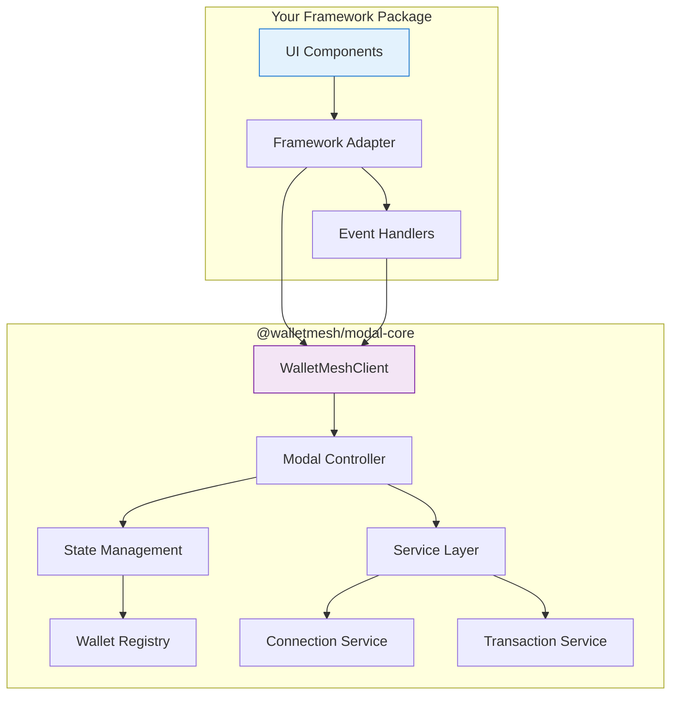

# Framework Developer Guide

**🚨 IMPORTANT**: This guide is for framework package developers who want to build UI libraries on top of `@walletmesh/modal-core`. If you're a dApp developer looking to integrate wallet connections, you should use a framework-specific package like `@walletmesh/modal-react` instead.

## Overview

`@walletmesh/modal-core` is a headless, framework-agnostic foundation library for building wallet connection modal UIs. It provides:

- ✅ Business logic for wallet discovery and connection
- ✅ State management for wallet interactions
- ✅ Error handling and recovery systems
- ✅ Transport layers for wallet communication
- ❌ No UI components or DOM rendering
- ❌ No framework-specific integrations

## Architecture for Framework Developers



## Core Concepts

### 1. WalletMeshClient - The Main Interface

The `WalletMeshClient` is your primary interface to modal-core's functionality:

```typescript
import { createWalletMeshClient } from '@walletmesh/modal-core';

const client = createWalletMeshClient({
  appName: 'Your dApp',
  appDescription: 'Your dApp description',
  appUrl: 'https://yourdapp.com',
  appIcon: 'https://yourdapp.com/icon.png',
  supportedChains: ['ethereum', 'polygon']
  // Configuration for your framework package
});
```

### 2. Headless Modal Pattern

Modal-core provides headless components that manage state without rendering UI:

```typescript
// Subscribe to state changes (headless state management)
const unsubscribe = client.subscribe((state) => {
  // Your framework handles the UI rendering based on state
  renderModalUI(state);
});

// Access client actions directly
function renderModalUI(state) {
  // Framework-specific rendering logic
  // Use client methods like client.connect(), client.disconnect()
}
```

### 3. Service-Based Architecture

Business logic is organized into services that your framework can consume:

```typescript
// Use client methods directly for wallet operations
// Connection management
const session = await client.connect(walletId);

// Transaction handling through provider
const provider = session.provider;
await provider.sendTransaction(txParams);

// Access session information
const address = session.address;
const chainId = session.chain.id;
```

## Building Your Framework Package

### Step 1: Project Setup

```bash
# Create your framework package
mkdir walletmesh-[framework]
cd walletmesh-[framework]

# Install dependencies
npm install @walletmesh/modal-core
npm install [your-framework-dependencies]
```

### Step 2: Core Integration

Create a main client wrapper that integrates modal-core with your framework:

```typescript
// src/WalletMeshProvider.tsx (React example)
import { createWalletMeshClient, WalletMeshClient } from '@walletmesh/modal-core';
import { createContext, useContext, useEffect, useState } from 'react';

interface WalletMeshContextValue {
  client: WalletMeshClient;
  isConnected: boolean;
  // Add framework-specific state
}

const WalletMeshContext = createContext<WalletMeshContextValue | null>(null);

export function WalletMeshProvider({ children, config }) {
  const [client] = useState(() => createWalletMeshClient(config));
  const [isConnected, setIsConnected] = useState(false);

  useEffect(() => {
    // Subscribe to connection state changes
    return client.subscribe((state) => {
      setIsConnected(state.connections.connectionStatus === 'connected');
    });
  }, [client]);

  return (
    <WalletMeshContext.Provider value={{ client, isConnected }}>
      {children}
    </WalletMeshContext.Provider>
  );
}

export function useWalletMesh() {
  const context = useContext(WalletMeshContext);
  if (!context) {
    throw new Error('useWalletMesh must be used within WalletMeshProvider');
  }
  return context;
}
```

### Step 3: UI Components

Build framework-specific UI components that use the headless modal:

```typescript
// src/components/ConnectButton.tsx (React example)
import { useWalletMesh } from '../WalletMeshProvider';

export function ConnectButton() {
  const { client, isConnected } = useWalletMesh();

  const handleConnect = async () => {
    if (isConnected) {
      await client.disconnect();
    } else {
      await client.connect();
    }
  };

  return (
    <button onClick={handleConnect}>
      {isConnected ? 'Disconnect' : 'Connect Wallet'}
    </button>
  );
}
```

### Step 4: Modal UI Implementation

Create modal components that render the wallet selection interface:

```typescript
// src/components/WalletModal.tsx (React example)
import { useWalletMesh } from '../WalletMeshProvider';
import { useEffect, useState } from 'react';

export function WalletModal() {
  const { client } = useWalletMesh();
  const [modalState, setModalState] = useState(client.getState());

  useEffect(() => {
    return client.subscribe(setModalState);
  }, [client]);

  if (!modalState.ui.isOpen) return null;

  return (
    <div className="wallet-modal-overlay">
      <div className="wallet-modal">
        <h2>Connect Wallet</h2>
        
        {modalState.connections.availableWallets.map(wallet => (
          <button 
            key={wallet.id}
            onClick={() => client.connect(wallet.id)}
            className="wallet-option"
          >
            
            {wallet.name}
          </button>
        ))}
        
        <button onClick={() => client.disconnect()}>
          Cancel
        </button>
      </div>
    </div>
  );
}
```

### Step 5: Framework-Specific Hooks/Composables

Create convenient abstractions for common operations:

```typescript
// src/hooks/useWalletConnection.ts (React example)
import { useWalletMesh } from '../WalletMeshProvider';
import { useState, useEffect } from 'react';

export function useWalletConnection() {
  const { client } = useWalletMesh();
  const [accounts, setAccounts] = useState<string[]>([]);
  const [chainId, setChainId] = useState<string | null>(null);

  useEffect(() => {
    return client.subscribe((state) => {
      if (state.connections.connectionStatus === 'connected') {
        const activeSession = state.connections.activeSessions[0];
        if (activeSession) {
          setAccounts([activeSession.address]);
          setChainId(activeSession.chain.id);
        }
      } else {
        setAccounts([]);
        setChainId(null);
      }
    });
  }, [client]);

  const connect = async (walletId?: string) => {
    return await client.connect(walletId);
  };

  const disconnect = async () => {
    await client.disconnect();
  };

  const switchChain = async (chainId: string) => {
    const session = await client.getActiveSession();
    return await session.provider.request({
      method: 'wallet_switchEthereumChain',
      params: [{ chainId }]
    });
  };

  return {
    accounts,
    chainId,
    isConnected: accounts.length > 0,
    connect,
    disconnect,
    switchChain
  };
}
```

## Framework-Specific Implementation Patterns

### React

```typescript
// Use React Context for state management
// Implement hooks for wallet operations
// Use useEffect for subscription management
// Handle SSR with proper hydration

export function WalletProvider({ children, config }) {
  const [client] = useState(() => createWalletMeshClient(config));
  // ... implementation
}
```

### Vue

```typescript
// Use provide/inject for dependency injection  
// Create composables for wallet operations
// Use reactive refs for state management
// Handle SSR with proper plugin setup

export function createWalletPlugin(config) {
  return {
    install(app) {
      const client = createWalletMeshClient(config);
      app.provide('walletMeshClient', client);
    }
  };
}
```

### Svelte

```typescript
// Use Svelte stores for state management
// Create actions for wallet operations  
// Handle reactivity with derived stores
// Support SvelteKit with proper SSR handling

import { writable, derived } from 'svelte/store';

export function createWalletStore(config) {
  const client = createWalletMeshClient(config);
  const state = writable(client.getState());
  
  client.subscribe(state.set);
  
  return {
    state: derived(state, $state => $state),
    connect: (walletId) => client.connect(walletId),
    disconnect: () => client.disconnect()
  };
}
```

### Angular

```typescript
// Use Angular services for client management
// Implement observables for state streams
// Use dependency injection for configuration
// Handle SSR with proper platform checks

@Injectable({ providedIn: 'root' })
export class WalletMeshService {
  private client = createWalletMeshClient(this.config);
  
  state$ = new BehaviorSubject(this.client.getState());
  
  constructor(@Inject(WALLET_CONFIG) private config) {
    this.client.subscribe(state => this.state$.next(state));
  }
}
```

## State Management Patterns

### 1. State Subscription

```typescript
// Subscribe to all state changes
const unsubscribe = client.subscribe((state) => {
  // Handle state updates in your framework
  updateFrameworkState(state);
});

// Subscribe to specific state slices
const unsubscribeConnection = client.subscribe(
  (state) => state.connections,
  (connections) => {
    // Handle connection state changes only
    updateConnectionUI(connections);
  }
);
```

### 2. Action Handling

```typescript
// Framework event handlers using client methods
const handleConnectClick = () => client.connect();
const handleWalletSelect = (walletId) => client.connect(walletId);
const handleDisconnect = () => client.disconnect();
```

### 3. Error Handling

```typescript
// Subscribe to error states
client.subscribe((state) => {
  if (state.ui.error) {
    // Display error in your framework's error handling system
    showFrameworkError(state.ui.error);
  }
});

// Handle specific errors
try {
  await client.connect(walletId);
} catch (error) {
  // Framework-specific error handling
  handleWalletError(error);
}
```

## Testing Your Framework Package

### Unit Testing

```typescript
// Mock the modal-core client
import { createMockClient } from '@walletmesh/modal-core/testing';

describe('WalletProvider', () => {
  it('should provide wallet context', () => {
    const mockClient = createMockClient();
    // Test your framework integration
  });
});
```

### Integration Testing

```typescript
// Test with real modal-core client
import { createWalletMeshClient } from '@walletmesh/modal-core';

describe('Wallet Integration', () => {
  it('should connect to test wallet', async () => {
    const client = createWalletMeshClient({
      appName: 'Test App',
      appDescription: 'Test App Description',
      appUrl: 'https://test.com',
      appIcon: 'https://test.com/icon.png'
    });
    // Test actual integration
  });
});
```

## Best Practices

### 1. State Management
- Keep framework state in sync with modal-core state
- Use framework-specific patterns (Context, stores, observables)
- Handle loading and error states appropriately
- Implement proper cleanup in useEffect/onDestroy

### 2. TypeScript Integration
- Re-export types from modal-core with framework-specific additions
- Provide proper type inference for hooks/composables
- Use generic types for flexible component APIs

### 3. SSR Support
- Handle server-side rendering appropriately
- Use modal-core's SSR utilities when available
- Provide proper hydration strategies
- Check for browser environment before initializing

### 4. Performance
- Implement proper memoization for derived state
- Use React.memo, Vue's shallowRef, or Svelte's derived stores
- Debounce frequent operations like balance checks
- Lazy load wallet provider libraries

### 5. Error Boundaries
- Implement framework-specific error boundaries
- Provide fallback UI for connection errors
- Log errors appropriately for debugging
- Offer recovery actions to users

## Package Publishing

### Package Structure

```
walletmesh-[framework]/
├── src/
│   ├── components/
│   ├── hooks/ (or composables/, stores/)
│   ├── providers/
│   └── index.ts
├── dist/
├── package.json
└── README.md
```

### package.json Configuration

```json
{
  "name": "@walletmesh/modal-[framework]",
  "version": "1.0.0",
  "main": "dist/index.js",
  "types": "dist/index.d.ts",
  "peerDependencies": {
    "@walletmesh/modal-core": "^1.0.0",
    "[framework]": "^[version]"
  },
  "exports": {
    ".": {
      "types": "./dist/index.d.ts",
      "import": "./dist/index.js",
      "require": "./dist/index.cjs"
    }
  }
}
```

### Documentation

Your framework package should include:

1. **README.md** - Installation and basic usage
2. **API documentation** - All hooks/components/composables
3. **Examples** - Common integration patterns
4. **Migration guides** - If updating from previous versions
5. **TypeScript definitions** - Exported types and interfaces

## Framework-Specific Examples

Complete examples for each framework are available in:

- [React Integration Example](./examples/react/)
- [Vue Integration Example](./examples/vue/)
- [Svelte Integration Example](./examples/svelte/)
- [Angular Integration Example](./examples/angular/)

## Support and Resources

- **Documentation**: [WalletMesh Core Docs](./documentation/)
- **API Reference**: [API Documentation](./API.md) 
- **Architecture**: [Architecture Guide](./ARCHITECTURE.md)
- **Error Handling**: [Error Handling Guide](./documentation/guides/error-handling.md)
- **Framework Adapters**: [Creating Framework Adapters](./documentation/guides/creating-framework-adapters.md)

## Community

- **Issues**: Report bugs and request features
- **Discussions**: Get help and share ideas
- **Contributing**: Guidelines for contributing to modal-core

Remember: `@walletmesh/modal-core` is designed to be the foundation for framework-specific implementations. Focus on providing excellent developer experience in your target framework while leveraging the robust business logic that modal-core provides.