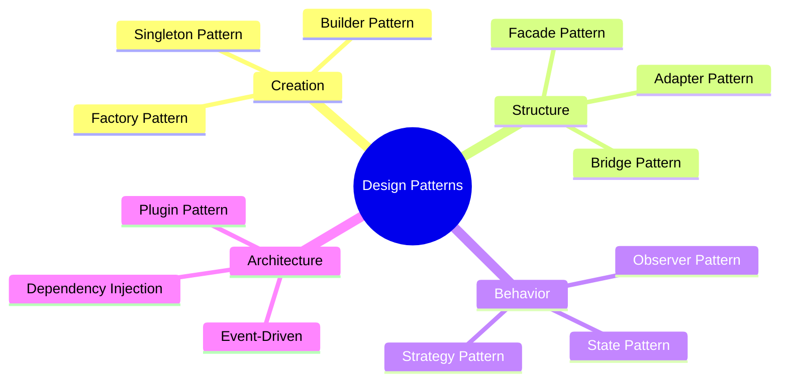
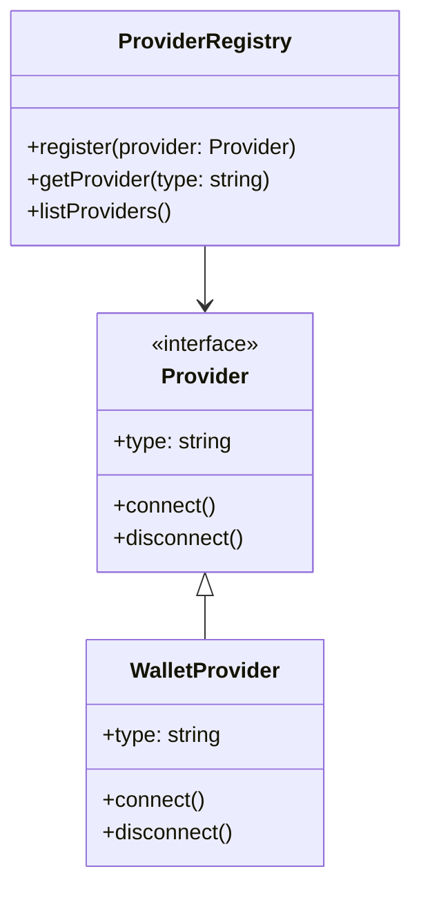
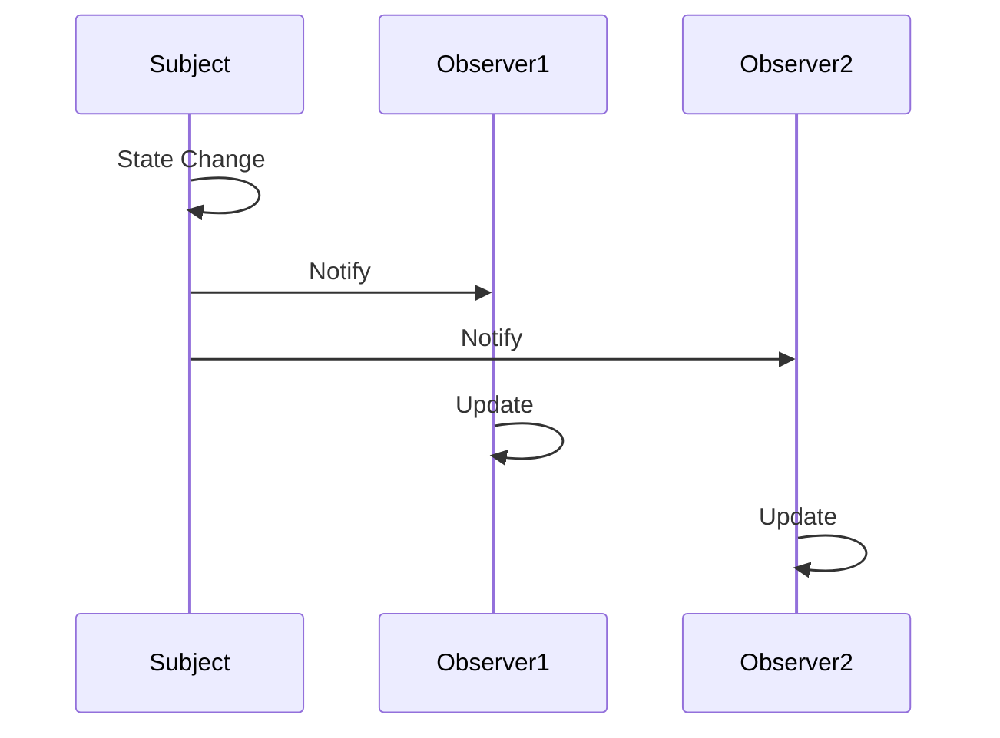
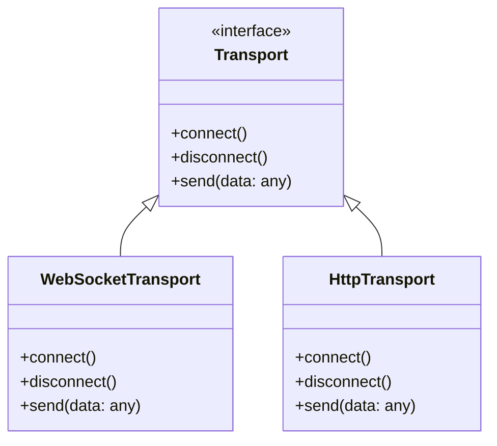
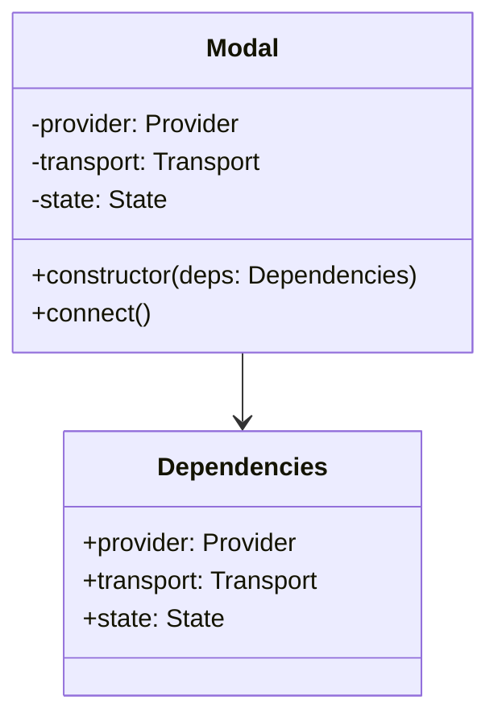
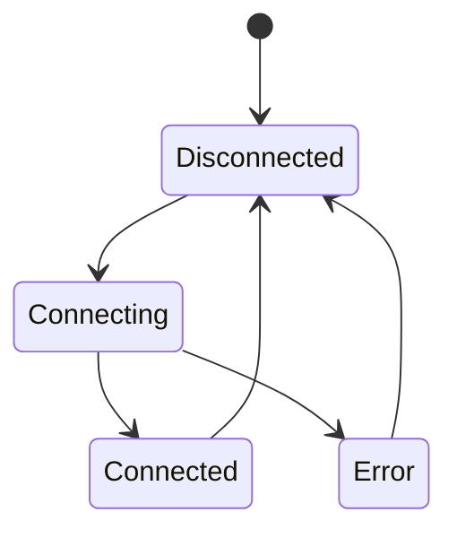

# Design Patterns in WalletMesh

This guide covers the core design patterns used throughout WalletMesh. Understanding these patterns is essential for effectively using and extending the library.

## Pattern Overview



## Core Patterns

### 1. Plugin Pattern

The Plugin Pattern enables extensible wallet provider support:



Usage example:
```typescript
// Register a custom provider
modal.registerProvider({
  type: 'custom-wallet',
  connect: async () => { /* ... */ },
  disconnect: async () => { /* ... */ }
});

// Use the registered provider
await modal.connect('custom-wallet');
```

### 2. Observer Pattern

Used for state management and event handling:



Implementation:
```typescript
// Subscribe to state changes
modal.subscribe((state) => {
  console.log('State updated:', state);
});

// Listen for specific events
modal.on('chainChanged', ({ chain }) => {
  console.log('Chain changed:', chain);
});
```

### 3. Strategy Pattern

Enables swappable implementations for different behaviors:



Usage:
```typescript
const modal = createModal({
  transport: new WebSocketTransport({
    url: 'wss://...'
  })
});
```

### 4. Dependency Injection

Manages component dependencies and enables testing:



Example:
```typescript
// Production setup
const modal = createModal({
  provider: new WalletProvider(),
  transport: new WebSocketTransport(),
  state: createState()
});

// Testing setup
const modal = createModal({
  provider: mockProvider,
  transport: mockTransport,
  state: mockState
});
```

### 5. State Pattern

Manages wallet connection states:



Implementation:
```typescript
class WalletState {
  private state: ConnectionState = 'disconnected';
  
  async connect() {
    this.setState('connecting');
    try {
      await this.provider.connect();
      this.setState('connected');
    } catch (error) {
      this.setState('error');
      throw error;
    }
  }
  
  // ... other state management methods
}
```

## Pattern Usage Guidelines

### When to Use Each Pattern

1. **Plugin Pattern**
   - Adding new wallet providers
   - Extending transport mechanisms
   - Custom UI implementations

2. **Observer Pattern**
   - State change notifications
   - Event broadcasting
   - UI updates

3. **Strategy Pattern**
   - Swappable transport layers
   - Different provider implementations
   - Custom error handling

4. **Dependency Injection**
   - Testing and mocking
   - Component configuration
   - Feature toggling

5. **State Pattern**
   - Connection management
   - Transaction flow
   - Error recovery

### Best Practices

1. **Pattern Composition**
```typescript
// Combine multiple patterns
class WalletConnector {
  constructor(private deps: Dependencies) {} // DI Pattern
  
  private strategies = new Map(); // Strategy Pattern
  
  subscribe(listener: Listener) {} // Observer Pattern
  
  registerProvider(provider: Provider) {} // Plugin Pattern
  
  async connect() {
    // State Pattern
    this.state.transition('connecting');
    // ...
  }
}
```

2. **Testing Considerations**
```typescript
describe('WalletConnector', () => {
  it('handles provider registration', () => {
    const connector = new WalletConnector({
      provider: mockProvider,
      transport: mockTransport
    });
    
    connector.registerProvider(customProvider);
    expect(connector.getProviders()).toContain(customProvider);
  });
});
```

3. **Error Handling**
```typescript
class ErrorHandler {
  private strategies = new Map();
  
  register(errorType: string, handler: ErrorStrategy) {
    this.strategies.set(errorType, handler);
  }
  
  handle(error: Error) {
    const handler = this.strategies.get(error.type);
    return handler ? handler.handle(error) : this.defaultHandle(error);
  }
}
```

## Common Implementation Patterns

### 1. Provider Registration
```typescript
// Define provider interface
interface Provider {
  type: string;
  connect(): Promise<void>;
  disconnect(): Promise<void>;
}

// Register providers
const modal = createModal();
modal.registerProvider(metamaskProvider);
modal.registerProvider(walletConnectProvider);
```

### 2. Event Management
```typescript
// Central event bus
class EventBus {
  private listeners = new Map();
  
  on(event: string, callback: Function) {
    if (!this.listeners.has(event)) {
      this.listeners.set(event, new Set());
    }
    this.listeners.get(event).add(callback);
  }
  
  emit(event: string, data: any) {
    const callbacks = this.listeners.get(event) || new Set();
    callbacks.forEach(cb => cb(data));
  }
}
```

### 3. State Management
```typescript
// Immutable state updates
class State {
  private state: any = {};
  private subscribers = new Set();
  
  update(newState: Partial<any>) {
    this.state = {
      ...this.state,
      ...newState
    };
    this.notify();
  }
  
  private notify() {
    this.subscribers.forEach(sub => sub(this.state));
  }
}
```

## Further Reading

- [Architecture Overview](../architecture/README.md)
- [API Guides](../api-guides/README.md)
- [Implementation Examples](../examples/README.md)
