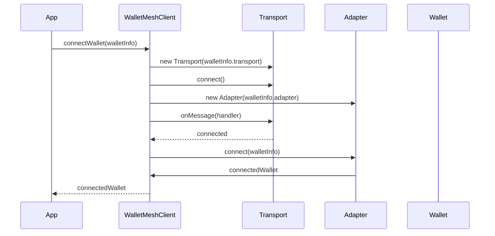
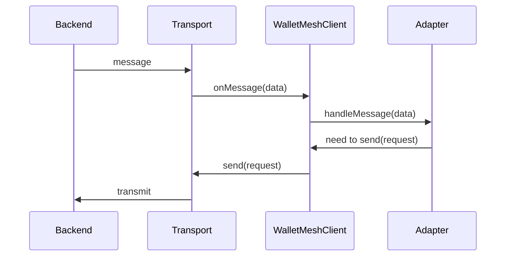
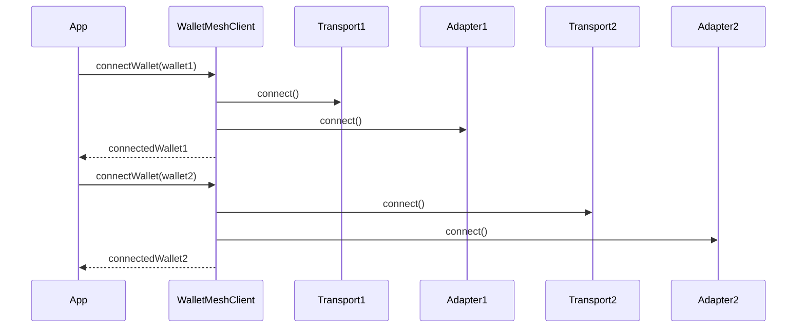

# WalletMesh Architecture

## Overview
WalletMesh provides a flexible architecture for wallet connectivity with clean separation between transport and business logic layers. The architecture supports multiple simultaneous wallet connections, each with its own transport and adapter configuration.

## Core Components

### Transport Layer
The transport layer handles the raw communication between frontend and backend components:

```typescript
interface Transport {
  connect(): Promise<void>;
  disconnect(): Promise<void>;
  send(data: unknown): Promise<void>;
  onMessage(handler: (data: unknown) => void): void;
}
```

Available implementations:
- `PostMessageTransport`: Uses window.postMessage for communication
- `WebSocketTransport`: (Planned) For WebSocket-based communication
- `ExtensionTransport`: (Planned) For browser extension communication

### Adapter Layer
Adapters handle chain-specific operations and protocol-level interactions:

```typescript
interface Adapter {
  connect(walletInfo: WalletInfo): Promise<ConnectedWallet>;
  disconnect(): Promise<void>;
  getProvider(): Promise<unknown>;
  handleMessage(data: unknown): void;
}
```

### WalletMeshClient
The client orchestrates multiple wallet connections:
- Manages transport and adapter lifecycles
- Routes messages between components
- Handles connection state per wallet
- Provides a clean API for multi-wallet applications

## Wallet Configuration

Wallets are defined with their required transport and adapter configurations:

```typescript
interface WalletInfo {
  id: string;          // Unique identifier
  name: string;
  icon: string;
  url?: string;
  transport: {
    type: TransportType;
    options?: TransportOptions;
  };
  adapter: {
    type: AdapterType;
    options?: AdapterOptions;
  };
}
```

## Sequence Diagrams

### Connection Flow


### Message Flow


### Multi-Wallet Management


## Usage Example

```typescript
const client = new WalletMeshClient();

// Define wallets
const webWallet = {
  id: 'aztec_web_1',
  name: 'Aztec Web Wallet',
  icon: 'icon-url',
  transport: {
    type: TransportType.PostMessage,
    options: { origin: 'https://wallet.aztec.network' }
  },
  adapter: {
    type: AdapterType.WalletMeshAztec
  }
};

const extensionWallet = {
  id: 'aztec_extension_1',
  name: 'Aztec Extension',
  transport: {
    type: TransportType.Extension,
    options: { extensionId: 'extension-id' }
  },
  adapter: {
    type: AdapterType.WalletMeshAztec
  }
};

// Connect multiple wallets
const web = await client.connectWallet(webWallet);
const extension = await client.connectWallet(extensionWallet);

// Work with specific wallets
const webProvider = await client.getProvider(web.id);
const extensionProvider = await client.getProvider(extension.id);

// List connected wallets
const connectedWallets = client.getConnectedWallets();

// Disconnect specific wallet
await client.disconnectWallet(web.id);
```

## Adding New Components

### Adding a New Transport

1. Implement the Transport interface
2. Add the transport type to TransportType enum
3. Register in WalletMeshClient.createTransport

Example:
```typescript
class WebSocketTransport extends BaseTransport {
  async connect(): Promise<void> {
    // Implement WebSocket connection
  }
  
  async send(data: unknown): Promise<void> {
    // Implement WebSocket sending
  }
  
  // ... implement other methods
}
```

### Adding a New Adapter

1. Implement the Adapter interface
2. Add the adapter type to AdapterType enum
3. Register in WalletMeshClient.createAdapter

Example:
```typescript
class NewChainAdapter implements Adapter {
  async connect(walletInfo: WalletInfo): Promise<ConnectedWallet> {
    // Implement chain-specific connection
  }
  
  handleMessage(data: unknown): void {
    // Handle chain-specific messages
  }
  
  // ... implement other methods
}
