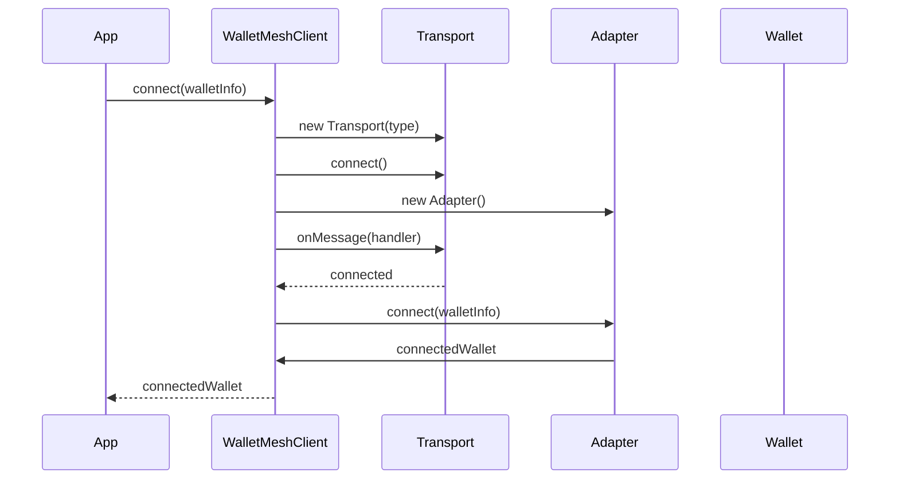
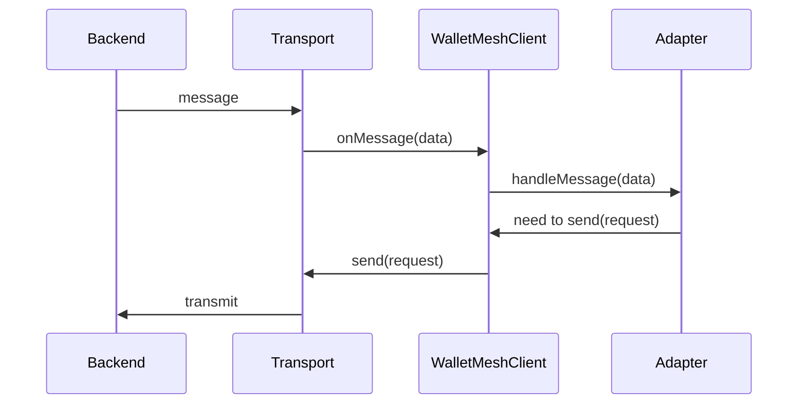
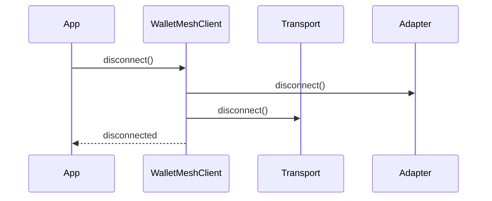

# WalletMesh Architecture

## Overview
WalletMesh provides a flexible architecture for wallet connectivity with clean separation between transport and business logic layers. The architecture is designed to be modular and extensible, allowing for easy addition of new transport methods and wallet adapters.

## Core Components

### Transport Layer
The transport layer handles the raw communication between frontend and backend components:

```typescript
interface Transport {
  connect(): Promise<void>;
  disconnect(): Promise<void>;
  send(data: unknown): Promise<void>;
  onMessage(handler: (data: unknown) => void): void;
}
```

Available implementations:
- `PostMessageTransport`: Uses window.postMessage for communication
- `WebSocketTransport`: (Planned) For WebSocket-based communication
- `ExtensionTransport`: (Planned) For browser extension communication

### Adapter Layer
Adapters handle chain-specific operations and protocol-level interactions:

```typescript
interface Adapter {
  connect(walletInfo: WalletInfo): Promise<ConnectedWallet>;
  disconnect(): Promise<void>;
  getProvider(): Promise<unknown>;
  handleMessage(data: unknown): void;
}
```

### WalletMeshClient
The client orchestrates the interaction between transports and adapters:
- Manages transport lifecycle
- Routes messages between components
- Handles connection state
- Provides a clean API for applications

## Sequence Diagrams

### Connection Flow


### Message Flow


### Disconnection Flow


## Message Routing

The WalletMeshClient acts as the central message router:

1. Incoming Messages:
   - Transport receives raw messages
   - WalletMeshClient routes to appropriate adapter
   - Adapter processes protocol-specific messages

2. Outgoing Messages:
   - Adapter prepares protocol messages
   - WalletMeshClient sends via transport
   - Transport handles delivery

## Usage Example

```typescript
const client = new WalletMeshClient();

// Connect to a wallet
const walletInfo = {
  name: "Example Wallet",
  transportType: TransportType.PostMessage,
  adapterType: AdapterType.WalletMeshAztec
};

try {
  const connected = await client.connect(walletInfo);
  console.log("Connected to wallet:", connected.address);
  
  // Get the chain-specific provider
  const provider = await client.getProvider();
  
  // Later, disconnect
  await client.disconnect();
} catch (error) {
  console.error("Connection failed:", error);
}
```

## Adding New Components

### Adding a New Transport

1. Implement the Transport interface
2. Add the transport type to TransportType enum
3. Register in WalletMeshClient.createTransport

Example:
```typescript
class WebSocketTransport extends BaseTransport {
  async connect(): Promise<void> {
    // Implement WebSocket connection
  }
  
  async send(data: unknown): Promise<void> {
    // Implement WebSocket sending
  }
  
  // ... implement other methods
}
```

### Adding a New Adapter

1. Implement the Adapter interface
2. Add the adapter type to AdapterType enum
3. Register in WalletMeshClient.createAdapter

Example:
```typescript
class NewChainAdapter implements Adapter {
  async connect(walletInfo: WalletInfo): Promise<ConnectedWallet> {
    // Implement chain-specific connection
  }
  
  handleMessage(data: unknown): void {
    // Handle chain-specific messages
  }
  
  // ... implement other methods
}
