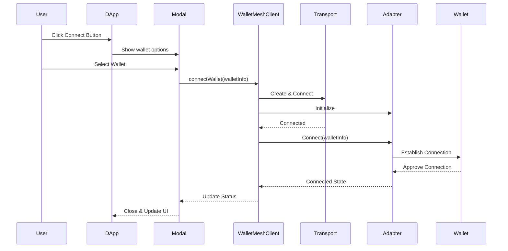
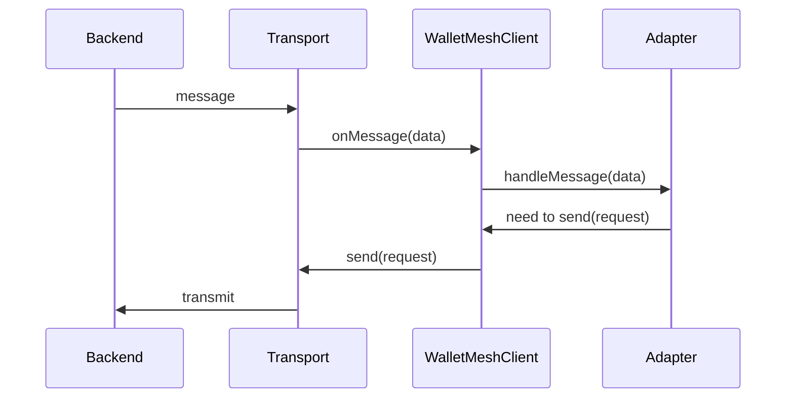
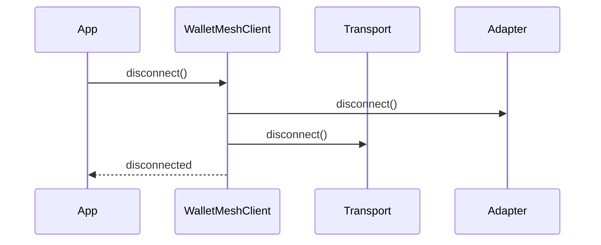
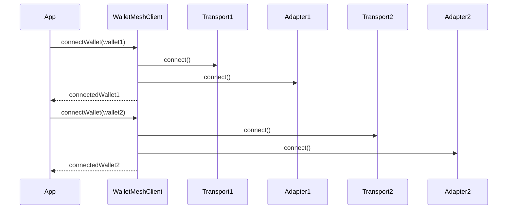

# WalletMesh Architecture

## Overview
WalletMesh provides a flexible architecture for wallet connectivity with clean separation between transport and business logic layers. The architecture supports multiple simultaneous wallet connections, each with its own transport and adapter configuration.

## DApp Integration

### Setup
1. Configure available wallets and DApp info
2. Wrap application with WalletProvider
3. Use the ConnectButton component

### Connection Flow

#### 1. Initial Setup
```typescript
// Configure DApp information
const dappInfo = {
  name: "My DApp",
  description: "Description",
  icon: "icon-url",
  origin: "https://mydapp.com"
};

// Configure available wallets
const wallets = [
  {
    id: "aztec_web",
    name: "Aztec Web Wallet",
    icon: "icon-url",
    transport: {
      type: TransportType.PostMessage,
      options: { origin: "https://wallet.aztec.network" }
    },
    adapter: {
      type: AdapterType.WalletMeshAztec
    }
  }
];

// Provide wallet configuration
<WalletProvider wallets={wallets} dappInfo={dappInfo}>
  <App />
</WalletProvider>
```

#### 2. Runtime Flow


### Message Flow


### Disconnection Flow


### Multi-Wallet Management


#### 3. Connection Process
1. User Interaction:
   - User clicks Connect Button
   - Modal displays available wallets
   - User selects desired wallet

2. Connection Establishment:
   - WalletMeshClient creates transport & adapter
   - Transport establishes communication channel
   - Adapter initiates chain-specific connection
   - Wallet confirms connection

3. Connection Management:
   - Session info stored for persistence
   - Automatic reconnection on page reload
   - Clean disconnection handling

#### 4. Error Handling
- Connection failures surface user-friendly errors
- Automatic cleanup of failed connections
- Session restoration failures prompt reconnection
- Transport errors handled gracefully

## Core Components

### Transport Layer
The transport layer handles the raw communication between frontend and backend components:

```typescript
interface Transport {
  connect(): Promise<void>;
  disconnect(): Promise<void>;
  send(data: unknown): Promise<void>;
  onMessage(handler: (data: unknown) => void): void;
}
```

Available implementations:
- `PostMessageTransport`: Uses window.postMessage for communication
- `WebSocketTransport`: (Planned) For WebSocket-based communication
- `ExtensionTransport`: (Planned) For browser extension communication

### Adapter Layer
Adapters handle chain-specific operations and protocol-level interactions:

```typescript
interface Adapter {
  connect(walletInfo: WalletInfo): Promise<ConnectedWallet>;
  disconnect(): Promise<void>;
  getProvider(): Promise<unknown>;
  handleMessage(data: unknown): void;
}
```

### WalletMeshClient
The client orchestrates multiple wallet connections:
- Manages transport lifecycle
- Routes messages between components
- Handles connection state per wallet
- Provides a clean API for multi-wallet applications

## Wallet Configuration

Wallets are defined with their required transport and adapter configurations:

```typescript
interface WalletInfo {
  id: string;          // Unique identifier
  name: string;
  icon: string;
  url?: string;
  transport: {
    type: TransportType;
    options?: TransportOptions;
  };
  adapter: {
    type: AdapterType;
    options?: AdapterOptions;
  };
}
```

## Usage Example

```typescript
const client = new WalletMeshClient();

// Define wallets
const webWallet = {
  id: 'aztec_web_1',
  name: 'Aztec Web Wallet',
  icon: 'icon-url',
  transport: {
    type: TransportType.PostMessage,
    options: { origin: 'https://wallet.aztec.network' }
  },
  adapter: {
    type: AdapterType.WalletMeshAztec
  }
};

const extensionWallet = {
  id: 'aztec_extension_1',
  name: 'Aztec Extension',
  transport: {
    type: TransportType.Extension,
    options: { extensionId: 'extension-id' }
  },
  adapter: {
    type: AdapterType.WalletMeshAztec
  }
};

// Connect multiple wallets
const web = await client.connectWallet(webWallet);
const extension = await client.connectWallet(extensionWallet);

// Work with specific wallets
const webProvider = await client.getProvider(web.id);
const extensionProvider = await client.getProvider(extension.id);

// List connected wallets
const connectedWallets = client.getConnectedWallets();

// Disconnect specific wallet
await client.disconnectWallet(web.id);
```

## Adding New Components

### Adding a New Transport

1. Implement the Transport interface
2. Add the transport type to TransportType enum
3. Register in WalletMeshClient.createTransport

Example:
```typescript
class WebSocketTransport implements Transport {
  async connect(): Promise<void> {
    // Implement WebSocket connection
  }
  
  async send(data: unknown): Promise<void> {
    // Implement WebSocket sending
  }
  
  // ... implement other methods
}
```

### Adding a New Adapter

1. Implement the Adapter interface
2. Add the adapter type to AdapterType enum
3. Register in WalletMeshClient.createAdapter

Example:
```typescript
class NewChainAdapter implements Adapter {
  async connect(walletInfo: WalletInfo): Promise<ConnectedWallet> {
    // Implement chain-specific connection
  }
  
  handleMessage(data: unknown): void {
    // Handle chain-specific messages
  }
  
  // ... implement other methods
}
```
