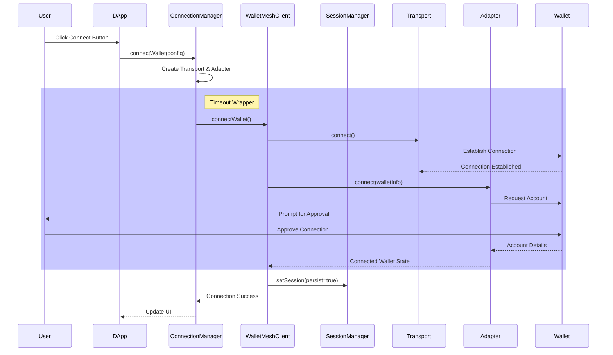
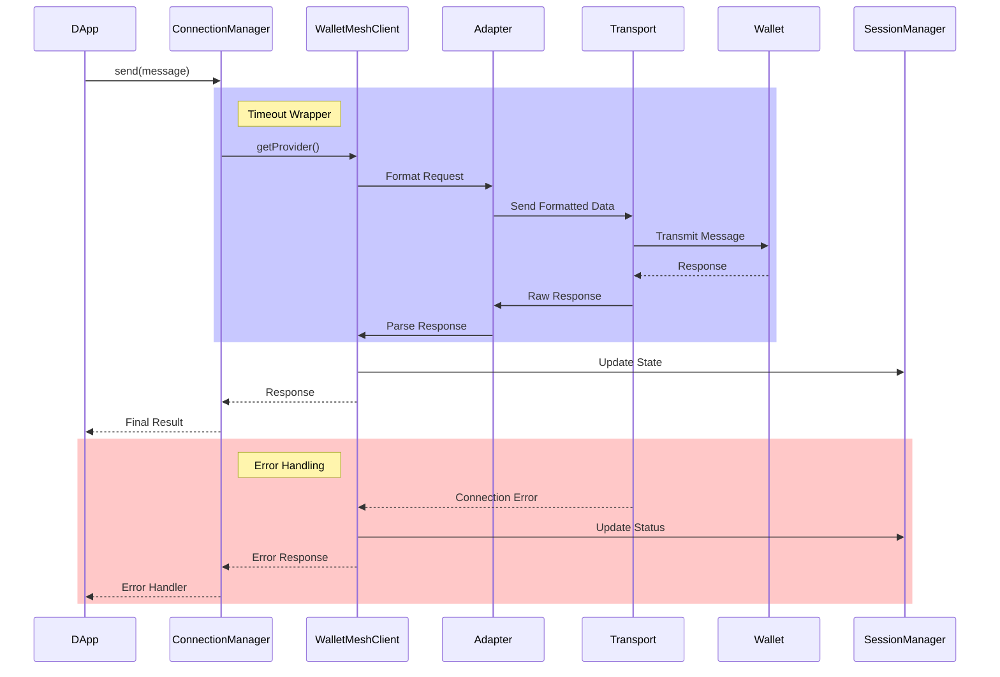
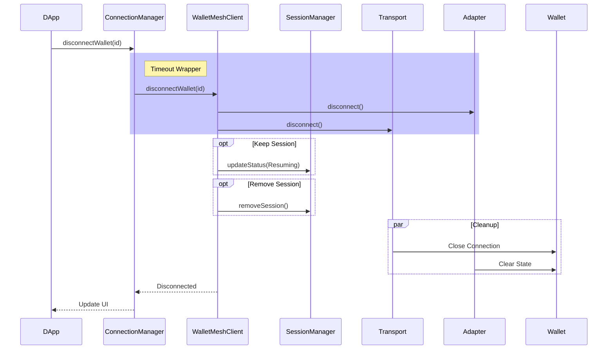
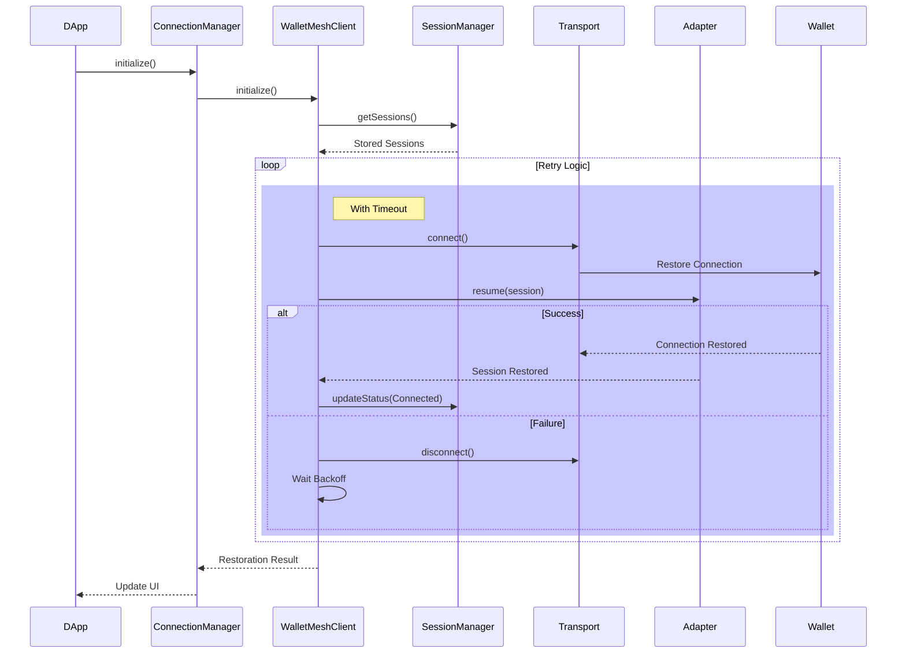

**@walletmesh/modal v0.0.6**

***

# WalletMesh Modal

WalletMesh provides a flexible and powerful solution for integrating multiple wallet connections into your decentralized application (DApp). It offers clean separation between transport and business logic layers, supporting multiple simultaneous wallet connections with robust error handling and user-friendly interfaces.

## Table of Contents
- [Installation](#installation)
- [Architecture](#architecture)
  - [Connection Flow](#connection-flow)
  - [Message Flow](#message-flow)
  - [Disconnection Flow](#disconnection-flow)
  - [Session Restoration Flow](#session-restoration-flow)
- [Quick Start](#quick-start)
- [Configuration](#configuration)
- [Core Components](#core-components)
  - [Provider](#provider)
  - [Hooks](#hooks)
  - [Transport Layer](#transport-layer)
  - [Adapter Layer](#adapter-layer)
- [Security Considerations](#security-considerations)
- [Error Handling](#error-handling)
- [TypeScript Support](#typescript-support)
- [Advanced Usage](#advanced-usage)
  - [Custom Adapters](#custom-adapters)
  - [Custom Transports](#custom-transports)

## Architecture
The following sequence diagrams illustrate the key flows in the wallet connection process:

## Installation

```bash
# Using npm
npm install @walletmesh/modal

# Using yarn
yarn add @walletmesh/modal

# Using pnpm
pnpm add @walletmesh/modal
```

## Connection Flow



## Message Flow



## Disconnection Flow



## Session Restoration Flow



## Quick Start

```typescript
import { 
  WalletProvider, 
  ConnectButton, 
  WalletMeshConfig,
  TransportType, 
  AdapterType 
} from '@walletmesh/modal';

// Create configuration using the builder pattern
const config = WalletMeshConfig.create()
  .clearWallets() // Clear default wallets if needed
  .addWallet({
    id: "aztec_web",
    name: "Aztec Web Wallet",
    icon: "data:image/svg+xml,...", // Must be data URI
    transport: {
      type: TransportType.PostMessage,
      options: { origin: "https://wallet.aztec.network" }
    },
    adapter: {
      type: AdapterType.WalletMeshAztec,
      options: { chainId: "aztec:testnet" }
    }
  })
  .setDappInfo({
    name: "My DApp",
    description: "A decentralized application",
    origin: "https://mydapp.com",
    icon: "data:image/svg+xml,..." // Optional, must be data URI
  })
  .build();

// Wrap your app with WalletProvider
function App() {
  return (
    <WalletProvider config={config} onError={console.error}>
      <ConnectButton />
      {/* Your app content */}
    </WalletProvider>
  );
}
```

## Security Considerations

### Icon Security
All icons (wallet and dApp) must be provided as data URIs to prevent XSS attacks:
```typescript
// Good - Using data URI
icon: "data:image/svg+xml,..."

// Bad - Using URL
icon: "https://example.com/icon.svg" // Will throw error
```

### Origin Validation
Always specify allowed origins for PostMessage transport:
```typescript
transport: {
  type: TransportType.PostMessage,
  options: {
    // Explicitly set allowed origin
    origin: "https://wallet.example.com"
  }
}
```

### Session Management
Sessions are stored securely in localStorage with:
- Validation of all stored data
- Sanitization of restored sessions
- Automatic session cleanup
```typescript
// Configure session timeout
.setTimeout({
  connectionTimeout: 30000,  // Connection timeout
  operationTimeout: 10000   // Operation timeout
})
```

### Error Handling
Implement proper error handling for all operations:
```typescript
try {
  await wallet.connect();
} catch (error) {
  if (error instanceof WalletError) {
    // Handle specific error types
    if (error.code === -30000) {
      // Connection error
    }
  }
}
```

## Configuration

The WalletMeshConfig builder provides a fluent API for configuring the modal:

```typescript
const config = WalletMeshConfig.create()
  // Wallet Management
  .clearWallets()                  // Remove default wallets
  .addWallet({...})               // Add single wallet
  .addWallets([{...}, {...}])     // Add multiple wallets
  .removeWallet('wallet_id')      // Remove specific wallet
  
  // Chain Configuration
  .setSupportedChains([
    'aztec:testnet',
    'aztec:mainnet'
  ])
  
  // DApp Information
  .setDappInfo({
    name: 'My DApp',
    description: 'DApp Description',
    origin: 'https://mydapp.com',
    icon: 'data:image/svg+xml,...', // Optional
    rpcUrl: 'https://rpc.example.com' // Optional
  })

  // Timeout Configuration
  .setTimeout({
    connectionTimeout: 30000,     // 30s for initial connections (default)
    operationTimeout: 10000       // 10s for other operations (default)
  })
  .build();
```

## Core Components

### Provider

The WalletProvider manages wallet connections and provides state to your application:

```typescript
interface WalletProviderProps {
  config: WalletMeshProviderConfig;
  onError?: (error: Error) => void;
  children: React.ReactNode;
}

// Usage
<WalletProvider 
  config={config}
  onError={(error) => {
    console.error('Wallet error:', error.message);
    // Error includes code and optional cause
    if (error.code === -30000) {
      // Handle connection error
    }
  }}
>
  <App />
</WalletProvider>
```

### Hooks

#### useWalletLogic

Primary hook for interacting with wallets:

```typescript
function WalletStatus() {
  const {
    connectionStatus,     // Current connection state
    connectedWallet,     // Active wallet info
    connectWallet,       // Connect function
    disconnectWallet,    // Disconnect function
    isModalOpen,         // Modal visibility
    openModal,           // Show modal
    closeModal          // Hide modal
  } = useWalletLogic();

  if (connectionStatus === ConnectionStatus.Connected) {
    return (
      <div>
        Connected to {connectedWallet?.info.name}
        <button onClick={disconnectWallet}>Disconnect</button>
      </div>
    );
  }

  return <button onClick={openModal}>Connect Wallet</button>;
}
```

### Transport Layer

Handles communication between DApp and wallet:

```typescript
interface Transport {
  connect(): Promise<void>;
  disconnect(): Promise<void>;
  send(data: unknown): Promise<void>;
  onMessage(handler: (data: unknown) => void): void;
  isConnected(): boolean;
}

// Available transport types
enum TransportType {
  PostMessage = 'postMessage',
  WebSocket = 'websocket',
  Extension = 'extension',
  Null = 'null'
}
```

### Adapter Layer

Manages chain-specific wallet interactions:

```typescript
interface Adapter {
  connect(walletInfo: WalletInfo): Promise<ConnectedWallet>;
  disconnect(): Promise<void>;
  getProvider(): Promise<unknown>;
  handleMessage(data: unknown): void;
}

// Available adapter types
enum AdapterType {
  WalletMeshAztec = 'wm_aztec',
  ObsidionAztec = 'obsidion_aztec'
}
```

## Error Handling

WalletMesh provides structured error handling with specific error types and codes:

```typescript
// Error codes by category
-30000: Connection errors
-30001: Disconnection errors
-30002: Session errors
-30003: Timeout errors
-30099: Generic wallet errors

// Error examples
try {
  await wallet.connect();
} catch (error) {
  if (error instanceof WalletTimeoutError) {
    console.error(`Operation timed out after ${error.timeout}ms`);
  } else if (error instanceof WalletConnectionError) {
    console.error(`Connection failed: ${error.message}`);
    console.error(`Error code: ${error.code}`);
    if (error.cause) {
      console.error('Caused by:', error.cause);
    }
  }
}

// Error utility
const error = handleWalletError(err, 'connect wallet');
// WalletConnectionError(-30000): Failed to connect wallet

// Type Guards
if (isWalletTimeoutError(error)) {
  // Handle timeout-specific error
  console.error(`Operation timed out after ${error.timeout}ms`);
}
```

## TypeScript Support

The package is written in TypeScript and provides comprehensive type definitions:

```typescript
// Type-safe configuration
const config: WalletMeshProviderConfig = WalletMeshConfig.create()
  .addWallet({
    id: string;
    name: string;
    icon?: string;
    url?: string;
    supportedChains?: string[];
    adapter: AdapterConfig;
    transport: TransportConfig;
  })
  .build();

// Strongly-typed hooks
const { 
  connectionStatus, // ConnectionStatus enum
  connectedWallet  // ConnectedWallet interface
} = useWalletLogic();

// Type guards
if (isWalletError(error)) {
  // Type-safe error handling
}
```

## Advanced Usage

### Custom Adapters

Create adapters for new chains or wallet types:

```typescript
class CustomAdapter implements Adapter {
  async connect(walletInfo: WalletInfo): Promise<ConnectedWallet> {
    // Implementation
  }
  
  async disconnect(): Promise<void> {
    // Implementation
  }
  
  async getProvider(): Promise<unknown> {
    // Implementation
  }
  
  handleMessage(data: unknown): void {
    // Implementation
  }
}
```

### Custom Transports

Implement new communication methods:

```typescript
class CustomTransport implements Transport {
  async connect(): Promise<void> {
    // Implementation
  }
  
  async disconnect(): Promise<void> {
    // Implementation
  }
  
  async send(data: unknown): Promise<void> {
    // Implementation
  }
  
  onMessage(handler: (data: unknown) => void): void {
    // Implementation
  }
  
  isConnected(): boolean {
    // Implementation
    return true;
  }
}
