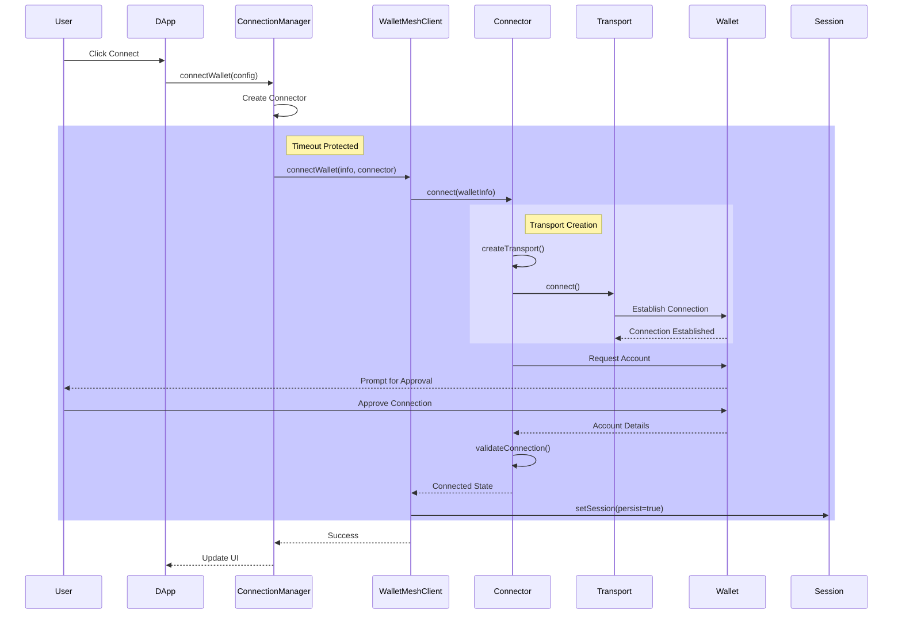

**@walletmesh/modal v0.0.7**

***

# WalletMesh Modal

A flexible and powerful framework for integrating wallet connections in decentralized applications, with a focus on security, type safety, and developer experience.

## Installation

Using npm:
```bash
npm install @walletmesh/modal
```

Using yarn:
```bash
yarn add @walletmesh/modal
```

Using pnpm:
```bash
pnpm add @walletmesh/modal
```

## Overview

WalletMesh Modal provides:
- Framework-agnostic wallet connection management
- Secure session persistence and restoration
- Timeout protection and error recovery
- Type-safe connector and transport interfaces
- Comprehensive React integration

## Quick Start for dApp Developers

### Basic Setup
```typescript
import { 
  WalletProvider, 
  ConnectButton, 
  WalletMeshConfig 
} from '@walletmesh/modal';

// Configure your dApp and available wallets
const config = WalletMeshConfig.create()
  .addWallet({
    id: "aztec_wallet",
    name: "Aztec Wallet",
    // Icon must be a data URI, not a URL - this is required for security
    icon: "data:image/svg+xml;base64,PHN2ZyB4bWxucz0iaHR0cDovL3d3dy53My5vcmcvMjAwMC9zdmciLz4=",
    connector: {
      type: ConnectorType.WalletMeshAztec,
      options: { chainId: "aztec:testnet" }
    }
  })
  .setDappInfo({
    name: "My DApp",
    description: "A decentralized application",
    // DApp icon must also be a data URI
    icon: "data:image/svg+xml;base64,PHN2ZyB4bWxucz0iaHR0cDovL3d3dy53My5vcmcvMjAwMC9zdmciLz4=",
    origin: "https://mydapp.com"
  })
  .build();

// Wrap your app with WalletProvider
function App() {
  return (
    <WalletProvider config={config} onError={console.error}>
      <ConnectButton />
      {/* Your app content */}
    </WalletProvider>
  );
}
```

### Example Integration

A complete working example is available in the [modal-example](/core/modal-example) package, which demonstrates:

- Development environment setup
- Multiple wallet configurations
- Error handling patterns
- Theme customization
- Accessibility considerations
- Best practices for production

To run the example:
```bash
cd core/modal-example
pnpm install
pnpm dev
```

Visit http://localhost:5173 to see the example in action.

### Using the Modal
The ConnectButton component handles the wallet selection flow:
```typescript
function WalletSection() {
  const { 
    connectionStatus,
    connectedWallet,
    openModal,
    disconnect 
  } = useWalletContext();

  if (connectionStatus === 'connected') {
    return (
      <div>
        Connected to: {connectedWallet.info.name}
        <button onClick={disconnect}>Disconnect</button>
      </div>
    );
  }

  return <button onClick={openModal}>Connect Wallet</button>;
}
```

### Error Handling
```typescript
<WalletProvider
  config={config}
  onError={(error) => {
    if (error instanceof WalletError) {
      switch (error.type) {
        case 'connector':
          // Handle connection errors
          break;
        case 'transport':
          // Handle communication errors
          break;
        case 'storage':
          // Handle session errors
          break;
      }
    }
  }}
>
  <WalletErrorBoundary
    fallback={(error) => (
      <div>Error: {error.message}</div>
    )}
  >
    <App />
  </WalletErrorBoundary>
</WalletProvider>
```

## Data Flow & Architecture

### Core Components

1. **WalletMeshClient** - Central coordinator
   - Manages wallet connections
   - Handles session persistence
   - Coordinates state updates

2. **ConnectionManager** - High-level orchestrator
   - Provides timeout protection
   - Handles error recovery
   - Manages connection lifecycle

3. **Connector** - Protocol implementation
   - Creates appropriate transport
   - Handles message formatting
   - Manages wallet state

4. **SessionManager** - State persistence
   - Secures session storage
   - Handles state restoration
   - Validates session data

### Connection Flow Diagram


## API Reference

### Core Interfaces

```typescript
interface WalletInfo {
  id: string;
  name: string;
  icon?: string; // Must be data URI
  url?: string;
  extensionId?: string;
  connector: ConnectorConfig;
}

interface ConnectorConfig {
  type: string;
  options?: Record<string, unknown>;
}

interface ConnectedWallet {
  info: WalletInfo;
  state: {
    chain: string;
    address: string;
    sessionId: string;
  };
}

interface Transport {
  connect(): Promise<void>;
  disconnect(): Promise<void>;
  send(data: unknown): Promise<void>;
  onMessage(handler: (data: unknown) => void): void;
  isConnected(): boolean;
}
```

### Error Types

```typescript
class WalletError extends Error {
  readonly type: 'client' | 'connector' | 'transport' | 'storage';
  readonly cause?: Error;
}

class WalletTimeoutError extends WalletError {
  readonly timeout: number;
}
```

### Configuration Options

```typescript
interface WalletMeshConfig {
  wallets: WalletInfo[];
  dappInfo: {
    name: string;
    description?: string;
    icon?: string; // Must be data URI
    origin: string;
    rpcUrl?: string;
  };
  timeouts?: {
    connectionTimeout?: number;
    operationTimeout?: number;
  };
}
```

For more detailed API documentation, see the [TypeDoc documentation](_media/README.md).
