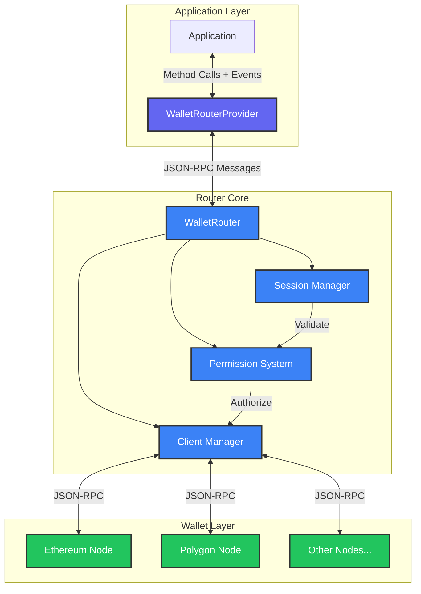

**@walletmesh/router v0.5.2**

***

# @walletmesh/router

A flexible routing system for managing multi-chain wallet connections with bi-directional communication support, built on top of [@walletmesh/jsonrpc](https://github.com/WalletMesh/walletmesh-packages/tree/main/core/jsonrpc).

## Quick Start

### Install the package
```bash
pnpm add @walletmesh/router
```

### Create a simple router setup
```typescript
import { WalletRouter, WalletRouterProvider, PermissivePermissionsManager, type JSONRPCWallet } from '@walletmesh/router';
import { JSONRPCNode } from '@walletmesh/jsonrpc';

// Initialize a basic Ethereum wallet as a JSONRPCNode
// This node handles JSON-RPC communication for Ethereum mainnet
const ethereumWallet: JSONRPCWallet = new JSONRPCNode({
  send: async (message) => {
    // Forward JSON-RPC messages to the injected Ethereum provider
    const result = await window.ethereum.request(message);
    // Send response back through the transport
    ethereumWallet.receiveMessage({ jsonrpc: '2.0', id: message.id, result });
  },
  onMessage: (handler) => {
    // Setup message handler for responses
  }
});

// Register wallet methods
etherneumWallet.registerMethod('eth_accounts', async () => {
  return window.ethereum.request({ method: 'eth_accounts' });
});

// Initialize the router with transport layer, wallets, and permission manager
// The router coordinates communication between the application and wallets
const router = new WalletRouter(
  { 
    send: (msg) => Promise.resolve(window.postMessage(msg, '*')),
    onMessage: (handler) => window.addEventListener('message', (e) => handler(e.data))
  },
  new Map([['eip155:1', ethereumWallet]]),
  // For development, use the permissive permission manager
  new PermissivePermissionsManager()
);

// Initialize the provider that applications use to interact with wallets
// The provider offers a high-level interface for wallet operations
const provider = new WalletRouterProvider({
  send: async (msg) => window.postMessage(msg, '*'),
  onMessage: (handler) => window.addEventListener('message', (e) => handler(e.data))
});

// Connect to Ethereum mainnet and request method permissions
// This establishes a session and requests access to specific RPC methods
const { sessionId, permissions } = await provider.connect({
  'eip155:1': ['eth_accounts', 'eth_sendTransaction']
}, 5000); // Optional timeout in milliseconds

// The permissions are in a human-readable format for display to users
console.log('Approved permissions:', permissions);
// The connect method returns the session ID for future requests
console.log('Connected with session:', sessionId);

// Call a wallet method using the established session
// The router will validate permissions and route the call to the appropriate wallet
const accounts = await provider.call('eip155:1', {
  method: 'eth_accounts'
}, 5000); // Optional timeout in milliseconds
```

## Features

🔗 **Multi-Chain Support**
- Connect to multiple blockchain wallets simultaneously
- Dynamic wallet addition and removal at runtime
- Unified interface across different chains

🔒 **Advanced Permissions**
- Granular method-level access control
- Dynamic permission updates
- Chain-specific permission management

🔄 **Bi-directional Communication**
- Real-time wallet state synchronization
- Event-driven architecture
- Automatic state recovery

💾 **Session Management**
- Persistent sessions with automatic recovery
- Configurable session lifetime
- Multiple storage backend support

🚦 **Request Handling**
- Efficient request batching
- Automatic request routing
- Comprehensive error handling

🛡️ **Type Safety**
- Full TypeScript support
- Comprehensive type definitions

## Architecture

The WalletMesh Router is designed with a modular architecture that separates concerns between routing, session management, permissions, and wallet interactions. Here's a high-level overview of how the system works:




### Core Components

1. **WalletRouterProvider**
   ```typescript
   class WalletRouterProvider extends JSONRPCNode<RouterMethodMap, RouterEventMap, RouterContext> {
     // Get current session ID
     get sessionId(): string | undefined;

     // Create an operation builder for chaining multiple calls
     chain(chainId: ChainId): OperationBuilder;

     // Connect to chains with permissions
     async connect(permissions: ChainPermissions, timeout?: number): Promise<{ sessionId: string, permissions: ChainPermissions }>;

     // Call a single wallet method
     async call(chainId: ChainId, call: MethodCall, timeout?: number): Promise<unknown>;

     // Call multiple methods in sequence (consider using chain() for better type safety)
     async bulkCall(chainId: ChainId, calls: MethodCall[], timeout?: number): Promise<unknown[]>;

     // Get/update permissions
     async getPermissions(chainIds?: ChainId[], timeout?: number): Promise<HumanReadableChainPermissions>;>;
     async updatePermissions(permissions: ChainPermissions, timeout?: number): Promise<HumanReadableChainPermissions>;

     // Get supported methods
     async getSupportedMethods(chainIds?: ChainId[], timeout?: number): Promise<Record<ChainId, string[]>>;

   // Clean up
   async disconnect(timeout?: number): Promise<void>;
 }
 ```

   **Method-Specific Serialization**:
   The `WalletRouterProvider` supports registration of custom serializers for specific wallet methods (e.g., `eth_sendTransaction`, `aztec_deployContract`). This allows for automatic transformation of complex parameters before they are sent to the router and deserialization of results when they are received. This is managed internally by the `ProviderSerializerRegistry`.

   - **Purpose**:
     - Ensures complex objects (like Aztec's `Fr` or `AztecAddress` types) are properly serialized for JSON-RPC transport.
     - Maintains compatibility with chain-specific data structures.
     - Provides transparent serialization/deserialization without manual intervention by the dApp developer.
   - **Registration**:
     Serializers are registered on the `WalletRouterProvider` instance using the `registerMethodSerializer` method.
     ```typescript
     // Example: Registering a serializer for an Aztec method
     // (Actual Aztec serializers are often bundled in packages like @walletmesh/aztec-rpc-wallet)
     provider.registerMethodSerializer('aztec_someMethod', {
       params: {
         serialize: async (method, params) => ({ method, serialized: JSON.stringify(params) }), // Simplified example
         deserialize: async (method, data) => JSON.parse(data.serialized)
       },
       result: {
         serialize: async (method, result) => ({ method, serialized: JSON.stringify(result) }),
         deserialize: async (method, data) => JSON.parse(data.serialized)
       }
     });
     ```
   - **How it Works**:
     - When `provider.call()` or `provider.bulkCall()` is used, the registered serializer for the target method (if any) is automatically applied to its parameters before the request is sent to the `WalletRouter` (via `wm_call`).
     - Similarly, results from `wm_call` are deserialized using the method's registered result serializer before being returned to the dApp.
     - This mechanism is crucial for handling non-standard JSON types used by specific blockchain SDKs.

2. **WalletRouter**
   ```typescript
   class WalletRouter extends JSONRPCNode<RouterMethodMap, RouterEventMap, RouterContext> {
     constructor(
       transport: { send: (message: unknown) => Promise<void> },
       wallets: Wallets,
       permissionManager: PermissionManager<RouterMethodMap, RouterContext>,
       sessionStore?: SessionStore
     );

     // Add wallet node
     addWallet(chainId: ChainId, wallet: JSONRPCWallet): void;

     // Remove wallet node
     removeWallet(chainId: ChainId): void;
   }
   ```

3. **Session Store**
   ```typescript
   interface SessionStore {
     // Store session data
     set(sessionId: string, data: SessionData): Promise<void>;

     // Get session if not expired
     get(sessionId: string): Promise<SessionData | undefined>;

     // Get all non-expired sessions
     getAll(): Promise<Map<string, SessionData>>;

     // Remove session
     delete(sessionId: string): Promise<void>;

     // Clear all sessions
     clear(): Promise<void>;

     // Validate and optionally refresh session
     validateAndRefresh(sessionId: string): Promise<SessionData | undefined>;

     // Clean up expired sessions
     cleanExpired(): Promise<number>;
   }
   ```

4. **JSONRPCWallet**
   ```typescript
   // JSONRPCWallet is a type alias for a JSONRPCNode configured for wallet communication
   type JSONRPCWallet = JSONRPCNode<WalletMethodMap, JSONRPCEventMap, JSONRPCContext>;
   
   // The WalletMethodMap includes wallet-specific methods
   interface WalletMethodMap extends JSONRPCMethodMap {
     wm_getSupportedMethods: {
       result: string[];
     };
     [method: string]: {
       params?: JSONRPCParams;
       result: unknown;
     };
   }
   ```

### Error Handling

```typescript
import { RouterError } from '@walletmesh/router';

// Error handling example
try {
  await provider.call('eip155:1', {
    method: 'eth_sendTransaction',
    params: [{...}]
  });
} catch (error) {
  if (error instanceof RouterError) {
    switch (error.code) {
      case 'insufficientPermissions':
        console.error('Permission denied:', error.message);
        break;
      case 'walletNotAvailable':
        console.error('Wallet error:', error.data);
        break;
      case 'unknownChain':
        console.error('Chain not supported:', error.message);
        break;
      case 'methodNotSupported':
        console.error('Method not supported:', error.message);
        break;
      default:
        console.error('Router error:', error.message);
    }
  }
}
```

### Session Configuration

```typescript
import { type SessionStoreConfig, MemorySessionStore, LocalStorageSessionStore } from '@walletmesh/router';

// In-memory session store with 24h lifetime
const memoryStore = new MemorySessionStore({
  lifetime: 24 * 60 * 60 * 1000,
  refreshOnAccess: true
});

// Local storage session store with custom config
const persistentStore = new LocalStorageSessionStore({
  lifetime: 7 * 24 * 60 * 60 * 1000, // 7 days
  refreshOnAccess: true
});
```

### Middleware

The router uses two core middleware components:

1. **Session Middleware**
```typescript
// Creates middleware for session validation
const sessionMiddleware = createSessionMiddleware(sessionStore);

// Validates session existence and freshness
// Automatically refreshes session expiry if configured
// Attaches session data to request context
```

2. **Permissions Middleware**
```typescript
// Creates middleware for permission checking
const permissionsMiddleware = createPermissionsMiddleware(permissionManager.checkPermissions.bind(permissionManager));

// Validates method permissions using the permission manager
// Supports both single and bulk method calls
// Handles permission states (ALLOW/ASK/DENY)
```

Permission managers can be created using provided helpers:
```typescript
// Fully permissive (development)
const devPermissions = new PermissivePermissionsManager();

// Allow/Ask/Deny permissions (production)
const prodPermissions = new AllowAskDenyManager(
  // Approval callback for new permission requests
  async (context, request) => {
    const approved = await showPermissionDialog(request);
    return approved ? request : {};
  },
  // Ask callback for methods in ASK state
  async (context, request) => {
    return await showMethodPrompt(request.method);
  },
  // Initial permission states
  new Map([
    ['eip155:1', new Map([
      ['eth_sendTransaction', AllowAskDenyState.ASK],
      ['eth_accounts', AllowAskDenyState.ALLOW],
      ['personal_sign', AllowAskDenyState.DENY]
    ])]
  ])
);
```

## Installation

```bash
pnpm add @walletmesh/router
```

## Usage Example

```typescript
import {
  WalletRouter,
  WalletRouterProvider,
  AllowAskDenyManager,
  AllowAskDenyState,
  type JSONRPCWallet
} from '@walletmesh/router';
import { JSONRPCNode } from '@walletmesh/jsonrpc';

// Initialize wallet nodes for multiple chains
const ethereumWallet: JSONRPCWallet = new JSONRPCNode(ethereumTransport);
// Register Ethereum wallet methods
etherneumWallet.registerMethod('eth_accounts', async () => {
  return window.ethereum.request({ method: 'eth_accounts' });
});
etherneumWallet.registerMethod('eth_sendTransaction', async (context, params) => {
  return window.ethereum.request({ method: 'eth_sendTransaction', params });
});

const polygonWallet: JSONRPCWallet = new JSONRPCNode(polygonTransport);
// Register Polygon wallet methods
polygonWallet.registerMethod('eth_getBalance', async (context, params) => {
  return window.polygon.request({ method: 'eth_getBalance', params });
});

// Create router instance with production-ready permission handling
const router = new WalletRouter(
  { 
    send: async (msg) => window.postMessage(msg, '*'),
    onMessage: (handler) => window.addEventListener('message', (e) => handler(e.data))
  },
  new Map([
    ['eip155:1', ethereumWallet],
    ['eip155:137', polygonWallet]
  ]),
  new AllowAskDenyManager(
    // Approval callback for new permission requests
    async (context, request) => {
      const approved = await showPermissionDialog(request);
      return approved ? request : {};
    },
    // Ask callback for methods in ASK state
    async (context, request) => {
      return await showMethodPrompt(request.method);
    },
    // Initial permission states
    new Map([
      ['eip155:1', new Map([
        ['eth_sendTransaction', AllowAskDenyState.ASK],
        ['eth_accounts', AllowAskDenyState.ALLOW],
        ['personal_sign', AllowAskDenyState.DENY]
      ])]
    ])
  )
);

// Initialize provider for application use
const provider = new WalletRouterProvider({
  send: async (msg) => window.postMessage(msg, '*'),
  onMessage: (handler) => window.addEventListener('message', (e) => handler(e.data))
});

// Establish connections to multiple chains with specific method permissions
const { sessionId, permissions } = await provider.connect({
  'eip155:1': ['eth_accounts', 'eth_sendTransaction'],
  'eip155:137': ['eth_getBalance', 'eth_call']
}, 5000); // Optional timeout in milliseconds

// Execute a single method call on Ethereum mainnet
const accounts = await provider.call('eip155:1', {
  method: 'eth_accounts'
}, 5000); // Optional timeout in milliseconds

// Execute multiple method calls in sequence on Ethereum mainnet
const [balance, allowance] = await provider.bulkCall('eip155:1', [
  { method: 'eth_getBalance', params: ['0x...'] },
  { method: 'eth_allowance', params: ['0x...', '0x...'] }
], 5000); // Optional timeout in milliseconds

// Subscribe to wallet state changes with automatic cleanup
const cleanup = provider.on('wm_walletStateChanged', ({ chainId, changes }) => {
  console.log(`Wallet state changed for ${chainId}:`, changes);
});

// Clean up resources and close connections
cleanup();
await provider.disconnect();
```

### Operation Builder

The router provides a fluent interface for chaining multiple RPC method calls into a single operation using the `OperationBuilder` class. This is particularly useful when you need to make multiple related calls in sequence:

```typescript
// Create and execute a chain of method calls
const [balance, code] = await provider
  .chain('eip155:1')
  .call('eth_getBalance', ['0x123...'])
  .call('eth_getCode', ['0x456...'])
  .execute();

// Single call returns direct result
const balance = await provider
  .chain('eip155:1')
  .call('eth_getBalance', ['0x123...'])
  .execute();

// Type-safe parameters and results
const [balance, allowance] = await provider
  .chain('eip155:1')
  .call('eth_getBalance', ['0x123...']) // params and result types from RouterMethodMap
  .call('eth_allowance', ['0x123...', '0x456...'])
  .execute();
```

Key features of the Operation Builder:
- **Method Chaining**: Build sequences of related method calls using a fluent interface
- **Type Safety**: Full TypeScript support with proper typing for parameters and results
- **Execution Modes**: 
  - Single call returns direct result
  - Multiple calls return array of results in call order

### Session Management

The router uses a flexible session management system that:
- Uniquely identifies sessions using a combination of origin and sessionId
- Supports multiple session storage backends through the `SessionStore` interface
- Provides both in-memory (`MemorySessionStore`) and persistent (`LocalStorageSessionStore`) implementations
- Automatically handles session validation and refresh
- Enables session recovery after page reloads or disconnects
- Manages session lifecycle events (creation, updates, termination)

### Permission System

The router implements a flexible permission system with two built-in strategies:

1. **Allow/Ask/Deny Permission Manager** (`AllowAskDenyManager`)
   - Manages permissions using three states:
     - `ALLOW`: Method is always allowed without prompting
     - `DENY`: Method is always denied without prompting
     - `ASK`: User is prompted for permission each time
   - Permissions are stored per chain and method:
     ```typescript
// Permission state structure
type AllowAskDenyChainPermissions<T extends RouterMethodMap> = Map<ChainId, Map<keyof T, AllowAskDenyState>>;

// Example configuration
const initialState = new Map([
  ['eip155:1', new Map([
    ['eth_sendTransaction', AllowAskDenyState.ASK],
    ['eth_accounts', AllowAskDenyState.ALLOW],
    ['personal_sign', AllowAskDenyState.DENY]
  ])]
]);

const manager = new AllowAskDenyManager(approveCallback, askCallback, initialState);
     ```
   - Interactive permission handling through customizable prompt callback
   - Supports both single and bulk method calls
   - Bulk calls require all methods to be permitted

2. **Permissive Manager** (`PermissivePermissionsManager`)
   - Simple "allow all" strategy for development/testing
   - Uses wildcard permissions: `"*": { "*": { allowed: true } }`
   - No user interaction required
   - Useful for rapid development and trusted environments

3. **Human-Readable Permissions**
   ```typescript
   type HumanReadableChainPermissions = {
     [chainId: string]: {
       [methodName: string]: {
         allowed: boolean;
         shortDescription: string;
         longDescription?: string;
       };
     };
   };

   // Example response
   {
     "eip155:1": {
       "eth_sendTransaction": {
         allowed: true,
         shortDescription: "ask",
         longDescription: "Prompt user before sending transactions"
       }
     }
   }
   ```

4. **Permission Flow**
   - Initial connect: Client requests permissions → Manager approves/modifies → Session created
   - Method calls: Session validated → Permissions checked → Method routed
   - Updates: Client requests changes → Manager approves → Session updated
   - Events: Permission changes trigger `wm_permissionsChanged` event

### Local Transport

The router package provides a `LocalTransport` implementation for creating in-process wallet connections without network overhead. This is particularly useful for:
- Testing wallet implementations
- Embedding wallets directly in applications
- Creating mock wallets for development
- Implementing custom wallet adapters

```typescript
import { LocalTransport, createLocalTransportPair, createLocalTransport } from '@walletmesh/router';
import { JSONRPCNode } from '@walletmesh/jsonrpc';

// Method 1: Create a pair of connected transports
const [clientTransport, walletTransport] = createLocalTransportPair();

// Set up the wallet side
const walletNode = new JSONRPCNode(walletTransport);
walletNode.registerMethod('eth_accounts', async () => {
  return ['0x123...', '0x456...'];
});

// Use client transport with the router
router.addWallet('eip155:1', clientTransport);

// Method 2: Connect directly to an existing node
const existingWalletNode = new JSONRPCNode(someTransport);
const transport = createLocalTransport(existingWalletNode);
router.addWallet('eip155:1', transport);
```

#### Error Handling Configuration

LocalTransport supports configurable error handling through the `LocalTransportOptions` interface:

```typescript
interface LocalTransportOptions {
  /**
   * Whether to throw errors instead of logging warnings.
   * When true, errors in message handling will be thrown.
   * When false (default), errors will be logged as warnings.
   * @defaultValue false
   */
  throwOnError?: boolean;
}

// Default behavior - errors are logged as warnings
const transport = new LocalTransport();

// Throw errors for stricter error handling (useful in tests)
const strictTransport = new LocalTransport({ throwOnError: true });

// Create transport pairs with error handling options
const [client, wallet] = createLocalTransportPair({ throwOnError: true });
```

#### Example: Embedded Wallet Implementation

```typescript
import { createLocalTransportPair, WalletRouter, type JSONRPCWallet } from '@walletmesh/router';
import { JSONRPCNode } from '@walletmesh/jsonrpc';

// Create an embedded wallet implementation
class EmbeddedWallet {
  private node: JSONRPCWallet;
  
  constructor(transport: LocalTransport) {
    this.node = new JSONRPCNode(transport);
    this.setupMethods();
  }
  
  private setupMethods() {
    this.node.registerMethod('eth_accounts', async () => {
      // Return accounts from secure storage
      return this.getAccounts();
    });
    
    this.node.registerMethod('eth_sendTransaction', async (context, params) => {
      // Sign and send transaction
      return this.signAndSendTransaction(params[0]);
    });
  }
}

// Set up the wallet connection
const [clientTransport, walletTransport] = createLocalTransportPair();
const embeddedWallet = new EmbeddedWallet(walletTransport);

// Add to router
router.addWallet('eip155:1', clientTransport);
```

#### Testing with LocalTransport

LocalTransport is ideal for testing because it:
- Provides synchronous-like behavior with minimal async overhead
- Supports error injection for testing error paths
- Maintains message ordering guarantees
- Has no network dependencies

```typescript
// In tests, use throwOnError for immediate error feedback
const [client, wallet] = createLocalTransportPair({ throwOnError: true });

// Set up a mock wallet
const mockWallet = new JSONRPCNode(wallet);
mockWallet.registerMethod('eth_accounts', async () => {
  throw new Error('Wallet locked');
});

// Test error handling
await expect(provider.call('eip155:1', {
  method: 'eth_accounts'
})).rejects.toThrow('Wallet locked');
```
