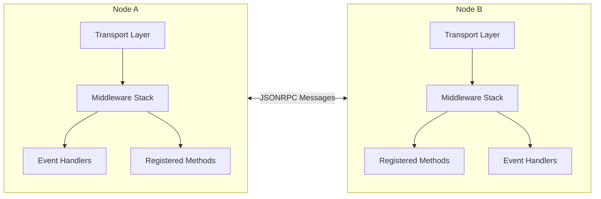
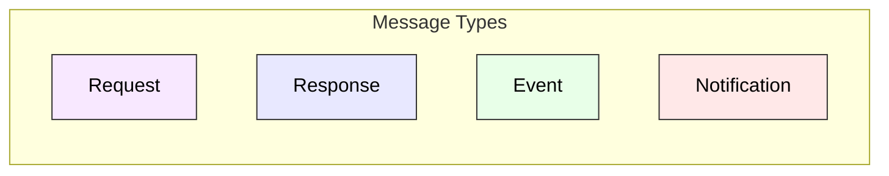

# @walletmesh/jsonrpc

A TypeScript implementation of the JSON-RPC 2.0 protocol, designed for building robust client-server applications with bi-directional communication capabilities.

## Quick Start

```bash
# Install the package
pnpm add @walletmesh/jsonrpc
```

```typescript
import { JSONRPCNode } from '@walletmesh/jsonrpc';

// Define shared types for type safety
type Methods = {
  add: {
    params: { a: number; b: number };
    result: number;
  };
  greet: {
    params: { name: string };
    result: string;
  };
};

type Events = {
  notification: { message: string };
};

// Create server node
const server = new JSONRPCNode<Methods, Events>({
  send: message => {
    // In a real app, send to client (e.g., via WebSocket)
    client.handleMessage(message);
  }
});

// Register server methods
server.registerMethod('add', (context, { a, b }) => a + b);
server.registerMethod('greet', (context, { name }) => `Hello, ${name}!`);

// Create client node
const client = new JSONRPCNode<Methods, Events>({
  send: message => {
    // In a real app, send to server (e.g., via WebSocket)
    server.handleMessage(message);
  }
});

// Use client to call server methods
async function main() {
  // Call methods
  const sum = await client.callMethod('add', { a: 2, b: 3 });
  console.log('Sum:', sum); // Output: Sum: 5

  const greeting = await client.callMethod('greet', { name: 'Alice' });
  console.log('Greeting:', greeting); // Output: Greeting: Hello, Alice!

  // Handle events
  const cleanup = client.on('notification', ({ message }) => {
    console.log('Notification:', message);
  });

  // Server can emit events
  server.emit('notification', { message: 'Server update!' });

  // Clean up when done
  cleanup();
}

main().catch(console.error);
```

This example demonstrates:
- Type-safe method and event definitions
- Bi-directional communication
- Method calls with parameters
- Event handling
- Proper cleanup

In a real application, you would:
1. Replace the direct message passing with your transport layer (WebSocket, postMessage, etc.)
2. Add error handling
3. Implement proper connection management
4. Add middleware for logging, authentication, etc.

## Features

✨ **Full JSON-RPC 2.0 Compliance**
- Complete implementation of the JSON-RPC 2.0 specification
- Support for both request-response and notification patterns
- Bi-directional communication capabilities

🔒 **Type Safety**
- Comprehensive TypeScript type definitions
- Generic type parameters for methods and events
- Compile-time parameter and result validation

🔄 **Middleware System**
- Request/response modification
- Context passing through middleware chain
- Automatic cleanup of middleware handlers

📡 **Event System**
- Asynchronous notification support
- Type-safe event definitions
- Automatic event handler cleanup

⚡ **Performance & Reliability**
- Configurable timeout support
- Parameter serialization for complex types
- Method response validation

## Architecture

The library implements a node-to-node architecture where each node can both send and receive JSON-RPC messages. Here's a high-level overview:





### Key Components

1. **JSONRPCNode**: The main class that implements the JSON-RPC 2.0 protocol
   - Handles both client and server functionality
   - Manages method registration and invocation
   - Processes incoming/outgoing messages
   - Coordinates middleware execution
   - Supports automatic cleanup of event handlers and middleware
   - Provides comprehensive error handling with custom error types

2. **Transport Layer**: Abstract interface for message transmission
   - Implemented by the user (e.g., WebSocket, postMessage)
   - Handles actual message delivery between nodes
   - Supports both synchronous and asynchronous communication

3. **Middleware Stack**: Chain of request/response processors
   - Request/response modification
   - Context sharing
   - Automatic cleanup on node close

4. **Type System**: Comprehensive TypeScript types
   - Method definitions with params/result types
   - Event definitions with payload types
   - Context types for shared data
   - Serialization interfaces
   - Support for both object and array parameters

## Usage

### Basic Setup

```typescript
// Define your types
type MethodMap = {
  add: { params: { a: number; b: number }; result: number };
  greet: { params: { name: string }; result: string };
};

type EventMap = {
  userJoined: { username: string; timestamp: number };
  statusUpdate: { status: 'online' | 'offline'; lastSeen?: number };
};

type Context = JSONRPCContext & {
  userId?: string;
  sessionData?: Record<string, unknown>;
};

// Create a node instance
const node = new JSONRPCNode<MethodMap, EventMap, Context>({
  send: message => {
    // Transport implementation (e.g., WebSocket, postMessage)
    ws.send(JSON.stringify(message));
  }
});
```

### Method Registration and Calls

```typescript
// Register a simple method
node.registerMethod('add', (context, { a, b }) => {
  if (typeof a !== 'number' || typeof b !== 'number') {
    throw new JSONRPCError(-32602, 'Invalid parameters: numbers required');
  }
  return a + b;
});

// Register a method with array parameters
node.registerMethod('sum', (context, numbers: number[]) => {
  if (!Array.isArray(numbers) || !numbers.every(n => typeof n === 'number')) {
    throw new JSONRPCError(-32602, 'Invalid parameters: array of numbers required');
  }
  return numbers.reduce((a, b) => a + b, 0);
});

// Call methods
const sum = await node.callMethod('add', { a: 1, b: 2 });
const total = await node.callMethod('sum', [1, 2, 3, 4]);

// Call with timeout
try {
  const result = await node.callMethod('slowMethod', { data: 'test' }, 5);
} catch (error) {
  if (error instanceof TimeoutError) {
    console.error('Request timed out');
  }
}
```

### Error Handling

```typescript
try {
  await node.callMethod('riskyMethod', { data: 'test' });
} catch (error) {
  if (error instanceof JSONRPCError) {
    console.error(`RPC Error ${error.code}: ${error.message}`);
    if (error.data) {
      console.error('Additional data:', error.data);
    }
  }
}

// Custom error in method handler
node.registerMethod('validateUser', (context, { username, age }) => {
  if (!username || typeof username !== 'string') {
    throw new JSONRPCError(-32602, 'Invalid username', {
      field: 'username',
      received: username,
      expected: 'non-empty string'
    });
  }
  if (!age || typeof age !== 'number' || age < 0) {
    throw new JSONRPCError(-32602, 'Invalid age', {
      field: 'age',
      received: age,
      expected: 'positive number'
    });
  }
  return { valid: true };
});
```

### Event System

```typescript
// Define event handlers with type safety
type UserJoinedHandler = (params: { username: string; timestamp: number }) => void;
type StatusUpdateHandler = (params: { status: 'online' | 'offline'; lastSeen?: number }) => void;

// Register event handlers with cleanup
const userJoinedCleanup = node.on('userJoined', ({ username, timestamp }) => {
  console.log(`${username} joined at ${new Date(timestamp).toLocaleString()}`);
});

const statusCleanup = node.on('statusUpdate', ({ status, lastSeen }) => {
  console.log(`Status changed to ${status}`);
  if (lastSeen) {
    console.log(`Last seen: ${new Date(lastSeen).toLocaleString()}`);
  }
});

// Emit events
node.emit('userJoined', {
  username: 'Alice',
  timestamp: Date.now()
});

node.emit('statusUpdate', {
  status: 'offline',
  lastSeen: Date.now()
});

// Later: remove handlers
userJoinedCleanup();
statusCleanup();
```

### Middleware System

```typescript
// Add logging middleware
const cleanupLogging = node.addMiddleware(async (context, request, next) => {
  console.log('Request:', request);
  const start = Date.now();
  const response = await next();
  console.log(`Response after ${Date.now() - start}ms:`, response);
  return response;
});

// Add authentication middleware
const cleanupAuth = node.addMiddleware(async (context, request, next) => {
  if (!context.userId) {
    throw new JSONRPCError(-32600, 'Unauthorized', {
      requiredField: 'userId',
      method: request.method
    });
  }
  return next();
});

// Add request validation middleware
const cleanupValidation = node.addMiddleware(async (context, request, next) => {
  if (!request.params) {
    throw new JSONRPCError(-32602, 'Parameters required', {
      method: request.method
    });
  }
  return next();
});

// Later: cleanup middleware
cleanupLogging();
cleanupAuth();
cleanupValidation();
```

### Parameter Serialization

```typescript
// Define serializer for complex types
const dateSerializer: JSONRPCSerializer<Date, string> = {
  params: {
    serialize: date => ({
      serialized: date instanceof Date ? date.toISOString() : new Date().toISOString()
    }),
    deserialize: data => new Date(data.serialized)
  },
  result: {
    serialize: date => ({
      serialized: date instanceof Date ? date.toISOString() : new Date().toISOString()
    }),
    deserialize: data => new Date(data.serialized)
  }
};

// Register method with serialization
node.registerMethod(
  'processDate',
  (context, { date }) => {
    if (!(date instanceof Date)) {
      throw new JSONRPCError(-32602, 'Invalid date parameter');
    }
    return new Date(date.getTime() + 86400000); // Add one day
  },
  dateSerializer
);

// Use the method
const tomorrow = await node.callMethod('processDate', { date: new Date() });
```

### Transport Layer Examples

The library is transport-agnostic and can work with any messaging system. Here are examples of common transport implementations:

#### Browser-to-Browser using postMessage

```typescript
// website-a.com
import { JSONRPCNode } from '@walletmesh/jsonrpc';

type Methods = {
  getData: { params: { id: string }; result: { data: string } };
};

// Create node for Website A
const nodeA = new JSONRPCNode<Methods>({
  send: message => {
    // Send to Website B's iframe
    const iframe = document.querySelector<HTMLIFrameElement>('#website-b-frame');
    if (iframe?.contentWindow) {
      iframe.contentWindow.postMessage(message, 'https://website-b.com');
    }
  }
});

// Listen for messages from Website B
window.addEventListener('message', event => {
  // Validate origin for security
  if (event.origin === 'https://website-b.com') {
    nodeA.handleMessage(event.data);
  }
});

// Use the node
const result = await nodeA.callMethod('getData', { id: '123' });
```

```typescript
// website-b.com
import { JSONRPCNode } from '@walletmesh/jsonrpc';

type Methods = {
  getData: { params: { id: string }; result: { data: string } };
};

// Create node for Website B
const nodeB = new JSONRPCNode<Methods>({
  send: message => {
    // Send to parent window (Website A)
    window.parent.postMessage(message, 'https://website-a.com');
  }
});

// Register method
nodeB.registerMethod('getData', async (context, { id }) => {
  return { data: `Data for ${id}` };
});

// Listen for messages from Website A
window.addEventListener('message', event => {
  // Validate origin for security
  if (event.origin === 'https://website-a.com') {
    nodeB.handleMessage(event.data);
  }
});
```

#### WebSocket Transport

```typescript
// Browser Client
import { JSONRPCNode } from '@walletmesh/jsonrpc';

type Methods = {
  subscribe: { params: { topic: string }; result: boolean };
};

type Events = {
  update: { topic: string; data: unknown };
};

// Create WebSocket connection
const ws = new WebSocket('wss://api.example.com');

// Create JSON-RPC node
const client = new JSONRPCNode<Methods, Events>({
  send: message => ws.send(JSON.stringify(message))
});

// Handle incoming messages
ws.addEventListener('message', event => {
  client.handleMessage(JSON.parse(event.data));
});

// Subscribe to updates
await client.callMethod('subscribe', { topic: 'prices' });

// Handle updates
client.on('update', ({ topic, data }) => {
  console.log(`Update for ${topic}:`, data);
});

// Clean up
ws.addEventListener('close', () => client.close());
```

```typescript
// Node.js Server
import { WebSocketServer } from 'ws';
import { JSONRPCNode } from '@walletmesh/jsonrpc';

const wss = new WebSocketServer({ port: 8080 });

wss.on('connection', ws => {
  // Create JSON-RPC node for this connection
  const server = new JSONRPCNode<Methods, Events>({
    send: message => ws.send(JSON.stringify(message))
  });

  // Handle incoming messages
  ws.on('message', data => {
    server.handleMessage(JSON.parse(data.toString()));
  });

  // Register methods
  server.registerMethod('subscribe', async (context, { topic }) => {
    // Subscribe logic here
    return true;
  });

  // Emit events when updates occur
  setInterval(() => {
    server.emit('update', {
      topic: 'prices',
      data: { BTC: 50000, ETH: 3000 }
    });
  }, 1000);

  // Clean up
  ws.on('close', () => server.close());
});
```

#### HTTP Transport

```typescript
// Browser Client
import { JSONRPCNode } from '@walletmesh/jsonrpc';

type Methods = {
  getUser: { params: { id: number }; result: { name: string; email: string } };
};

const client = new JSONRPCNode<Methods>({
  send: async message => {
    const response = await fetch('https://api.example.com/jsonrpc', {
      method: 'POST',
      headers: {
        'Content-Type': 'application/json',
      },
      body: JSON.stringify(message)
    });
    
    const data = await response.json();
    client.handleMessage(data);
  }
});

// Use the client
const user = await client.callMethod('getUser', { id: 123 });
```

```typescript
// Node.js Server (Express)
import express from 'express';
import { JSONRPCNode } from '@walletmesh/jsonrpc';

const app = express();
app.use(express.json());

app.post('/jsonrpc', async (req, res) => {
  // Create new node for each request
  const server = new JSONRPCNode<Methods>({
    send: message => res.json(message)
  });

  // Register methods
  server.registerMethod('getUser', async (context, { id }) => {
    // Fetch user from database
    return {
      name: 'John Doe',
      email: 'john@example.com'
    };
  });

  // Handle the request
  await server.handleMessage(req.body);
});

app.listen(3000);
```

### Cleanup

```typescript
// Clean shutdown
await node.close(); // Removes all event handlers and middleware
ws.close();
```

## Error Codes

The library uses standard JSON-RPC 2.0 error codes:

- Parse error (-32700): Invalid JSON received
- Invalid Request (-32600): The JSON sent is not a valid Request object
- Method not found (-32601): The requested method does not exist
- Invalid params (-32602): Invalid method parameters
- Internal error (-32603): Internal JSON-RPC error
- Server error (-32000 to -32099): Implementation-defined server errors
  - TimeoutError uses -32000
  - Other codes in this range can be used for custom server errors
