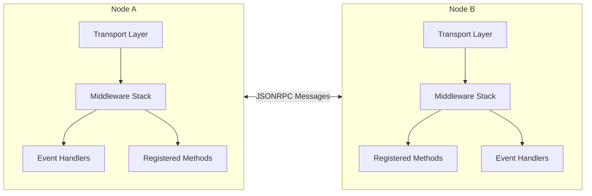
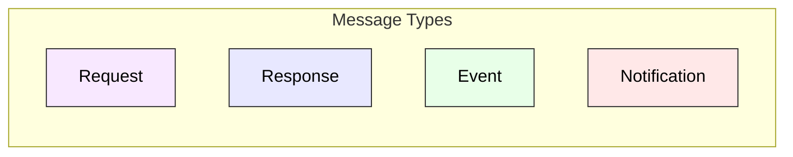
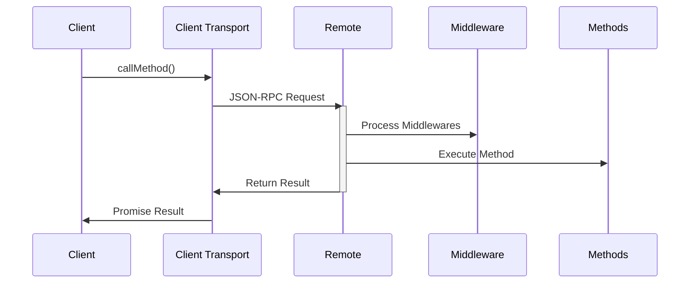

**@walletmesh/jsonrpc v0.1.0**

***

# JSON-RPC TypeScript Library

A JSON-RPC 2.0 library for TypeScript, providing a unified node implementation with bi-directional communication and middleware support.

## Architecture

The library implements a node-to-node architecture where each node can both send and receive JSON-RPC messages. Here's a high-level overview:





### Key Components

1. **JSONRPCNode**: The main class that implements the JSON-RPC 2.0 protocol
   - Handles both client and server functionality
   - Manages method registration and invocation
   - Processes incoming/outgoing messages
   - Coordinates middleware execution

2. **Transport Layer**: Abstract interface for message transmission
   - Implemented by the user (e.g., WebSocket, postMessage)
   - Handles actual message delivery between nodes

3. **Middleware Stack**: Chain of request/response processors
   - Executes in order of registration
   - Can modify requests/responses
   - Supports method-specific middleware

4. **Type System**: Comprehensive TypeScript types
   - Method definitions with params/result types
   - Event definitions with payload types
   - Context types for shared data
   - Serialization interfaces



## Features

* JSON-RPC 2.0 compliant node-to-node communication
* Bi-directional support with events and method calls
* Type-safe method and event definitions using TypeScript generics
* Comprehensive middleware support:
  * Request/response modification
  * Context passing through middleware chain
  * Method-specific middleware
  * Middleware ordering and removal
* Customizable transport layer for sending messages
* Built-in error handling with custom error codes and messages
* Support for notifications (methods without responses)
* Timeout support for method calls
* Optional event handling for broadcast-style communication
* Parameter serialization for method parameters and results

## Usage

1. Define your types:
   - Method map (`T extends JSONRPCMethodMap`) - Defines available RPC methods
   - Event map (`E extends JSONRPCEventMap`) - Defines available events
   - Context type (`C extends JSONRPCContext`) - Defines shared context data
2. Create a node instance with your types:
   ```typescript
   const node = new JSONRPCNode<MethodMap, EventMap, Context>({
     send: message => {
       // Transport implementation
     }
   });
   ```
3. Register methods and event handlers
4. Add middleware if needed
5. Start communicating bi-directionally with other nodes

The library does not provide a built-in transport layer, allowing you to use any communication method needed (WebSocket, postMessage, etc.).

### Type Parameters

The `JSONRPCNode` class takes three type parameters:

```typescript
class JSONRPCNode<
  T extends JSONRPCMethodMap = JSONRPCMethodMap,  // Method definitions
  E extends JSONRPCEventMap = JSONRPCEventMap,    // Event definitions
  C extends JSONRPCContext = JSONRPCContext       // Context type
>
```

1. `T` - Method Map: Defines the available RPC methods
   ```typescript
   type MethodMap = {
     add: { params: { a: number; b: number }; result: number };
     greet: { params: { name: string }; result: string };
   };
   ```

2. `E` - Event Map: Defines the available events
   ```typescript
   type EventMap = {
     userJoined: { username: string };
     statusUpdate: { user: string; status: 'online' | 'offline' };
   };
   ```

3. `C` - Context: Defines data shared across middleware and handlers
   ```typescript
   type Context = JSONRPCContext & {
     user?: string;
     isAuthorized?: boolean;
   };
   ```

### Examples

#### Using `window.postMessage` for bi-directional communication

```typescript
type MethodMap = {
  echo: { params: string; result: string };
};

type EventMap = {
  userTyping: { username: string };
  messageReceived: { text: string; from: string };
};

// Create nodes
const nodeA = new JSONRPCNode<MethodMap, EventMap, JSONRPCContext>({
  send: message => {
    window.postMessage(JSON.stringify(message), '*');
  }
});

const nodeB = new JSONRPCNode<MethodMap, EventMap, JSONRPCContext>({
  send: message => {
    window.postMessage(JSON.stringify(message), '*');
  }
});

// Register methods
nodeA.registerMethod('echo', async (_context, params) => {
  return params;
});

// Register event handlers
nodeA.on('userTyping', ({ username }) => {
  console.log(`${username} is typing...`);
});

nodeB.on('messageReceived', ({ text, from }) => {
  console.log(`Message from ${from}: ${text}`);
});

// Setup message handling
window.addEventListener('message', event => {
  const message = JSON.parse(event.data);
  nodeA.receiveMessage(message);
  nodeB.receiveMessage(message);
});

// Use the nodes
nodeB.callMethod('echo', 'Hello, world!').then(result => {
  console.log('Echo result:', result);
});

nodeA.emit('userTyping', { username: 'Alice' });
nodeB.emit('messageReceived', { text: 'Hi!', from: 'Bob' });
```

#### Using WebSockets for bi-directional communication

```typescript
type MethodMap = {
  echo: { params: string; result: string };
};

type EventMap = {
  userJoined: { username: string };
  userLeft: { username: string };
};

// WebSocket server
const wss = new WebSocket.Server({ port: 8080 });

wss.on('connection', (ws) => {
  const node = new JSONRPCNode<MethodMap, EventMap, JSONRPCContext>({
    send: message => {
      ws.send(JSON.stringify(message));
    }
  });

  // Register methods
  node.registerMethod('echo', async (_context, params) => {
    return params;
  });

  // Handle events
  node.on('userJoined', ({ username }) => {
    console.log(`${username} joined`);
    // Broadcast to other nodes
    node.emit('userJoined', { username });
  });

  ws.on('message', message => {
    node.receiveMessage(JSON.parse(message.toString()));
  });
});

// WebSocket client
const ws = new WebSocket('ws://localhost:8080');
const clientNode = new JSONRPCNode<MethodMap, EventMap, JSONRPCContext>({
  send: message => {
    ws.send(JSON.stringify(message));
  }
});

ws.on('open', () => {
  // Call methods
  clientNode.callMethod('echo', 'Hello!').then(result => {
    console.log('Echo:', result);
  });

  // Emit events
  clientNode.emit('userJoined', { username: 'Alice' });
});

ws.on('message', message => {
  clientNode.receiveMessage(JSON.parse(message.toString()));
});
```

### Events

Events provide a way to broadcast messages to all connected nodes without expecting a response. This is useful for notifications, status updates, or any broadcast-style communication.

```typescript
type EventMap = {
  userJoined: { username: string; timestamp: number };
  messageReceived: { text: string; from: string };
  statusUpdate: { user: string; status: 'online' | 'offline' };
};

// Create node with event support
const node = new JSONRPCNode<MethodMap, EventMap, JSONRPCContext>({
  send: message => {
    // Transport implementation
  }
});

// Register event handlers
node.on('userJoined', ({ username, timestamp }) => {
  console.log(`${username} joined at ${new Date(timestamp)}`);
});

node.on('messageReceived', ({ text, from }) => {
  console.log(`${from}: ${text}`);
});

// Multiple handlers for the same event
node.on('statusUpdate', ({ user, status }) => {
  console.log(`${user} is now ${status}`);
});

node.on('statusUpdate', ({ user, status }) => {
  updateUserList(user, status);
});

// Emit events
node.emit('userJoined', {
  username: 'Alice',
  timestamp: Date.now()
});

node.emit('messageReceived', {
  text: 'Hello everyone!',
  from: 'Bob'
});

// Handler cleanup
const cleanup = node.on('statusUpdate', handler);
// Later...
cleanup(); // Remove the handler
```

### Middleware

Middleware functions can receive a context object that can be used to share data across middleware and method handlers.

```typescript
// Define a custom context type
type Context = JSONRPCContext & {
  user?: string;
};

// Create a node instance with custom context type
const node = new JSONRPCNode<MethodMap, JSONRPCEventMap, Context>({
  send: message => {
    // Send message to remote node
  }
});

// Middleware that modifies the context
node.addMiddleware(async (context, request, next) => {
  // Set user information in context
  context.user = request.params?.userName;
  // Proceed to the next middleware or handler
  return next();
});

// Method handler that accesses the context
node.registerMethod('getUser', (context, params) => {
  // Return the user from context
  return `Current user: ${context.user}`;
});
```

The context object is created per request and passed through all middleware and method handlers. It allows you to store and access request-specific data, enabling features like authentication, authorization, and logging.

```typescript
// Logging middleware applied to all methods
node.addMiddleware(async (context, request, next) => {
    console.log('Received request:', request);
    const response = await next();
    console.log('Sending response:', response);
    return response;
});
```

#### Middleware Applied to Specific Methods with Context

You can apply middleware to specific methods and utilize the context:

```typescript
import { applyToMethods } from '@walletmesh/jsonrpc';

// Define context with authorization
type Context = JSONRPCContext & {
  isAuthorized?: boolean;
};

const node = new JSONRPCNode<MethodMap, JSONRPCEventMap, Context>({
  send: message => {
    // Transport implementation
  }
});

// Middleware applied only to 'add' method
node.addMiddleware(
  applyToMethods(['add'], async (context, request, next) => {
    // Perform authorization check and store result in context
    context.isAuthorized = checkAuthorization(request);
    if (!context.isAuthorized) {
      throw new JSONRPCError(-32600, 'Unauthorized');
    }
    return next();
  }),
);

// Method handler that relies on context
node.registerMethod('add', (context, params) => {
  if (!context.isAuthorized) {
    throw new JSONRPCError(-32600, 'Unauthorized');
  }
  return params.a + params.b;
});
```

### Method Timeouts

The `callMethod` function supports an optional `timeoutInSeconds` parameter. A value of `0` means no timeout (wait indefinitely), which is also the default behavior.

```typescript
import { JSONRPCNode, TimeoutError } from '@walletmesh/jsonrpc';

const node = new JSONRPCNode<MethodMap, JSONRPCEventMap, JSONRPCContext>(transport);

try {
    // Call method with 5 second timeout
    const result = await node.callMethod('slowMethod', { data: 'test' }, 5);
    console.log('Result:', result);
} catch (error) {
    if (error instanceof TimeoutError) {
        console.error('Request timed out');
    } else {
        console.error('Error:', error);
    }
}
```

### Error Handling

Custom errors can be thrown in method handlers or middleware using JSONRPCError:

```typescript
import { JSONRPCError } from '@walletmesh/jsonrpc';

const node = new JSONRPCNode<MethodMap, JSONRPCEventMap, JSONRPCContext>({
  send: message => {
    // Transport implementation
  }
});

node.registerMethod('errorMethod', () => {
    throw new JSONRPCError(-32000, 'Custom error', 'Error data');
});

// Error handling middleware
node.addMiddleware(async (context, request, next) => {
    try {
        return await next();
    } catch (error) {
        // Log error
        console.error('Error in method:', request.method, error);
        throw error; // Re-throw to maintain error chain
    }
});
```

### Parameter Serialization

The library supports custom serialization of method parameters and results, allowing you to define custom serializers for your data types:

```typescript
type MethodMap = {
  processDate: { params: { date: Date }; result: Date };
};

const node = new JSONRPCNode<MethodMap, EventMap, JSONRPCContext>({
  send: message => {
    // Transport implementation
  }
});

// Define serializers for your types
const dateSerializer: Serializer<Date> = {
    serialize: (date: Date) => ({ serialized: date.toISOString() }),
    deserialize: (data: JSONRPCSerializedData) => new Date(data.serialized)
};

// Create method-specific serializer
const methodSerializer: JSONRPCSerializer<{ date: Date }, Date> = {
    params: {
        serialize: (params) => ({
            serialized: JSON.stringify({ date: params.date.toISOString() })
        }),
        deserialize: (data) => {
            const parsed = JSON.parse(data.serialized);
            return { date: new Date(parsed.date) };
        }
    },
    result: dateSerializer
};

// Register method with serializer
node.registerMethod('processDate',
    (_context, params) => {
        // params.date is automatically deserialized to Date
        return params.date;
    },
    methodSerializer
);

// Register serializer for remote method calls
node.registerSerializer('processDate', methodSerializer);

// Call method - serialization is handled automatically
const result = await node.callMethod('processDate', {
    date: new Date()
});
// result is automatically deserialized to Date
```

## Testing

```bash
pnpm test
