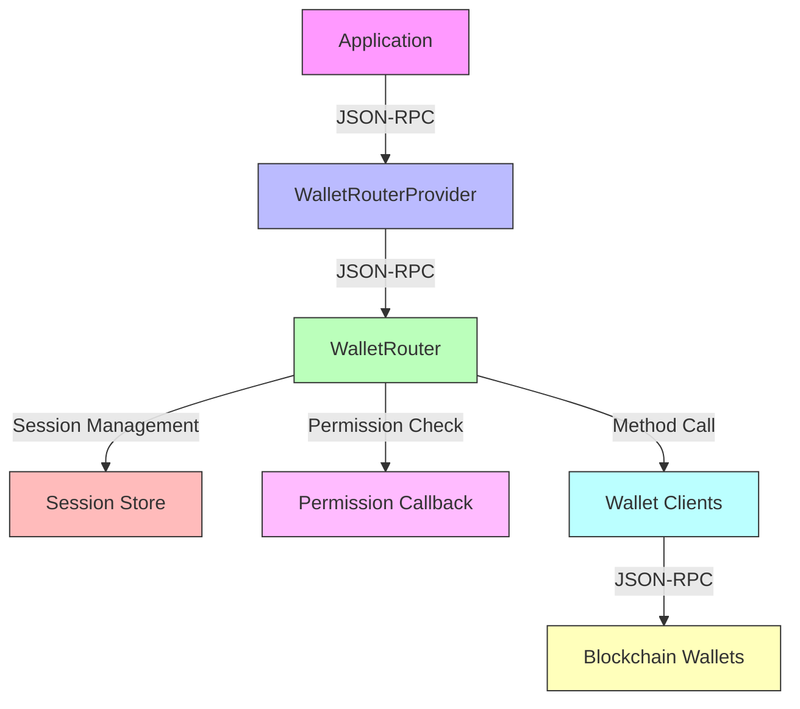
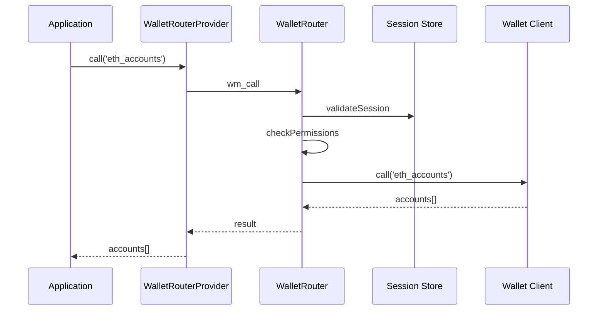

# WalletMesh Router

A flexible router for managing wallet connections across multiple blockchains. While initially inspired by chainagnostic.org, this implementation uses its own conventions for wallet sessions and method invocation to provide a more tailored solution.

## Architecture Overview

The WalletMesh Router is designed with a modular architecture that separates concerns between routing, session management, permissions, and wallet interactions. Here's a high-level overview of how the system works:



### Component Roles

1. **WalletRouterProvider**: Client-side interface that applications use to interact with the router
2. **WalletRouter**: Core routing component that manages sessions, permissions, and wallet connections
3. **Session Store**: Manages active wallet sessions and their associated permissions
4. **Permission Callback**: Flexible permission system that validates all operations
5. **Wallet Clients**: Adapters for different wallet implementations
6. **Blockchain Wallets**: Actual wallet implementations for different chains

### Request Flow



## Installation

```bash
pnpm add @walletmesh/router
```

## Permission System

The router uses a single permission callback to validate all operations. This callback receives complete context about the operation being performed and returns a boolean indicating whether it should be allowed.

### Session Management

The router uses a multi-chain session model where a single session can manage connections to multiple chains. Sessions are uniquely identified by a combination of the request origin and a session ID, ensuring proper isolation between different applications.

```typescript
interface SessionData {
  /** Unique session identifier */
  id: string;
  /** Origin of the session request */
  origin: string;
  /** Permissions granted to this session per chain */
  permissions: Record<ChainId, string[]>;
}
```

### Permission Context

The permission callback receives a context object containing:

```typescript
interface PermissionContext {
  /** Type of operation being performed (connect, call, disconnect, etc) */
  operation: OperationType;
  /** Chain ID the operation targets */
  chainId: ChainId;
  /** Method being called (for call operations) */
  method?: string;
  /** Parameters for the operation */
  params?: unknown;
  /** Origin of the request */
  origin: string;
  /** Current session data if available */
  session?: SessionData;
}
```

### Example Implementations

The router provides two example permission implementations:

#### Fully Permissive (Development)

```typescript
import { createPermissivePermissions } from '@walletmesh/router';

const router = new WalletRouter(
  sendResponse,
  wallets,
  createPermissivePermissions() // Allows all operations
);
```

#### String Pattern Matching

```typescript
import { createStringMatchPermissions } from '@walletmesh/router';

const router = new WalletRouter(
  sendResponse,
  wallets,
  createStringMatchPermissions([
    // Allow eth_call on any chain
    '*:eth_call',
    // Allow all eth_ methods on Ethereum mainnet
    'eip155:1:eth_*',
    // Allow specific method on specific chain
    'eip155:5:eth_getBalance'
  ])
);
```

### Custom Permission Implementation

You can implement your own permission logic by providing a callback:

```typescript
const router = new WalletRouter(
  sendResponse,
  wallets,
  async (context) => {
    // Example: Allow only specific origins
    if (!['trusted-dapp.com', 'localhost'].includes(context.origin)) {
      return false;
    }

    // Example: Rate limit certain operations
    if (context.method === 'eth_sendTransaction') {
      return await checkRateLimit(context.origin);
    }

    // Example: Allow only read operations
    if (context.method?.startsWith('eth_')) {
      return !context.method.includes('send') &&
             !context.method.includes('sign');
    }

    return true;
  }
);
```

## Usage

### Session Storage

The router supports pluggable session storage through the `SessionStore` interface. This allows you to customize how wallet sessions are stored, retrieved, and managed. Two implementations are provided out of the box:

#### Session Store Configuration

All session stores support configuration options for expiry behavior:

```typescript
interface SessionStoreConfig {
  /** Session lifetime in milliseconds. If not provided, sessions never expire */
  lifetime?: number;
  /** Whether to refresh session expiry on access. Default false */
  refreshOnAccess?: boolean;
}
```

#### MemorySessionStore (Default)

Stores sessions in memory with configurable expiry. Sessions are lost when the application restarts.

```typescript
import { WalletRouter, MemorySessionStore } from '@walletmesh/router';

// Default configuration (24 hour lifetime)
const defaultStore = new MemorySessionStore();

// Custom configuration
const store = new MemorySessionStore({
  lifetime: 30 * 60 * 1000, // 30 minutes
  refreshOnAccess: true // Extend session lifetime on each access
});

const router = new WalletRouter(
  sendResponse,
  wallets,
  permissionCallback,
  store // Optional, uses defaultStore if not provided
);
```

#### LocalStorageSessionStore

Stores sessions in browser localStorage for persistence across page reloads, with the same expiry configuration options.

```typescript
import { WalletRouter, LocalStorageSessionStore } from '@walletmesh/router';

const store = new LocalStorageSessionStore({
  lifetime: 7 * 24 * 60 * 60 * 1000, // 1 week
  refreshOnAccess: true // Keep sessions alive while in use
});

const router = new WalletRouter(
  sendResponse,
  wallets,
  permissionCallback,
  store
);
```

#### Custom Storage Implementation

You can implement your own storage solution by implementing the `SessionStore` interface:

```typescript
interface SessionStore {
  /** Store a new session */
  set(sessionId: string, data: SessionData): Promise<void>;

  /** Retrieve a session if it exists and has not expired */
  get(sessionId: string): Promise<SessionData | undefined>;

  /** Remove a session */
  delete(sessionId: string): Promise<void>;

  /** Clear all sessions */
  clear(): Promise<void>;

  /** Validate a session and optionally refresh its expiry */
  validateAndRefresh(sessionId: string): Promise<SessionData | undefined>;

  /** Remove all expired sessions */
  cleanExpired(): Promise<number>;
}

// Example: Redis-based session store with custom expiry handling
class RedisSessionStore implements SessionStore {
  constructor(config: SessionStoreConfig = {}) {
    this.config = config;
  }

  async validateAndRefresh(sessionId: string): Promise<SessionData | undefined> {
    const data = await this.redis.get(`session:${sessionId}`);
    if (!data) return undefined;

    const session = JSON.parse(data);

    // Check expiry
    if (session.expiresAt && Date.now() > session.expiresAt) {
      await this.delete(sessionId);
      return undefined;
    }

    // Refresh expiry if configured
    if (this.config.refreshOnAccess && this.config.lifetime) {
      session.expiresAt = Date.now() + this.config.lifetime;
      await this.redis.set(`session:${sessionId}`, JSON.stringify(session));
    }

    return session.data;
  }

  // ... other methods
}
```

### Custom Wallet Clients

The router accepts any wallet client that implements the `WalletClient` interface:

```typescript
interface WalletClient {
  // Call a method on the wallet
  call<T = unknown>(method: string, params?: unknown): Promise<T>;

  // Optional: Get supported capabilities
  getSupportedMethods?(): Promise<{ methods: string[] }>;
}
```

You can implement this interface to support any wallet implementation:

```typescript
class MyCustomWalletClient implements WalletClient {
  async call<T = unknown>(method: string, params?: unknown): Promise<T> {
    // Your implementation here
    return result;
  }

  async getSupportedMethods(): Promise<{ methods: string[] }> {
    return {
      methods: ['eth_accounts', 'eth_sendTransaction']
    };
  }
}
```

For JSON-RPC based wallets, we provide a convenient adapter:

```typescript
import { WalletRouter, JSONRPCWalletClient } from '@walletmesh/router';
import { JSONRPCClient } from '@walletmesh/jsonrpc';

// Create wallet clients
const wallets = new Map([
  ['eip155:1', new JSONRPCWalletClient(new JSONRPCClient(...))],  // Ethereum mainnet
  ['eip155:5', new MyCustomWalletClient()]  // Custom implementation
]);

// Initialize router
const router = new WalletRouter(
  async (response) => {
    // Handle JSON-RPC responses
    console.log(response);
  },
  wallets,
  createPermissivePermissions()
);
```

### Client-Side Provider

```typescript
import { WalletRouterProvider } from '@walletmesh/router';

// Initialize provider
const provider = new WalletRouterProvider(
  async (request) => {
    // Send request to router
    const response = await fetch('/api/wallet', {
      method: 'POST',
      body: JSON.stringify(request)
    });
    return response.json();
  }
);

// Connect to multiple chains with specific permissions
const sessionId = await provider.connect({
  'eip155:1': ['eth_accounts', 'eth_sendTransaction'],
  'eip155:137': ['eth_getBalance', 'eth_call']
});

// Single method call on Ethereum mainnet
const accounts = await provider.call('eip155:1', {
  method: 'eth_accounts'
});

// Bulk method calls on Polygon
const [balance, gasPrice] = await provider.bulkCall('eip155:137', [
  {
    method: 'eth_getBalance',
    params: [accounts[0], 'latest']
  },
  {
    method: 'eth_gasPrice'
  }
]);

// Get chain capabilities for both networks
const ethMethods = await provider.getSupportedMethods('eip155:1');
const polygonMethods = await provider.getSupportedMethods('eip155:137');
```

## API Reference

### WalletRouter

Server-side router for managing wallet connections across multiple blockchains.

#### Methods

- `wm_reconnect`: Attempt to reconnect to an existing session
  ```typescript
  params: { sessionId: string }
  returns: {
    status: boolean, // true if reconnection successful
    permissions: Record<ChainId, string[]> // current permissions if successful
  }
  ```

- `wm_connect`: Create a new session with permissions for multiple chains
  ```typescript
  params: { permissions: Record<ChainId, string[]> }
  returns: { sessionId: string }
  ```

- `wm_disconnect`: End an existing session and remove all chain connections
  ```typescript
  params: { sessionId: string }
  returns: boolean
  ```

- `wm_getPermissions`: Get current session permissions across all chains
  ```typescript
  params: {
    sessionId: string,
    chainIds?: ChainId[] // Optional array of specific chains to get permissions for
  }
  returns: Record<ChainId, string[]>
  ```

- `wm_updatePermissions`: Update permissions for all chains in the session
  ```typescript
  params: {
    sessionId: string,
    permissions: Record<ChainId, string[]>
  }
  returns: boolean
  ```

- `wm_call`: Invoke a method on a specific chain
  ```typescript
  params: {
    chainId: string,
    sessionId: string,
    call: {
      method: string,
      params?: unknown
    }
  }
  returns: unknown
  ```

- `wm_bulkCall`: Execute multiple methods in sequence on the same chain
  ```typescript
  params: {
    chainId: string,
    sessionId: string,
    calls: {
      method: string,
      params?: unknown
    }[]
  }
  returns: unknown[]
  ```

- `wm_getSupportedMethods`: Get supported methods for one or more chains
  ```typescript
  params: {
    chainIds?: string[] // Optional - if not provided, returns router's supported methods under 'router' chain ID
  }
  returns: Record<ChainId, string[]> // Maps chain IDs to their supported methods
  ```

### WalletRouterProvider

Client-side provider for interacting with the router.

#### Methods

- `connect(permissions: Record<ChainId, string[]>, timeout?: number)`: Connect to multiple chains with specified permissions. Returns a session ID. Optional timeout in milliseconds.

- `disconnect(timeout?: number)`: End the current session and all chain connections. Optional timeout in milliseconds.

- `getPermissions(chainIds?: ChainId[], timeout?: number)`: Get current session permissions. Optionally specify chains to get permissions for. Optional timeout in milliseconds.

- `updatePermissions(permissions: Record<ChainId, string[]>, timeout?: number)`: Update permissions for specified chains. Optional timeout in milliseconds.

- `call<T = unknown>(chainId: string, call: { method: string, params?: unknown }, timeout?: number)`: Invoke a method on a specific chain. Returns a promise of type T. Optional timeout in milliseconds.

- `bulkCall(chainId: string, calls: { method: string, params?: unknown }[], timeout?: number)`: Execute multiple methods in sequence on the same chain. Returns array of results. Optional timeout in milliseconds.

- `getSupportedMethods(chainIds?: string[], timeout?: number)`: Get supported methods for one or more chains. Returns a record mapping chain IDs to their supported methods. If no chain IDs provided, returns router's supported methods under 'router' chain ID. Optional timeout in milliseconds.

#### Properties

- `sessionId`: Get the current session ID (undefined if not connected)

All timeout parameters are optional and specify the maximum time in milliseconds to wait for the operation to complete. If not provided, the operation will not timeout.

## Error Handling

The router provides specific error codes for common failure scenarios:

- `-32000`: Unknown chain ID
  - When attempting to use a chain that isn't configured in the router
  - When trying to connect or call methods on an unsupported blockchain

- `-32001`: Invalid or expired session
  - When using an invalid or non-existent session ID
  - When the session has expired based on configured lifetime
  - When attempting to use a session that was previously disconnected

- `-32002`: Insufficient permissions for method
  - When attempting to call a method not included in the session's permissions
  - When trying to use wildcard permissions outside of updatePermissions
  - When the permission callback explicitly denies the operation

- `-32003`: Method not supported by chain
  - When calling a method that the wallet implementation doesn't support
  - When the wallet returns a method not found error

- `-32004`: Wallet service not available
  - When the wallet client is unreachable
  - When the underlying wallet connection fails
  - When the wallet returns an unexpected error

- `-32005`: Partial failure in bulk operations
  - When some calls in a bulk operation succeed but others fail
  - The error includes partial responses for successful calls

- `-32006`: Invalid request parameters
  - When required parameters are missing
  - When parameters are malformed or of incorrect type
  - When attempting operations with invalid chain IDs or method names

- `-32603`: Internal error
  - For unexpected internal errors in the router
  - When error handling itself fails
  - For any other unhandled exceptions

## Development

```bash
# Install dependencies
pnpm install

# Run tests
pnpm test

# Build package
pnpm build
