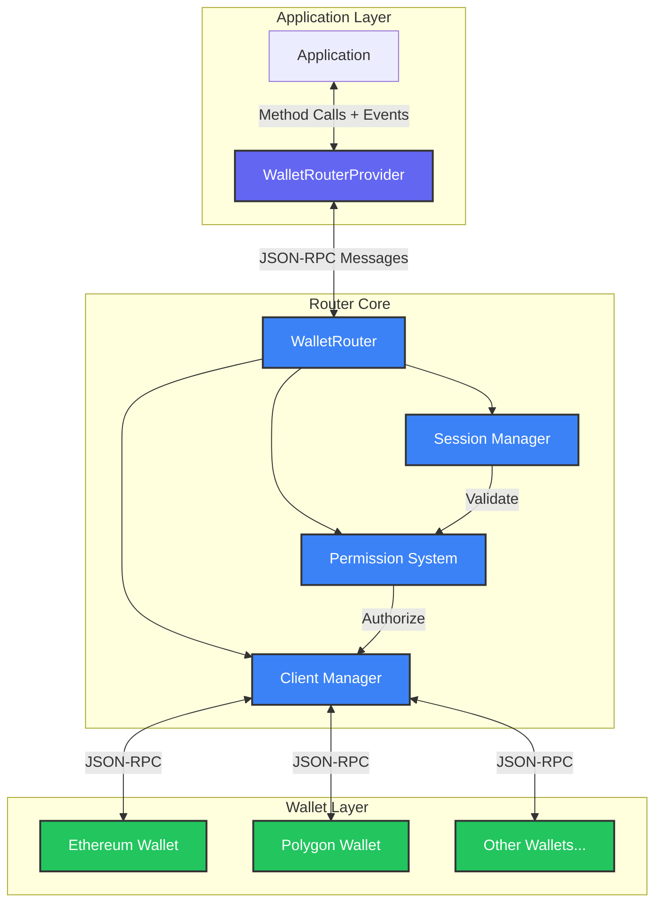

**@walletmesh/router v0.2.0**

***

# @walletmesh/router

A flexible routing system for managing multi-chain wallet connections with bi-directional communication support, built on top of [@walletmesh/jsonrpc](https://github.com/WalletMesh/wm-core/tree/main/packages/jsonrpc).

## Quick Start

```bash
# Install the package
pnpm add @walletmesh/router

# Create a simple router setup
import { WalletRouter, WalletRouterProvider } from '@walletmesh/router';

// Initialize a basic Ethereum wallet client that wraps window.ethereum
// This client implements the WalletClient interface for Ethereum mainnet
const ethereumWallet = {
  async call(method: string, params?: unknown[]) {
    // Forward requests to the injected Ethereum provider (e.g., MetaMask)
    return window.ethereum.request({ method, params });
  }
};

// Initialize the router with transport layer and wallet implementations
// The router coordinates communication between the application and wallets
const router = new WalletRouter(
  transport,
  new Map([['eip155:1', ethereumWallet]]),
  // Basic permission check that allows all methods (customize for production)
  async (ctx, req) => true,
  // Basic permission approval that accepts all requests (customize for production)
  async (ctx, perms) => perms
);

// Initialize the provider that applications use to interact with wallets
// The provider offers a high-level interface for wallet operations
const provider = new WalletRouterProvider(transport);

// Connect to Ethereum mainnet and request method permissions
// This establishes a session and requests access to specific RPC methods
const sessionId = await provider.connect({
  'eip155:1': ['eth_accounts', 'eth_sendTransaction']
});

// Call a wallet method using the established session
// The router will validate permissions and route the call to the appropriate wallet
const accounts = await provider.call('eip155:1', {
  method: 'eth_accounts'
});
```

## Features

🔗 **Multi-Chain Support**
- Connect to multiple blockchain wallets simultaneously
- Dynamic wallet addition and removal at runtime
- Unified interface across different chains

🔒 **Advanced Permissions**
- Granular method-level access control
- Dynamic permission updates
- Chain-specific permission management

🔄 **Bi-directional Communication**
- Real-time wallet state synchronization
- Event-driven architecture
- Automatic state recovery

💾 **Session Management**
- Persistent sessions with automatic recovery
- Configurable session lifetime
- Multiple storage backend support

🚦 **Request Handling**
- Efficient request batching
- Automatic request routing
- Comprehensive error handling

🛡️ **Type Safety**
- Full TypeScript support
- Comprehensive type definitions

## Architecture

The WalletMesh Router is designed with a modular architecture that separates concerns between routing, session management, permissions, and wallet interactions. Here's a high-level overview of how the system works:




### Core Components

1. **WalletRouterProvider**
   ```typescript
   class WalletRouterProvider extends JSONRPCNode<RouterMethodMap, RouterEventMap, RouterContext> {
     // Get current session ID
     get sessionId(): string | undefined;

     // Connect to chains with permissions
     async connect(permissions: Record<ChainId, string[]>, timeout?: number): Promise<string>;

     // Call wallet method
     async call(chainId: ChainId, call: MethodCall, timeout?: number): Promise<unknown>;

     // Call multiple methods in sequence
     async bulkCall(chainId: ChainId, calls: MethodCall[], timeout?: number): Promise<unknown[]>;

     // Get/update permissions
     async getPermissions(chainIds?: ChainId[], timeout?: number): Promise<Record<ChainId, string[]>>;
     async updatePermissions(permissions: Record<ChainId, string[]>, timeout?: number): Promise<void>;

     // Get supported methods
     async getSupportedMethods(chainIds?: ChainId[], timeout?: number): Promise<Record<ChainId, string[]>>;

     // Clean up
     async disconnect(timeout?: number): Promise<void>;
   }
   ```

2. **WalletRouter**
   ```typescript
   class WalletRouter extends JSONRPCNode {
     constructor(
       transport: Transport,
       wallets: Wallets,
       permissionCallback: PermissionCallback,
       permissionApprovalCallback: PermissionApprovalCallback,
       sessionStore?: SessionStore
     );

     // Add wallet client
     addWallet(chainId: string, client: WalletClient): void;

     // Remove wallet client
     removeWallet(chainId: string): void;

     // Handle wallet events
     protected handleWalletEvent(chainId: string, event: string, data: unknown): void;
   }
   ```

3. **Session Store**
   ```typescript
   interface SessionStore {
     // Store session data
     set(sessionId: string, data: SessionData): Promise<void>;

     // Get session if not expired
     get(sessionId: string): Promise<SessionData | undefined>;

     // Get all non-expired sessions
     getAll(): Promise<Map<string, SessionData>>;

     // Remove session
     delete(sessionId: string): Promise<void>;

     // Clear all sessions
     clear(): Promise<void>;

     // Validate and optionally refresh session
     validateAndRefresh(sessionId: string): Promise<SessionData | undefined>;

     // Clean up expired sessions
     cleanExpired(): Promise<number>;
   }
   ```

4. **Wallet Client**
   ```typescript
   interface WalletClient {
     // Call wallet method
     call<T = unknown>(method: string, params?: unknown[]): Promise<T>;

     // Optional event handling
     on?(event: string, handler: (data: unknown) => void): void;
     off?(event: string, handler: (data: unknown) => void): void;

     // Optional method discovery
     getSupportedMethods?(): Promise<string[]>;
   }
   ```

### Error Handling

```typescript
// Router error codes and messages
const RouterErrorMap = {
  unknownChain: { code: -32000, message: 'Unknown chain ID' },
  invalidSession: { code: -32001, message: 'Invalid or expired session' },
  insufficientPermissions: { code: -32002, message: 'Insufficient permissions for method' },
  methodNotSupported: { code: -32003, message: 'Method not supported by chain' },
  walletNotAvailable: { code: -32004, message: 'Wallet service not available' },
  partialFailure: { code: -32005, message: 'Partial failure' },
  invalidRequest: { code: -32006, message: 'Invalid request parameters' },
  unknownError: { code: -32603, message: 'Internal error' }
};

// Error handling example
try {
  await provider.call('eip155:1', {
    method: 'eth_sendTransaction',
    params: [{...}]
  });
} catch (error) {
  if (error instanceof RouterError) {
    switch (error.code) {
      case -32002:
        console.error('Permission denied:', error.message);
        break;
      case -32004:
        console.error('Wallet error:', error.data);
        break;
      default:
        console.error('Router error:', error.message);
    }
  }
}
```

### Session Configuration

```typescript
// Session store configuration options
interface SessionStoreConfig {
  // Session lifetime in milliseconds (optional)
  lifetime?: number;
  // Whether to refresh session expiry on access (optional)
  refreshOnAccess?: boolean;
}

// In-memory session store with 24h lifetime
const memoryStore = new MemorySessionStore({
  lifetime: 24 * 60 * 60 * 1000,
  refreshOnAccess: true
});

// Local storage session store with custom config
const persistentStore = new LocalStorageSessionStore({
  lifetime: 7 * 24 * 60 * 60 * 1000, // 7 days
  refreshOnAccess: true
});

// Custom session store implementation
class CustomStore implements SessionStore {
  async set(sessionId: string, data: SessionData): Promise<void> {
    // Store session
  }

  async get(sessionId: string): Promise<SessionData | undefined> {
    // Get session if not expired
  }

  async getAll(): Promise<Map<string, SessionData>> {
    // Get all non-expired sessions
  }

  async delete(sessionId: string): Promise<void> {
    // Remove session
  }

  async clear(): Promise<void> {
    // Clear all sessions
  }

  async validateAndRefresh(sessionId: string): Promise<SessionData | undefined> {
    // Validate session and optionally refresh expiry
  }

  async cleanExpired(): Promise<number> {
    // Remove expired sessions
    // Returns number of sessions removed
  }
}
```

### Middleware

The router uses two core middleware components:

1. **Session Middleware**
```typescript
// Creates middleware for session validation
const sessionMiddleware = createSessionMiddleware(sessionStore);

// Validates session existence and freshness
// Automatically refreshes session expiry if configured
// Attaches session data to request context
```

2. **Permissions Middleware**
```typescript
// Creates middleware for permission checking
const permissionsMiddleware = createPermissionsMiddleware(permissionCallback);

// Validates method permissions using callback
// Supports both direct and pattern-based permission checks
// Handles both single and bulk method calls
```

Permission callbacks can be created using provided helpers:
```typescript
// Fully permissive (development)
const devPermissions = createPermissivePermissions();

// Pattern matching (production)
const prodPermissions = createStringMatchPermissions([
  "*:eth_call",                // Allow eth_call on any chain
  "eip155:1:eth_*",           // Allow all eth_ methods on Ethereum mainnet
  "eip155:5:eth_getBalance"   // Allow specific method on specific chain
]);
```

## Installation

```bash
pnpm add @walletmesh/router
```

## Usage Example

```typescript
// Initialize wallet clients for multiple chains
// Each client implements the WalletClient interface for its respective chain
const wallets = new Map([
  ['eip155:1', ethereumWallet],
  ['eip155:137', polygonWallet]
]);

// Create router instance with production-ready permission handling
// The router manages wallet connections, permissions, and method routing
const router = new WalletRouter(
  transport,
  wallets,
  // Permission callback validates method access based on session permissions
  // Returns true if the method is allowed for the chain in the current session
  async (context, request) => {
    return context.session?.permissions?.[request.params.chainId]?.includes(request.params.call.method) ?? false;
  },
  // Permission approval callback handles user interaction for permission requests
  // Shows a dialog and returns approved permissions or empty if denied
  async (context, permissions) => {
    const approved = await showPermissionDialog(permissions);
    return approved ? permissions : {};
  }
);

// Initialize provider for application use
// The provider abstracts router complexity and provides a clean API
const provider = new WalletRouterProvider(transport);

// Establish connections to multiple chains with specific method permissions
// This creates a session that can interact with both Ethereum and Polygon
const sessionId = await provider.connect({
  'eip155:1': ['eth_accounts', 'eth_sendTransaction'],
  'eip155:137': ['eth_getBalance', 'eth_call']
});

// Execute a single method call on Ethereum mainnet
// The router handles permission checks and routing automatically
const accounts = await provider.call('eip155:1', {
  method: 'eth_accounts'
});

// Execute multiple method calls in sequence on Ethereum mainnet
// This is more efficient than individual calls for related operations
const [balance, allowance] = await provider.bulkCall('eip155:1', [
  { method: 'eth_getBalance', params: ['0x...'] },
  { method: 'eth_allowance', params: ['0x...', '0x...'] }
]);

// Subscribe to wallet state changes with automatic cleanup
// The router emits events when wallet state changes (e.g., connection, chain)
const cleanup = provider.on('wm_walletStateChanged', ({ chainId, changes }) => {
  console.log(`Wallet state changed for ${chainId}:`, changes);
});

// Clean up resources and close connections
// This removes event listeners and terminates the session
cleanup();
await provider.disconnect();
```

## Best Practices

1. **Session Management**
   - Use persistent session storage in production
   - Implement session cleanup for inactive sessions
   - Handle session recovery gracefully

2. **Error Handling**
   - Implement proper error handling for all operations
   - Use appropriate error codes for different scenarios
   - Provide helpful error messages and data

3. **Permissions**
   - Implement granular permission controls
   - Use method-specific permissions
   - Handle permission updates properly

4. **Performance**
   - Use request batching when possible
   - Implement proper cleanup for event handlers
   - Handle wallet connection state properly

5. **Security**
   - Validate all incoming messages
   - Implement proper origin checking
   - Use secure transport layers

### Session Management

The router uses a flexible session management system that:
- Uniquely identifies sessions using a combination of origin and sessionId
- Supports multiple session storage backends through the `SessionStore` interface
- Provides both in-memory (`MemorySessionStore`) and persistent (`LocalStorageSessionStore`) implementations
- Automatically handles session validation and refresh
- Enables session recovery after page reloads or disconnects
- Manages session lifecycle events (creation, updates, termination)

### Permission System

Permissions are managed through a sophisticated callback-based system:

1. **Permission Approval**
   - Initial permission requests are handled by a dedicated approval callback
   - Supports modifying requested permissions before approval
   - Enables custom permission UI flows
   - Handles both initial connect and permission update scenarios

2. **Runtime Validation**
   - Every operation is validated through a permission callback
   - Supports granular control at method and chain level
   - Enables context-aware permission decisions
   - Allows dynamic permission updates based on wallet state

3. **Permission Structure**
   ```typescript
   type ChainPermissions = {
     [chainId: string]: string[]; // Array of allowed methods
   };

   // Example:
   {
     'eip155:1': ['eth_accounts', 'eth_sendTransaction'],
     'eip155:137': ['eth_getBalance', 'eth_call']
   }
   ```
