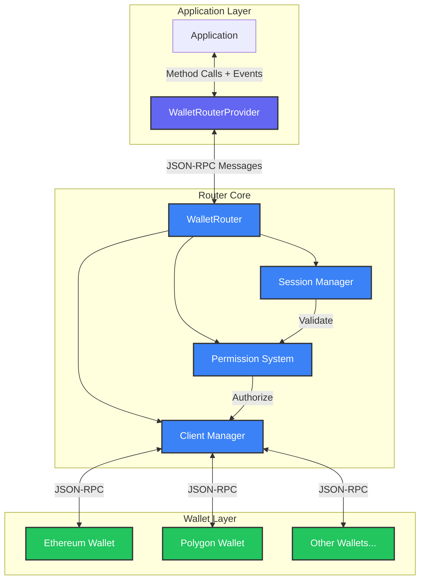
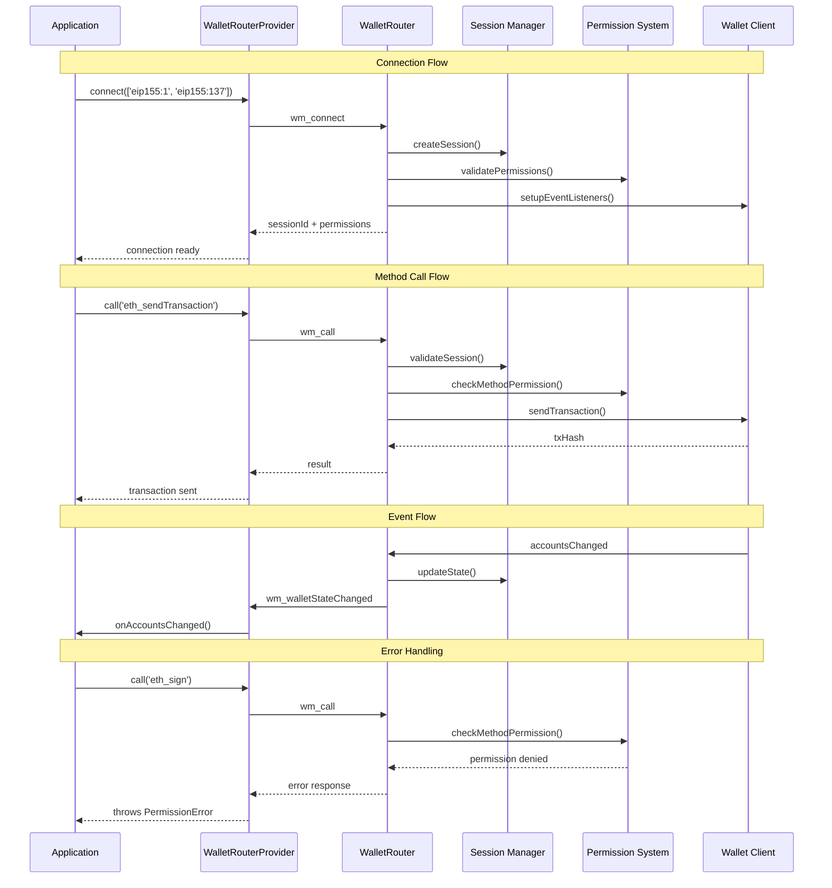

**@walletmesh/router v0.1.2**

***

# WalletMesh Router

A flexible router for managing wallet connections across multiple blockchains with bi-directional communication support. While initially inspired by chainagnostic.org, this implementation uses its own conventions for wallet sessions and method invocation to provide a more tailored solution.

## Architecture

The WalletMesh Router is built around several key architectural concepts:

### Session Management

The router uses a flexible session management system that:
- Uniquely identifies sessions using a combination of origin and sessionId
- Supports multiple session storage backends through the `SessionStore` interface
- Provides both in-memory (`MemorySessionStore`) and persistent (`LocalStorageSessionStore`) implementations
- Automatically handles session validation and refresh
- Enables session recovery after page reloads or disconnects
- Manages session lifecycle events (creation, updates, termination)

### Permission System

Permissions are managed through a sophisticated callback-based system:

1. **Permission Approval**
   - Initial permission requests are handled by a dedicated approval callback
   - Supports modifying requested permissions before approval
   - Enables custom permission UI flows
   - Handles both initial connect and permission update scenarios

2. **Runtime Validation**
   - Every operation is validated through a permission callback
   - Supports granular control at method and chain level
   - Enables context-aware permission decisions
   - Allows dynamic permission updates based on wallet state

3. **Permission Structure**
   ```typescript
   type ChainPermissions = {
     [chainId: string]: string[]; // Array of allowed methods
   };

   // Example:
   {
     'eip155:1': ['eth_accounts', 'eth_sendTransaction'],
     'eip155:137': ['eth_getBalance', 'eth_call']
   }
   ```

### JSON-RPC Integration

The router leverages the @walletmesh/jsonrpc package to provide:
- Standardized communication protocol
- Easy integration of any JSON-RPC compatible wallet
- Bi-directional event handling
- Built-in request/response correlation
- Automatic message serialization

Custom wallet clients can be easily implemented by extending the `JSONRPCWalletClient` class or implementing the `WalletClient` interface:

```typescript
interface WalletClient {
  call<T = unknown>(method: string, params?: unknown): Promise<T>;
  on?(event: string, handler: (data: unknown) => void): void;
  off?(event: string, handler: (data: unknown) => void): void;
  getSupportedMethods?(): Promise<{ methods: string[] }>;
}
```

## Features

- 🔗 **Multi-Chain Support**: Connect to multiple blockchain wallets simultaneously
- 🔒 **Granular Permissions**: Fine-grained control over wallet method access
- 🔄 **Bi-directional Events**: Real-time wallet state synchronization
- 💾 **Session Management**: Persistent sessions with automatic recovery
- 🚦 **Request Batching**: Efficient handling of multiple wallet requests
- 🛡️ **Type Safety**: Full TypeScript support with comprehensive type definitions
- 🧪 **Well Tested**: Comprehensive test coverage with Vitest

## Implementation Details

The WalletMesh Router is designed with a modular architecture that separates concerns between routing, session management, permissions, and wallet interactions. Here's a high-level overview of how the system works:



### Core Components

1. **WalletRouterProvider**
   - Client-side interface for applications
   - Handles method call serialization and event deserialization
   - Manages connection lifecycle and session state
   - Provides TypeScript-friendly API for wallet interactions
   - Implements retry logic and timeout handling

2. **WalletRouter**
   - Core routing and orchestration component
   - Manages bi-directional message flow
   - Coordinates between sessions, permissions, and wallet connections
   - Handles event propagation and error management
   - Implements connection pooling and request batching

3. **Session Manager**
   - Maintains active wallet sessions
   - Handles session creation, validation, and expiration
   - Manages permission sets per chain
   - Supports session persistence and recovery
   - Implements session cleanup and garbage collection

4. **Permission System**
   - Flexible permission validation engine
   - Supports method-level and chain-level permissions
   - Implements permission inheritance and wildcards
   - Handles permission updates and revocation
   - Provides audit logging capabilities

5. **Client Manager**
   - Manages wallet client instances
   - Handles client connection lifecycle
   - Implements client-specific adapters
   - Manages event subscription and cleanup
   - Provides client health monitoring

### Message Flow



## Installation

```bash
pnpm add @walletmesh/router
```

## Usage

### Client-Side Provider with Event Handling

```typescript
import { WalletRouterProvider } from '@walletmesh/router';

// Initialize provider
const provider = new WalletRouterProvider({
  send: async (message) => {
    // Send message to router
    await fetch('/api/wallet', {
      method: 'POST',
      body: JSON.stringify(message)
    });
  }
});

// Listen for wallet state changes
provider.on('wm_walletStateChanged', ({ chainId, changes }) => {
  if (changes.accounts) {
    console.log(`Accounts changed on ${chainId}:`, changes.accounts);
  }
  if (changes.networkId) {
    console.log(`Network changed on ${chainId}:`, changes.networkId);
  }
});

// Listen for session changes
provider.on('wm_permissionsChanged', ({ sessionId, permissions }) => {
  console.log(`Permissions updated for session ${sessionId}:`, permissions);
});

provider.on('wm_sessionTerminated', ({ sessionId, reason }) => {
  console.log(`Session ${sessionId} terminated:`, reason);
});

// Connect to multiple chains with specific permissions
const sessionId = await provider.connect({
  'eip155:1': ['eth_accounts', 'eth_sendTransaction'],
  'eip155:137': ['eth_getBalance', 'eth_call']
});

// Use methods as before
const accounts = await provider.call('eip155:1', {
  method: 'eth_accounts'
});
```

### Server-Side Router with Event Support

```typescript
import { WalletRouter, JSONRPCWalletClient } from '@walletmesh/router';
import { JSONRPCNode } from '@walletmesh/jsonrpc';

// Create wallet clients
const wallets = new Map([
  ['eip155:1', new JSONRPCWalletClient(new JSONRPCNode({
    send: message => {
      // Send to Ethereum wallet
    }
  }))],
  ['eip155:137', new JSONRPCWalletClient(new JSONRPCNode({
    send: message => {
      // Send to Polygon wallet
    }
  }))]
]);

// Initialize router
const router = new WalletRouter(
  {
    send: async (message) => {
      // Send response/event to provider
      await sendToProvider(message);
    }
  },
  wallets,
  createPermissivePermissions()
);
```

### Custom Wallet Client Implementation

```typescript
class MyCustomWalletClient implements WalletClient {
  private eventHandlers: Map<string, Set<(data: unknown) => void>> = new Map();

  async call<T = unknown>(method: string, params?: unknown): Promise<T> {
    // Implementation
  }

  on(event: string, handler: (data: unknown) => void): void {
    if (!this.eventHandlers.has(event)) {
      this.eventHandlers.set(event, new Set());
    }
    this.eventHandlers.get(event)?.add(handler);
  }

  off(event: string, handler: (data: unknown) => void): void {
    this.eventHandlers.get(event)?.delete(handler);
  }

  protected emit(event: string, data: unknown): void {
    this.eventHandlers.get(event)?.forEach(handler => handler(data));
  }
}
```

## Error Handling

The router provides comprehensive error handling through the `RouterError` class. Common error scenarios include:

- **Permission Denied**: When a method call is not allowed for the current session
- **Invalid Session**: When using an expired or invalid session ID
- **Method Not Found**: When calling an unsupported wallet method
- **Network Error**: When communication with a wallet fails
- **Timeout**: When a wallet operation exceeds the configured timeout

```typescript
try {
  await provider.call('eip155:1', {
    method: 'eth_sendTransaction',
    params: [/* ... */]
  });
} catch (error) {
  if (error instanceof RouterError) {
    switch (error.code) {
      case 'PERMISSION_DENIED':
        console.error('Missing required permissions');
        break;
      case 'SESSION_INVALID':
        console.error('Session expired, reconnecting...');
        break;
      // Handle other error types
    }
  }
}
```

## Development

```bash
# Install dependencies
pnpm install

# Run tests
pnpm test

# Run tests with coverage
pnpm coverage

# Build the package
pnpm build

# Generate documentation
pnpm docs

# Lint code
pnpm lint

# Format code
pnpm format
```
